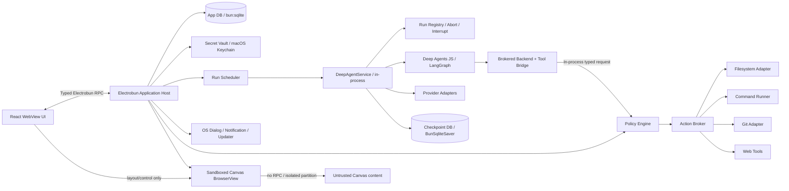
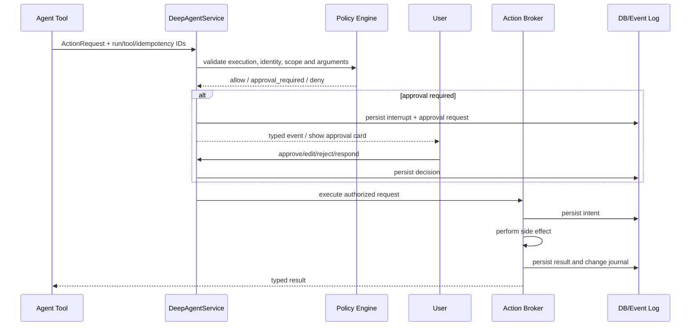

# 技术架构

## 1. 架构目标

- UI、Agent 和本机副作用相互解耦。
- 单个 Run/Provider/Tool 错误不损坏其他会话；application runtime 异常后可从持久状态恢复。
- 权限与审批在模型之外执行。
- 运行事件、checkpoint 和业务数据可独立演进。
- Provider、MCP、Skills、Knowledge 和 Canvas 共享工具、事件、权限和密钥基础设施。
- 首发 macOS，但模块边界不依赖 macOS 特有业务逻辑。

## 2. 总体架构



本文锁定的 Electrobun `1.18.1` 不是 Electron 的多进程替代实现：原生 launcher 启动应用包内的 Bun，框架在 Bun main thread 初始化原生 GUI event loop，并在 application worker 中执行 `src/bun/index.ts`。开发者需要 Bun 工具链完成 install/script/build，但发行包已经包含 runtime，终端用户不需要另装 Bun。

参考实现 `oh-your-pi` 直接在该 application worker 内 import Pi Agent SDK，没有应用级 sidecar。本文只复用这种 Electrobun 拓扑和 typed RPC 模式，Agent 实现仍固定为 LangChain `deepagents`。上游 `main` 已出现 Cottontail/JSC 路线，因此升级 Electrobun 等同于更换 application runtime，必须重新通过全部 Runtime POC。

### 2.1 参考实现可复用模式

- `src/bun/index.ts` 作为 Electrobun composition root，Agent SDK 直接运行在 application worker。
- shared Zod DTO → `BrowserView.defineRPC` adapter → application service → WebView client，SDK 类型不穿透 UI。
- Prompt/start 请求快速返回，delta、Tool、认证和完成状态由 typed message 持续推送。
- 每次请求显式携带 workspace/thread identity，不让 Host 依赖 UI 当前选中项。
- GUI 文件预览与 Agent Tool 分离；共同使用 `realpath`、根目录 containment、软链接逃逸检查、大小上限和二进制检测。

Pi SDK 的 SessionManager、JSONL、ModelRuntime、事件 mapper 和权限 extension 不复用；参考项目也没有 Keychain、完整自动更新、durable HITL、崩溃恢复或 app-level 命令进程监管，不能把这些缺口当作产品基线。

### 2.2 安全说明

- Electrobun Application Host 与 in-process DeepAgentService 都是受信任应用代码，不是 OS 权限沙箱。
- DeepAgentService 不暴露通用 Shell backend；所有本机副作用进入同进程但独立分层的 Policy Engine 与 Action Broker。
- Electrobun 加密 RPC 保护 View 与 Host 的传输，但不代替身份、Schema、capability 和状态校验。
- `BrowserView` 的 `sandbox: true` 会禁用 RPC，只保留事件通道；它不是完整的网络或操作系统沙箱。
- 真正的权限边界是 Host 中的 Policy Engine、Action Broker、RPC 校验、Secret Vault 和操作系统权限。
- stdio MCP Server 是用户主动安装的本机程序，Phase 2 必须明确提示它具有宿主机权限。

## 3. 运行时与模块职责

### 3.1 Electrobun Application Host

作为 composition root，承担桌面特权、全局协调和 Agent application service：

- 窗口、菜单、深链、自定义协议和应用生命周期。
- Electrobun typed RPC 注册、BrowserView 身份和 capability 校验。
- Secret Vault、数据库仓储和迁移。
- Run Scheduler、DeepAgentService、Run Registry 和启动恢复。
- Policy Engine、审批和 Action Broker。
- 文件、命令、Git、网络出口和系统通知。
- Canvas Preview 创建、CSP/导航策略、权限拒绝和销毁。
- 更新、签名信息和本地诊断。

LLM graph 由 Host 内的 DeepAgentService 异步运行，Markdown 仍只在 WebView 渲染。命令、Git、索引、序列化和大事件转换不得阻塞 application worker；Phase 0 必须用 3 个并发 Run 证明 RPC、窗口和取消仍可响应，达不到预算时再触发隔离 ADR。

### 3.2 View RPC 边界

- 主 WebView 只获得按领域分组的命令、查询和消息 API。
- Electrobun RPC Schema 提供编译期类型；所有安全相关入参与出参仍使用共享 Zod Schema做运行时校验。
- 不向 WebView 暴露通用 RPC 转发、文件路径拼接、Shell、Host 对象或 Secret。
- Host 按已登记的 BrowserView ID、窗口角色和当前 capability 校验请求，不信任只由 UI 声明的身份。
- 订阅绑定 View 生命周期，View 销毁时自动释放；已接受的 Run 是否继续由后台任务策略决定，不依赖某个页面存活。
- Canvas Preview 设置 `sandbox: true`，不注册应用 RPC，只允许经过校验的单向事件。

### 3.3 React WebView UI

- 页面、路由、表单、消息、轨迹、Diff、任务中心和设置 UI。
- 通过 Query 获取持久状态，通过 Subscription 接收增量事件。
- WebView 缓存不是事实来源；刷新后从数据库恢复。
- Markdown/HTML 经过清理，外链交给 Host 校验后打开。
- 不导入 Bun/Node-only 包、Provider SDK、数据库或 Deep Agents。

### 3.4 DeepAgentService

Phase 1 默认直接运行在 Electrobun application worker。它不是 Pi SDK 的 `SessionManager` 或 JSONL host，而是围绕 Deep Agents/LangGraph 建立以下模型：

- 共享不可变 graph definition/compiled graph cache。
- `threadId` 对应可持久 LangGraph thread，`runId` 对应一次应用执行。
- `RunRegistry` 只保存活动 Run 的 `AbortController`、stream task、pending interrupt IDs 和资源句柄。
- checkpoint/store 是持久事实来源；Registry、Provider client 和 stream iterator 不持久化。
- start 命令快速返回 accepted/run ID，后续 delta、Tool、interrupt 和完成状态通过规范化事件流发送。

职责：

- 构建有效 Agent 配置和 Deep Agents graph。
- 调用 Provider、管理 LangGraph thread/checkpoint。
- 把 Deep Agents stream 转为内部 RuntimeEvent。
- 调用 Brokered Backend/Tool Bridge，不直接执行 Shell。
- 接收开始、恢复、停止和审批继续命令。
- 只在内存持有当前 Run 所需的 Provider Key。
- 在应用退出、窗口策略变化和 Session 删除时显式 dispose/abort，释放 Provider、stream 和命令资源。

不承担：

- UI 数据查询。
- API Key 永久存储。
- 任意本地路径授权。
- 应用更新或系统通知。

HITL 不能复制参考实现的 pending Promise：approval/interrupt 必须先落库，恢复时使用同一 `threadId`、LangGraph config 与 `Command({ resume })`，即使 WebView reload 或应用重启也不会永久悬挂。

### 3.5 可选 sidecar 决策

仅以下实测结果可以触发 sidecar ADR：

- 选定 Electrobun application runtime 无法正确加载 Deep Agents、Provider SDK、`AsyncLocalStorage` 或必需 native addon。
- Deep Agents 导致 application worker 崩溃、event-loop 长时间阻塞或无法满足内存/CPU隔离要求。
- Agent 必须跨 Host 生命周期作为独立 daemon 运行，或需要独立升级边界。
- 命令进程树必须由独立进程监管才能可靠回收。

仅“Agent 是长任务”不构成 sidecar 理由。若 ADR 选择 sidecar，才增加 bundled runtime、framed RPC、版本握手、背压、heartbeat、crash loop、process-tree kill、Secret channel、checkpoint writer ownership、签名和更新矩阵；本文默认实现不包含这些复杂度。

### 3.6 Canvas Preview

- Web Canvas 使用单独 Electrobun `BrowserView`，不在主 WebView 中执行不可信页面。
- 设置 `sandbox: true`，不注册 Electrobun RPC；使用独立 partition 和受控 `views://`/wrapper 页面。
- wrapper 页面设置严格 CSP，默认拒绝脚本外联、权限、导航、新窗口、下载和网络。
- 当前 Electrobun 未提供与 Electron `webRequest` 等价且有文档保证的子资源拦截 API。Phase 0 必须用真实 HTTP/DNS 测试证明默认断网；未通过前 Web Canvas 只能渲染应用生成的静态内容，不能承诺任意 HTML 隔离运行。
- 用户允许某个 Canvas/域名访问网络时，必须通过明确的 Host capability 和受控代理实现，不能仅依赖顶层导航规则。
- Preview 无法调用应用 RPC；编辑内容由 Host 通过受控资源加载更新。

## 4. 仓库布局

```text
.
├── apps/
│   └── desktop/
│       ├── src/bun/           # Electrobun entry, RPC adapters and desktop services
│       ├── src/agent/         # in-process DeepAgentService and Run Registry
│       ├── src/views/main/    # React WebView and typed RPC client
│       ├── src/views/canvas/  # minimal sandbox wrapper
│       ├── electrobun.config.ts
│       └── vite.config.ts
├── packages/
│   ├── contracts/          # Zod schemas, IDs, RPC and event contracts
│   ├── domain/             # Pure state machines and policies
│   ├── database/           # Drizzle schema, repositories and migrations
│   ├── agent-runtime/      # Deep Agents wrapper and stream normalization
│   ├── action-broker/      # filesystem, command, git and web actions
│   ├── providers/          # model/embedding adapters and capabilities
│   ├── ui/                 # design tokens and reusable React components
│   ├── mcp/                # Phase 2
│   ├── skills/             # Phase 2
│   ├── knowledge/          # Phase 2
│   ├── canvas/             # Canvas domain and render protocol
│   └── testkit/            # fakes, fixtures and contract suites
├── docs/
├── scripts/
├── package.json
├── bunfig.toml
└── bun.lock
```

避免在第一天创建所有空包。Phase 0 只创建 `contracts`、`domain`、`database`、`agent-runtime`、`action-broker` 和 `ui`；其余在对应垂直切片开始时创建。

## 5. 分层规则

```text
WebView/UI
    ↓ contracts only
Application services
    ↓
Domain (pure TypeScript)
    ↓ ports
Adapters (Electrobun, Bun SQLite, LangChain, MCP, filesystem)
```

强制规则：

- `domain` 不依赖 Electrobun、Bun、React、LangChain、数据库或操作系统。
- `contracts` 只放跨 WebView/RPC 和模块边界的稳定类型，不复用数据库 Row 类型。
- Provider/MCP SDK 类型不穿透到 UI。
- 所有 Adapter 错误映射为稳定的 `AppError`。
- 任意 Tool 必须声明 `riskClass`、`sideEffectClass`、`idempotencyClass` 和 `requiredCapabilities`。

## 6. 构建与依赖策略

### 6.1 Electrobun CLI + Vite

- Electrobun CLI 负责 Application Host 构建、应用 bundle、自解压产物、签名、公证和更新 metadata。
- React WebView 沿用官方 React + Tailwind + Vite 集成模式；Vite 只处理 WebView 资源和 HMR。
- 产品锁定 Electrobun `1.18.1` 及其发行包内 runtime；开发 CI 的 Bun 版本与 package 内 runtime 分别记录，不能相互推断。
- Phase 0 在开发、package、签名/公证产物中直接 import 并运行 Deep Agents，验证 RPC、`bun:sqlite`、BrowserView、`views://` 资源和 Updater。
- `useAsar` 仅在 package smoke 证明 Host、DeepAgentService、迁移和静态资源均可正确加载后启用；必须放在真实文件系统的资源使用 `asarUnpack` 或构建复制规则。

### 6.2 Application runtime 兼容

- `node:fs`、Web Streams、`fetch` 等基础 API 的高兼容度不能推导出 Deep Agents 整体兼容。
- `AsyncLocalStorage`、`node:child_process`、`worker_threads`、取消/流背压和 Node 原生模块列为高风险面。
- `bun add`、类型检查、参考项目成功或单次模型回复只证明可安装/可启动；Go 条件必须在 Electrobun application worker 内覆盖真实 Provider、工具调用、HITL、checkpoint、同步 subagent、并发、取消和故障恢复。
- 不在生产用全局 monkey patch 或静默 fallback 掩盖语义差异。

### 6.3 SQLite 与 Bun 兼容

- 业务 DB 使用 Bun 内置 `bun:sqlite` 和 Drizzle Bun SQLite adapter，避免 `better-sqlite3` 的 Node ABI 与重建链。
- `@langchain/langgraph-checkpoint-sqlite` 硬依赖 `better-sqlite3`，不列入生产依赖。
- 项目实现 `BunSqliteSaver extends BaseCheckpointSaver`，复用 LangGraph serializer 和 thread/checkpoint 语义，并运行与官方 saver 语义对齐的项目行为 contract suite。
- App DB 与 checkpoint DB 均启用 WAL；备份、迁移、退出和崩溃恢复需要覆盖 WAL/SHM 文件。
- 新增 Node 原生模块前必须单独证明 Bun ABI 兼容、目标架构打包和签名加载，不能假设 Electron/Node 预编译产物可用。

### 6.4 发布安全基线

Electrobun 不提供 Electron Fuses、`safeStorage` 或同等的框架级安全开关。Phase 0 必须建立并验证：

- 所有生产产物签名、公证；更新 metadata 与下载产物执行完整性和来源校验。
- 主 WebView 仅注册最小 typed RPC，Canvas BrowserView 设置 `sandbox: true` 且不注册 RPC。
- 生产构建关闭调试入口，不发布敏感 source map，忽略外部环境传入的调试配置。
- Secret Vault 通过 macOS Keychain adapter 保存 Provider Key；Keychain 不可用时显式报错，不回退到明文或应用自制弱加密。
- CSP、导航、权限、外链和 Canvas 子资源网络测试作为发布阻断项。

### 6.5 依赖升级

- Electrobun 与其实际 application runtime 作为一组升级，运行 Deep Agents/host/RPC/BrowserView/package/update 兼容矩阵。
- Deep Agents/LangChain 作为一组升级，运行 Provider、checkpoint、interrupt 和 stream contract suite。
- 每次升级必须通过已有 checkpoint 恢复 fixture。
- 只有在稳定版无法修复阻断问题且 canary 通过完整矩阵时才可临时采用 prerelease，并记录回退版本。
- 自动依赖 PR 不自动合并生产依赖。

## 7. DeepAgentService

### 7.1 AgentFactory

`AgentFactory` 输入稳定的 `EffectiveAgentConfig`：

```ts
interface EffectiveAgentConfig {
  agentVersionId: string;
  mode: "ask" | "plan" | "agent";
  model: ResolvedModelConfig;
  project?: ResolvedProjectContext;
  tools: EffectiveToolDefinition[];
  permissions: EffectivePermissionPolicy;
  skills: ResolvedSkillSource[];
  memory: ResolvedMemorySource[];
  subagents: ResolvedSubagent[];
}
```

构建步骤：

1. 解析 Agent、Session、Project 和临时覆盖。
2. 验证模型能力与依赖。
3. 按模式裁剪工具。
4. 生成 Brokered Backend 和 Tool wrappers。
5. 配置 checkpoint、interrupt 和 stream transformers。
6. 记录配置快照哈希，再开始 Run。

### 7.2 模式强制

- **Ask**：不注册写文件、命令和有副作用 Tool。
- **Plan**：只注册只读工具和结构化 `submit_plan`；计划批准后创建关联的执行 Run。
- **Agent**：注册有效执行工具，实际动作仍由 Policy Engine 判断。
- 切换模式不会改变正在运行的 Run；只影响下一次提交。

### 7.3 Stream Normalizer

Deep Agents/LangGraph 事件转换为稳定的 `AppRunEvent`：

- message delta/final。
- todo/plan updated。
- subagent started/progress/completed。
- tool proposed/approval/executing/result。
- context summarized。
- usage recorded。
- run status/error。

转换器必须容忍未知上游事件：记录调试日志，但不能让整个流失败。

### 7.4 子 Agent

Phase 1：

- 使用 Deep Agents 同步 subagent。
- 子 Agent 共享 Project Broker，但可拥有更窄权限和工具。
- UI 根据 namespace/agent name 展示嵌套轨迹。
- 同一 Run 的子 Agent 不计入全局 Session 并发槽，但单 Run 设置子 Agent 并行上限。

Phase 2：

- POC A：本地启动 Agent Protocol Server，复用 Deep Agents async middleware。
- POC B：实现 Local Task Broker，子任务映射为独立本地 Run。
- 以启动复杂度、恢复能力、资源占用和 API 稳定性选择，不同时维护两套正式实现。

## 8. Run Scheduler

### 8.1 调度规则

- 设置值 `maxActiveSessions` 范围 1–5，默认 3。
- 每个 Session 最多一个副作用 Run。
- 队列默认 FIFO，用户提升优先级后记录审计事件。
- `waiting_approval` 是否占槽：Phase 0 压测后决定；默认释放模型计算槽，但保留 Session 写锁。
- 同一 Project 的文件写入经过 per-path lock；多个 Run 可读并行。
- 除 Session 槽外，设置全局和 per-Provider Connection 的模型调用信号量；主 Agent 与同步子 Agent 都计入，避免子 Agent 绕过并发和限流策略。
- 命令执行和知识索引使用独立并发池，不能占满模型调度器或 Electrobun application worker。

### 8.2 Runtime 生命周期

- 应用启动生成 `appInstanceId`；Run Registry 中的 callback/event 必须同时匹配 `runId` 和当前 execution token，防止取消或恢复后的迟到事件污染新执行。
- WebView reload 只释放订阅，不自动停止 Run；关闭最后窗口时由后台运行策略决定保留 Host、显示 Tray，或协作式取消后退出。
- 应用退出先停止接收新 Run，再 abort graph/provider、终止 Action Broker 管理的命令进程树、flush 事件/checkpoint，并给出有界超时。
- application runtime 异常退出后，下一次启动把旧实例的 `preparing/running/waiting_approval/waiting_user/stopping` Run 转为 `interrupted`；durable HITL 可恢复，内存 Promise 不可作为状态来源。
- 活动 Session/graph/Provider 资源必须有 dispose、空闲回收和并发上限，不能让 registry 随会话无限增长。
- 恢复前执行 Tool Recovery Resolver，不直接重放状态不确定的副作用。

## 9. Action Broker

### 9.1 请求流程



### 9.2 Tool 元数据

每项工具注册：

| 字段 | 示例 |
| --- | --- |
| `riskClass` | low / medium / high / prohibited |
| `sideEffectClass` | none / local_write / external_write / execution |
| `idempotencyClass` | pure / idempotent / conditionally_idempotent / non_idempotent |
| `scopeResolver` | project path、domain、MCP server 等 |
| `approvalRenderer` | Diff、命令、JSON 参数、OAuth scope |
| `redactor` | Secret/Header/路径脱敏 |
| `recoveryStrategy` | retry / verify_then_retry / manual_only |

### 9.3 文件

Brokered Backend 实现 Deep Agents filesystem protocol：

- 路径规范化、`realpath`、Project 根目录、软链接和大小写校验。
- GUI 文件预览与 Agent filesystem Tool 使用不同 API；预览只读，初始正文上限 512 KiB，并在读取后再次确认 canonical path 仍在 Project 内。
- 读、glob、grep 默认尊重排除规则。
- 写入使用预期 revision/哈希和临时文件原子替换。
- 写前后生成哈希、Patch 和必要的压缩内容快照。
- 大文件、二进制和批量删除提高风险等级。

### 9.4 命令

不把任意 Shell 字符串当作可自动批准命令：

- 自动允许候选必须使用 `executable + args[]`，`shell=false`。
- 管道、重定向、变量展开或复合命令进入 `shell_command`，至少中风险并显示完整命令。
- 默认最小环境和受控 PATH；Secret 只在明确配置的变量中注入。
- 每次执行有 cwd、超时、输出上限、进程组和取消句柄。
- 高风险分类不能只靠字符串黑名单。

### 9.5 Git

- 通过固定 executable 和参数数组调用系统 Git。
- 所有命令加禁用 pager/外部 diff 的参数和受控环境。
- Phase 1 只开放 status、diff、apply reverse patch 等白名单操作。
- push、commit、branch、worktree 不注册为 Agent Tool。

## 10. Provider 架构

```ts
interface ChatProviderAdapter {
  type: ProviderType;
  testConnection(input: TestConnectionInput): Promise<TestConnectionResult>;
  listModels?(connection: ProviderConnection): Promise<ModelSummary[]>;
  createChatModel(config: ResolvedModelConfig): BaseChatModel;
  normalizeUsage(raw: unknown): NormalizedUsage;
  resolveCapabilities(model: ModelSummary): ModelCapabilities;
}
```

- OpenAI、Anthropic、Gemini、DeepSeek 使用对应 LangChain Provider。
- Kimi、智谱使用品牌化 OpenAI-compatible preset。
- Custom Claude-compatible 通过 Anthropic 自定义 API URL。
- Adapter 内部处理认证、URL、Header、用量和错误；UI 只认稳定契约。
- 同一 Provider Connection 的登录/刷新串行执行并绑定 AbortController，WebView reload 或用户取消不会留下并发 OAuth 流。
- Provider Key 由 Host 内的 DeepAgentService 按 Run scope 从 Secret Vault 读取并交给 Provider adapter，不经过 WebView RPC。
- Secret 不进入通用事件总线、checkpoint 或持久化 trace；Run 结束、连接切换或取消时释放引用。

## 11. 持久化

### 11.1 分库

```text
appData/
├── database/app.db             # 产品业务数据
├── database/checkpoints.db     # LangGraph checkpoint
├── attachments/
├── change-blobs/
├── canvas/
├── skills/
├── knowledge/
└── logs/
```

- `app.db` 只由 Host 的 Repository 层通过 `bun:sqlite` 写入。
- `checkpoints.db` 只由同一 application worker 内的 `BunSqliteSaver` adapter 写入。
- 两者都使用 WAL，但不尝试跨库事务。
- Run 状态与 checkpoint 通过 `threadId/checkpointId` 引用；恢复时进行一致性核对。
- Phase 1 保持单 application worker、每个 DB 独立连接所有权。只有未来 sidecar/Runtime Pool ADR 通过后，才重新设计 checkpoint writer ownership，并完成 `SQLITE_BUSY`、WAL 备份和清理测试。

### 11.2 为什么分库

- 避免 UI 查询依赖 LangGraph 内部表。
- Deep Agents/LangGraph 升级可独立迁移 checkpoint。
- 业务备份、数据导出和删除策略更清晰。
- 避免业务 Repository 与 LangGraph saver 共用连接、事务和 Schema 生命周期。

### 11.3 数据一致性

- 运行事件先写 `app.db` 再推送 WebView。
- checkpoint 写入和业务事件不是原子事务，因此每个 Run 保存 `lastCheckpointId` 和 `lastDurableEventSeq`。
- 启动恢复器处理“checkpoint 领先”或“事件领先”的情况，并产生 reconciliation 事件。
- 业务表使用显式 transaction；文件副作用使用 intent/result journal。

### 11.4 桌面状态

- 窗口位置、尺寸和最近 UI 偏好不写入 checkpoint，与 Agent 状态分开。
- 小型窗口状态文件使用 Schema 校验、150 ms 防抖、临时文件 + rename 原子替换；POSIX 平台权限为 `0600`。
- 损坏的窗口状态只重置 UI 布局，不影响 Session、Run 或 checkpoint 恢复。

## 12. Canvas 架构

### 12.1 编辑

- CodeMirror 负责 Markdown、Code、Mermaid 和 Vega-Lite 源码。
- Canvas 文档使用 revision 和 Patch API。
- 用户草稿与命名版本分开存储。
- Agent 调用 Canvas Tool 时必须提交 `baseRevision`；冲突返回 typed error。

### 12.2 预览

- Markdown、Mermaid 和 Vega-Lite 在主 WebView 中使用严格清理后的输出。
- Web Canvas 只在独立 sandbox Preview `BrowserView` 运行。
- Preview 资源通过受控 `views://` wrapper 或构建时复制的只读资源读取，不使用任意 `file://`。
- Preview 默认 CSP 为 `default-src 'none'`，按 Canvas 类型最小开放脚本、样式、图片和字体来源；用户内容不得覆盖安全头或 wrapper CSP。
- 顶层导航、下载和外链由 Host 拦截；子资源默认断网只有在 DG-08 POC 通过后才能视为成立。

## 13. Phase 2 扩展架构

### 13.1 MCP

- `McpManager` 运行在 Host 管理的 Integration Service 中，管理连接生命周期；`@langchain/mcp-adapters` 仅存在 Adapter 内。
- stdio Server 由该服务启动并使用最小环境；DeepAgentService 只获得 Tool Schema 和代理 Tool，不持有 MCP 子进程、OAuth Token 或直连能力。
- 每次 MCP Tool 调用都先进入 Action Broker；有副作用调用在执行前写 `action_executions` intent，执行完成后写 result。
- Integration Service 在调用完成前退出时，未完成 execution 进入 `outcome_unknown`，恢复器不得自动重放非幂等 Tool。
- 远程 OAuth Provider 通过 Host Secret Vault 保存 Token。
- MCP Tool 转换为统一 ToolDefinition，必须补齐风险和恢复元数据。

### 13.2 Skills

- 安装时复制到应用数据目录、验证 `SKILL.md`、记录来源与内容哈希。
- DeepAgentService 接收解析后的有效 Skill 路径，不直接扫描用户任意目录。
- Skill 脚本通过 Command Tool 执行，不能绕过 Policy Engine。

### 13.3 Knowledge

定义 `KnowledgeIndexStore` Port：

- `upsertDocuments`、`deleteDocuments`、`search`、`rebuild`、`stats`。
- Phase 2 启动前对 SQLite vector extension 与 LanceDB 做打包、签名、性能和迁移 POC。
- 未通过 POC 前不在核心 Schema 中耦合具体向量数据库。

## 14. 可观察性

- Host、DeepAgentService、Broker 和 Preview 使用统一 correlation IDs。
- 本地结构化日志默认不记录完整 prompt、文件内容或 Secret。
- Run 轨迹来自业务事件，不直接展示日志。
- 可选调试包包含版本、配置摘要、脱敏日志和 DB integrity 结果，用户确认后导出。
- Electrobun 当前没有可直接替代 Electron `crashReporter` 的项目级基线；Phase 0 必须定义 Application Host、原生 launcher 和可选 sidecar 的崩溃日志采集与用户授权导出路径。

## 15. 架构验收

| ID | 验收 |
| --- | --- |
| ARC-001 | WebView 无法导入/调用 application runtime、Secret、文件或 Shell |
| ARC-002 | Provider/graph/Tool 错误不拖垮其他 Run；application runtime 强制退出后可在重启时恢复 |
| ARC-003 | 未经 Action Broker 的写文件/命令调用不可达 |
| ARC-004 | Ask/Plan 模式即使提示注入也无法获得副作用 Tool |
| ARC-005 | WebView 断线重连可按 event sequence 补齐轨迹 |
| ARC-006 | checkpoint 与业务事件发生偏差时恢复器能确定状态 |
| ARC-007 | Web Canvas 无法调用应用 RPC、Bun、本地文件或未授权网络 |
| ARC-008 | 打包签名产物可直接加载 Deep Agents、Provider SDK、`bun:sqlite`、Keychain adapter 和 Preview |
| ARC-009 | Electrobun application worker 内 Deep Agents 的 stream、HITL、checkpoint、取消、subagent 和上下文传播 contract 全部通过 |
| ARC-010 | stable/canary 更新校验、失败回滚与 runtime 版本探测在签名产物中通过 |
| ARC-011 | Phase 0 以实测决定保持 in-process；若选择 sidecar，相关协议、监管、签名和恢复验收全部补齐 |
