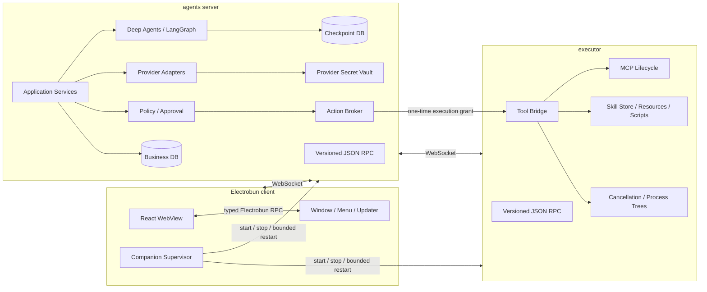
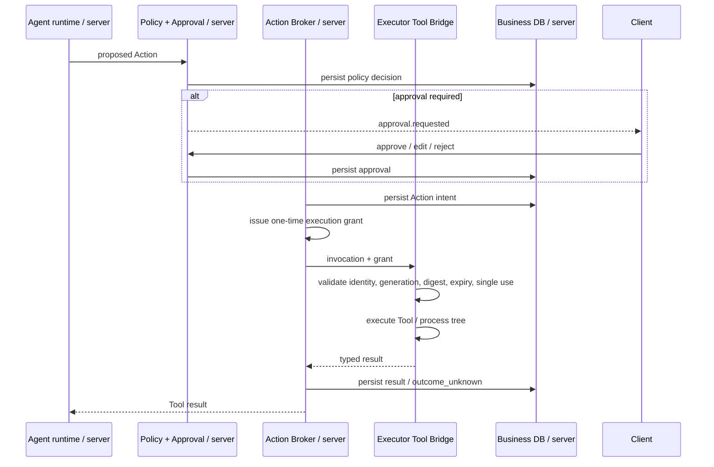

# 技术架构

> 状态：批准的目标架构；尚未完全实现
> 当前实现证据见[实施进度](./progress.md)

## 1. 架构目标

- UI、Agent 决策和本机副作用由不同应用角色承载。
- 每项持久状态和实际资源只有一个明确所有者。
- 进程断线、重启和迟到消息不能污染新的执行实例。
- 权限与审批在模型之外决定，executor 在执行前独立验证授权。
- Provider、MCP、Skills、Knowledge 和 Canvas 复用稳定协议、事件、权限和 Secret 基础设施。
- 首发为单机 macOS desktop；协议保留未来独立 client/executor 的注册能力，但不提前实现远程部署。

## 2. 术语与实现状态

本文中的“三进程”指三个**应用角色/可执行程序**：

| 角色 | 可执行程序 | 核心职责 |
| --- | --- | --- |
| Electrobun client | 桌面应用 | UI、系统集成、companion supervisor |
| agents server | Bun compiled binary | 业务数据、Provider、Agent runtime、Run、Policy/approval |
| executor | Bun compiled binary | Tool、MCP、Skill 和本机进程执行 |

Electrobun 可另有 launcher、application worker 和 WebView 等框架进程，因此不能用 PID 数量判断架构是否正确。

当前仓库代码仍是单 Electrobun Application Host 内的 Ask Chat 切片。以下图和职责描述是迁移目标，不代表 companion、WebSocket 或 registry 已存在。

## 3. 总体架构



应用协议只允许：

```text
client <-> agents server <-> executor
```

client 不提供绕过 agents server 的 executor RPC，executor 也不直接读取 client 状态、业务 DB 或 checkpoint。

## 4. 角色职责

### 4.1 Electrobun client

负责：

- React WebView、路由、表单、消息、轨迹、审批、Diff、任务中心和设置 UI。
- 窗口、菜单、通知、外链、深链、Updater、Canvas BrowserView 和桌面诊断入口。
- 主 WebView 的最小 typed Electrobun RPC、View 身份和 capability 校验。
- 启动、监管和关闭一个本地 agents server 与一个本地 executor。
- 展示 server/executor 的连接、恢复、重试和 crash-loop 状态。

不负责：

- 业务数据库或 checkpoint 写入。
- Provider 调用、Agent graph、Policy 决策或 Action intent。
- 文件、命令、Git、MCP 或 Skill 脚本的实际执行。
- 永久保存或向 WebView 返回 Secret 明文。

### 4.2 agents server

agents server 是业务事实来源，独占：

- 业务 DB、migration、backup、checkpoint 和启动 reconciliation。
- Provider/model 配置与 credential、Agent definitions/versions 及其不可变快照。
- Provider/model Secret Vault、Provider 访问和模型用量。
- Agent runtime、LangGraph thread/checkpoint、Run Scheduler、Run 状态和 durable event。
- Executor/Agent registry、可用性投影和 Run 到 executor 的调度。
- Policy Engine、审批、Allow all、Action intent/result 和 recovery decision。
- execution grant 的签发、使用状态和审计。
- Agent 对 executor resource 的稳定引用，以及从 executor 同步得到的可替换、非权威、可丢弃 inventory/capability cache。

agents server 不保存可恢复 MCP/Skill config、MCP credential/OAuth state 或 Skill 内容副本，也不直接执行文件、命令、Git、MCP Tool 或 Skill 脚本。

### 4.3 executor

executor 是本机执行事实来源，独占：

- 内置 Tool 的实际文件、命令、Git、网络或其他 host 操作。
- MCP config、credential/token/OAuth state、stdio/HTTP/SSE 连接和子进程生命周期。
- Skill installation、immutable versions、content/hash、metadata、资源和脚本。
- executor-private DB、Skill data root、`ExecutorSecretStore` 和相关本地数据。
- 持久化 `inventoryEpoch`、单调递增 `inventoryRevision`，以及带 deletion tombstone 的有界 inventory change log。
- invocation 取消、超时、输出限制、子进程组和进程树清理。
- 本 executor 的能力、健康状态和运行中 invocation registry。

executor 不拥有产品 DB/checkpoint、Agent definitions、Agent runtime、Provider 访问、Provider/model credential 或 Policy/approval。它拥有自身 MCP credential 并可在 connection/process 生命周期内加载到内存或目标 MCP child 的最小环境；每次 Tool action 仍需 server 的一次性 execution grant。

## 5. Desktop 部署与生命周期

### 5.1 当前批准的 desktop 模式

“当前 desktop 模式”指批准的部署方式，不等于代码已实现：

- client 启动并监管一个本地 agents server。
- client 启动并监管一个由当前 host environment 支持的本地 executor。
- agents server 只绑定 loopback 动态端口。
- client 与 executor 都作为 WebSocket client 连接并注册到 agents server。
- client 可通过 agents server 列出已注册 executor；desktop 首版通常只有一个。
- 多个 Agent 绑定同一 executor，关系为 **Agent N:1 Executor**。

### 5.2 启动

1. client 生成新的 client `instanceId`/`generation`，启动 agents-server binary。
2. agents server 取得动态 loopback 端口，通过受控 bootstrap 返回 endpoint、protocol range 和分别绑定 client/executor 的一次性注册材料。
3. agents server 打开业务 DB/checkpoint，完成 migration 或开发期 reset，并恢复 registry 投影。
4. client 连接并用稳定 `clientId` 注册。
5. client 启动 executor；executor 生成新的 `instanceId`/`generation`，连接并用稳定 `executorId` 注册能力。
6. agents server 先将 executor 标为 `syncing`，立即调用 `inventory.getSnapshot()` 并原子替换本地 cache。
7. full sync 成功后 agents server 才将 executor 标为 online/runnable；绑定它的 Agent 才可启动新 Run。

bootstrap 只负责发现本地 endpoint 和首个认证材料，不承载业务 RPC。

### 5.3 正常退出

1. client 请求 agents server 停止接受新 Run。
2. agents server 持久化 shutdown intent，取消或中断活动 Run，并要求 executor 停止 invocation。
3. executor 终止受管进程树、关闭 MCP/Skill 资源并回报完成。
4. agents server flush event/checkpoint/DB 后关闭。
5. client 等待两个 companion 在有界超时内退出；只有超时后才升级终止。

client 不应在退出时把仍有副作用结果未对账的 Run 伪装为正常完成。

### 5.4 异常与重启

- companion 异常退出由 client 使用有上限的指数退避重启；每个角色分别计数。
- 达到上限后停止自动重启，进入明确的 recovery UX，允许重试、重置开发数据或导出诊断。
- agents server 重启后从 DB/checkpoint 恢复；client/executor 使用稳定 ID 和新的 instance/generation 重新注册。
- executor 离线时，其 Agent 不能启动新 Run。已执行中的 Run 由 server 标记 interrupted/recovery-required，不假设 Tool 未发生。
- client/WebView 重连不改变 server 中的 Run 所有权；按 durable event cursor 补齐。
- 旧 instance/generation 的连接、callback、grant 或 result 一律拒绝。

## 6. 身份、注册与可用性

### 6.1 身份层级

| 字段 | 生命周期 | 用途 |
| --- | --- | --- |
| `clientId` | 安装级稳定 | client 逻辑身份，重连/重启保留 |
| `executorId` | executor 配置级稳定 | Agent 绑定、能力和历史关联 |
| `instanceId` | 每次进程启动/连接注册新建 | 区分并发或迟到实例 |
| `generation` | 稳定身份下单调递增 | 解决新旧实例竞争 |
| `connectionId` | 单 WebSocket | 观测与连接级背压 |

server 只承认某稳定身份的最高有效 generation。`instanceId` 不复用；断线重连也必须产生新的连接身份并重新注册。

### 6.2 注册

client 注册声明 UI/API capability；executor 注册声明 host platform、Tool/MCP/Skill capability、并发限制和版本。server 校验：

- protocol/version overlap。
- bootstrap 或后续认证材料。
- stable ID、instance ID、generation 和角色。
- binary/build compatibility。
- capability Schema 和大小上限。

注册成功后 server 返回当前 server instance、协商版本、heartbeat/lease 参数和可见 registry snapshot。每次 executor connection/registration 接受后都进入 `syncing`，不能复用上次连接的 cache 直接标记 runnable。

### 6.3 Agent 与 Executor

- Agent 定义和版本由 server 持久化，并包含 `executorId` 绑定。
- 当前 desktop 自动创建/选择唯一 local executor；UI 仍从 server registry 读取，而不是硬编码“本机总是在线”。
- executor syncing/offline 时可以查看 Agent、Session 和历史 Run，但不能启动新 Run。
- 未来 executor 可独立启动和注册；client 可列出并选择已登记 executor。远程调度、配对、TLS、租户和网络信任模型另立 ADR。

### 6.4 Inventory 同步与对账

executor 仍是 MCP/Skill/config/credential 的唯一 source of truth；server inventory 只是 discovery/reconciliation cache：

1. executor 在自己的 DB 中持久化 opaque `inventoryEpoch` 和该 epoch 内单调递增的 `inventoryRevision`。普通进程重启保留 epoch/revision；inventory store reset/recreate 才生成新 epoch。
2. 每次 MCP/Skill config、lifecycle descriptor、Tool schema 或 executor capability 变化时，executor 在同一持久化 transaction 中更新权威状态、递增 revision，并追加 change record；删除使用 tombstone。有界 log 可压缩，并公开最早可增量读取的 revision。
3. commit 后 executor 发送轻量 `inventory.changed` hint；payload 只含 epoch、最新 revision 和 category，不含 resource config、Tool schema body、credential、环境值或 Skill 内容。
4. server 对 hint 去抖后调用 `inventory.getChanges(sinceRevision, cursor)`，分页拉取并原子应用同一 epoch 的连续变化。
5. 无论是否收到 hint，server 都为每个 online executor 每 60 秒执行一次增量 reconciliation，并使用独立的 ±20% random jitter，即每次间隔在 48–72 秒内。
6. revision gap、change log 已压缩、epoch 变化/reset、invalid cursor 或无法证明连续性时，server 调用 `inventory.getSnapshot()` 并原子替换整个 cache。
7. executor offline 时 cache 只标记 stale，不清空。hint/poll/RPC 失败不能解释为 resource deletion；删除只来自有效 tombstone 或成功 full snapshot 的原子替换。

每次 connection/registration/reconnect 都强制立即 full sync；完成前 registry 状态是 `syncing`，assigned Agent 不 runnable。client-routed MCP/Skill mutation 返回 executor commit 后的 epoch/revision，server 随即增量拉取到该位置以 read its own write；同步暂时失败时保留 persisted mutation result，但 cache 标记 stale，不能伪造 descriptor 或删除。

cache 只可包含 stable resource ID、version/hash、MCP Tool schema、health、executor capability 和 redacted `credentialConfigured` 状态。token、sensitive env、recoverable MCP config、完整 `SKILL.md`/resources、executor secret locator 一律禁止进入 snapshot/change/hint/cache。

Run start/restore 仍通过 live executor RPC 验证每个 assigned resource 的 owner/version/hash 和当前 Tool schema。inventory polling 只用于 discovery/reconciliation，既不是授权，也不能替代 Policy/approval/execution grant。

## 7. RPC 拓扑与协议

### 7.1 Transport

- application transport 使用 WebSocket。
- payload 使用 versioned JSON RPC；请求、响应、notification 和 stream event 都由共享 Zod schema 校验。
- desktop agents server 只监听 loopback 动态端口，不使用固定公开端口。
- 长 Run 由快速 `accepted` 响应加事件流表示，不用无限 RPC timeout。
- 每条连接有最大 frame、in-flight、队列和 backpressure 限制。

### 7.2 信封

```ts
interface RpcEnvelope<T> {
  protocolVersion: number;
  requestId?: string;
  method: string;
  sender: {
    role: "client" | "agents_server" | "executor";
    stableId: string;
    instanceId: string;
    generation: number;
  };
  payload: T;
}
```

所有跨角色消息显式携带 correlation ID；Run/Tool/Action 消息还必须携带 `runId`、`toolCallId`、`actionId` 或 `invocationId`。角色不能依赖 UI 当前选择或连接顺序推断业务身份。

### 7.3 未来扩展缝

协议允许未来：

- client 与 executor 独立启动后向既有 agents server 注册。
- 一个 client 列出多个 executor。
- Docker、cloud VM 或 remote-server transport adapter。

当前范围不包含远程 discovery、配对、TLS/PKI、多租户、NAT 穿透、云调度或容器编排。不得为“未来远程”提前弱化 desktop loopback 和最小权限默认值。

## 8. Agent runtime、Provider 与持久化

### 8.1 Agent runtime

Deep Agents/LangGraph 只运行在 agents server：

- `threadId` 对应持久 LangGraph thread，`runId` 对应一次应用执行。
- server 的 Run Registry 只保存活动 graph/Provider/interrupt handle；DB、checkpoint、Run 状态和事件才是可恢复事实。
- `AgentFactory` 解析 Agent、Session、Project、Provider、executor capability 及稳定 MCP/Skill resource refs，生成不可变 effective config snapshot。
- Ask/Plan/Agent 的有效 Tool 集由 server 强制裁剪。
- Deep Agents stream 先转换为稳定 `AppRunEvent`，持久化后再推送 client。

### 8.2 Provider

- Provider adapter、连接测试、模型调用、用量和错误归一化属于 agents server。
- Provider/model Secret 从 server Secret Vault 按 Run scope 读取，不进入 client 或 executor。
- MCP credential/token/OAuth state 由 owning executor 的 `ExecutorSecretStore` 管理；server 只路由不落盘的设置 command，不保存 recoverable copy。

### 8.3 数据所有权

```text
appData/
├── database/app.db          # agents server
├── database/checkpoints.db  # agents server
├── attachments/             # agents server 管理的产品资产
├── change-blobs/            # agents server 管理的 Action 记录
├── canvas/                  # client/server 受控产品资产
├── executors/<executorId>/  # local executor private root，0700
│   ├── executor.db          # MCP/Skill state + inventory epoch/revision/change log
│   ├── skills/              # immutable Skill version content/resources
│   └── secrets/             # local ExecutorSecretStore files，0600
└── logs/                    # 各角色独立写，诊断时汇总
```

- `app.db` 和 checkpoint DB 都只有 agents server writer。
- executor 不打开产品 DB；`executor.db` 只由 owning executor 写入，server 不把 inventory cache 当作恢复来源。
- server 先持久化 event/Action result，再向 client 发布。
- local executor root 使用 `0700`，credential file 使用 `0600`，写入采用临时文件 + atomic replace，并检查 owner；拒绝 symlink，平台支持时使用 no-follow。
- 该本地文件基线只防范其他普通 OS 用户，不防范同账户 malware、root、磁盘 snapshot 或 backup。`ExecutorSecretStore` Port 允许其他 executor 改用 Keychain、Docker Secret 或 cloud secret manager。
- 本次开发期重构无需迁移现有 DB/checkpoint；不兼容时明确重置，不能静默误读。

## 9. Tool Bridge、Action Broker 与授权

### 9.1 请求流程



### 9.2 一次性 execution grant

grant 至少绑定：

- `grantId`、`actionId`、`invocationId`、`runId`、`toolCallId`。
- 目标 `executorId` 及其当前 instance/generation。
- action type、参数摘要、能力、路径/网络范围和风险决策摘要。
- 签发/过期时间、单次使用 nonce 和 protocol version。

executor 必须拒绝过期、重复、目标不匹配、参数摘要变化、旧 generation 或未认证 server 连接上的 grant。执行结果必须带回 `grantId`/`invocationId`；server 才能完成 Action result。

### 9.3 恢复

- server 在发送 invocation 前持久化 intent。
- executor 断线且结果未知时，server 将 Action 标为 `outcome_unknown`。
- pure/idempotent Action 可按策略验证后重试；non-idempotent Action 不自动重放。
- grant 不跨 executor restart 复用；恢复需 server 重新决策并签发新 grant。

## 10. MCP 与 Skills

### 10.1 MCP

- executor 是其 MCP config、credential/token/OAuth state、lifecycle、Tool inventory 和本地数据的唯一 source of truth。
- client 提供完整 MCP UI；command 先到 server 做 client/executor identity、Agent binding 和产品授权校验，再路由到选定 executor。executor 持久化后返回 redacted result 与新的 inventory epoch/revision，server 立即按第 6.4 节拉取到该 revision。
- executor offline 时 command 明确失败；server 可展示标为 stale 的 inventory cache，但不能据此编辑、恢复配置或返回 success。
- server 只保存 Agent resource refs 和可替换、非权威、可丢弃的 redacted inventory/capability cache，不保存 MCP config、Secret Ref、credential 或 OAuth state。
- Agent runtime 只从 server 获得规范化 ToolDefinition；每次调用仍经过 Policy/approval、Action intent 和 execution grant。
- executor 从自己的 `ExecutorSecretStore` 加载 credential；stdio MCP 只向目标 child 注入最小环境，不修改 executor 全局环境，也不传给无关 child/Agent。
- HTTP MCP 可在可行时按 request 注入凭证，但这是优化，不是所有 transport 的统一要求。
- query RPC、inventory、UI、prompt、日志、诊断和 export 永不返回 MCP credential。
- executor 可在 connection/process 生命周期内持有 credential reference；撤销、过期或 MCP shutdown 必须关闭资源并释放引用。JavaScript runtime 不保证可靠清零 string memory。
- executor-owned credential 只解决 MCP 认证，不授予 Tool 权限；连接保持 authenticated 时，每次 Tool execution 仍需新的、一次性 execution grant。

### 10.2 Skills

- executor 是 Skill installation、immutable version、content/hash、metadata、resources/scripts 和本地数据的唯一 source of truth。
- client 提供完整 Skill UI；command 经 server 校验 client/executor identity 与产品授权后路由到 executor，只有 executor 持久化成功后才返回 redacted result/inventory epoch/revision，并触发 server read-own-write reconciliation。
- Agent version 只保存 owning `executorId + stableSkillId + version + contentHash`；同一 Agent 不能引用其他 executor 的 MCP/Skill。
- server 构建或恢复 Agent 时，按稳定 ref 从 executor 获取 metadata 与 `SKILL.md` 并验证 version/hash；offline、missing 或 mismatch 均 fail closed。
- fetched Skill content 只用于内存中的 prompt assembly；Agent version、Run config snapshot、checkpoint、event、backup、inventory 和 diagnostics 都不保存可恢复正文，恢复时重新按 ref 获取。
- server 可缓存 replaceable inventory/descriptor snapshot，但不能把它当作 Skill 恢复副本。
- references/assets/scripts 的读取或执行继续通过 executor；Skill 不能借 `allowed-tools` 绕过 Policy 或 grant。
- executor offline 时，依赖其 Skill 的 Agent 不得以缺失内容的方式静默启动。

## 11. Canvas

- 主 WebView 只编辑和展示受控产品状态。
- Web Canvas 使用独立 sandbox BrowserView/partition，不注册业务 RPC。
- Canvas 不能直接连接 executor；任何文件、网络或脚本能力都必须经 agents server Policy 和 executor grant。
- 默认断网、CSP、导航、下载和本地资源隔离仍是发布阻断项。

## 12. 构建、打包与版本

- `agents-server` 和 `executor` 都使用 TypeScript strict + Bun，编译为目标架构二进制。
- 两个 companion 与 Electrobun client 来自同一 release，随应用打包、签名、校验和更新。
- 启动注册必须比较 client/server/executor build 与 protocol compatibility；未知组合 fail closed。
- stable 产物不得依赖用户安装 Bun/Node，也不得运行时下载 companion。
- package smoke 必须证明 companion 可执行权限、路径、签名、动态库、loopback 和协作退出均正常。

## 13. 安全边界

- 三角色均为受信任应用代码；拆进程提供故障和职责隔离，不等于完整 OS sandbox。
- WebView 仍按不可信处理，只能通过 client 的领域 RPC。
- agents server 的 Policy/approval 是授权事实来源；executor 的 grant validation 是执行前最后一道强制门。
- executor-owned MCP credential/config 与 execution grant 是正交状态：前者维持连接认证，后者逐次授权 Tool execution。
- executor 的文件根、命令解析、环境、网络、输出和进程树约束不能仅依赖 grant 字符串。
- RPC 加密/认证不能代替 Schema、角色、stable identity、instance/generation、capability 和业务状态校验。
- loopback 不等于可信；本机其他进程不得仅凭端口即可注册或调用。

## 14. 架构验收

旧 ARC-011“Phase 0 决定保持 in-process 或条件性 sidecar”已废止；三角色是批准基线。

| ID | 验收 |
| --- | --- |
| ARC-001 | packaged desktop 同时包含可启动的 client、agents-server 和 executor；框架额外 PID 不影响角色识别 |
| ARC-002 | 业务应用 RPC 只有 `client <-> server <-> executor`，不存在 client 直连 executor 的特权路径 |
| ARC-003 | desktop server 只绑定动态 loopback；未认证本机进程不能注册或调用 |
| ARC-004 | stable ID 在重连/重启后保持，旧 instance/generation 的消息、result 和 grant 被拒绝 |
| ARC-005 | agents server 是产品 DB/checkpoint、Provider/model、Agent、Run/event、Policy/approval/Action 的唯一写入所有者 |
| ARC-006 | 每个 executor 是其 MCP config/credential/OAuth/lifecycle、Skill immutable content/resources、Tool/进程树和 private data 的唯一 source of truth |
| ARC-007 | 一个本地 executor 可承载多个 Agent；offline 时相关 Agent 不能启动新 Run |
| ARC-008 | policy/approval/intent 先持久化，executor 只执行有效的一次性 grant，重复或篡改 grant 被拒绝 |
| ARC-009 | Agent 只引用 assigned executor 的稳定 MCP/Skill resource；server 按 version/hash 获取 Skill metadata/`SKILL.md`，missing/mismatch fail closed |
| ARC-010 | client 协作关闭两个 companion；异常退出使用 capped backoff，达到上限后进入 recovery UX |
| ARC-012 | server/executor 分别被 kill 后，Run/Action 能进入确定的 completed/interrupted/outcome_unknown 状态，不盲目重复副作用 |
| ARC-013 | 两个 TypeScript + Bun companion 在签名产物中可执行、可握手、可更新，终端用户无需安装 runtime |
| ARC-014 | 当前实现与目标差距始终在 progress 文档中明确，不用现有单进程 Ask 测试替代目标架构验收 |
| ARC-015 | Provider/model credential 从不进入 executor；MCP credential 只在 executor private store/目标 process memory 中使用，永不经 query/UI/prompt/log/diagnostic/export 暴露 |
| ARC-016 | client MCP/Skill command 经 server 校验后路由；executor offline 或持久化失败时不返回成功，server snapshot 不能恢复 executor config |
| ARC-017 | 每次 executor 注册/重连先 full inventory sync；epoch/revision、hint、60 秒 ±20% poll、delta/tombstone 和 snapshot fallback 可收敛且 cache 可丢弃 |
| ARC-018 | syncing/offline cache 标为 stale 且失败 poll 不代表删除；Run start/restore 仍 live 验证 resource/version/hash，inventory 不构成授权 |
