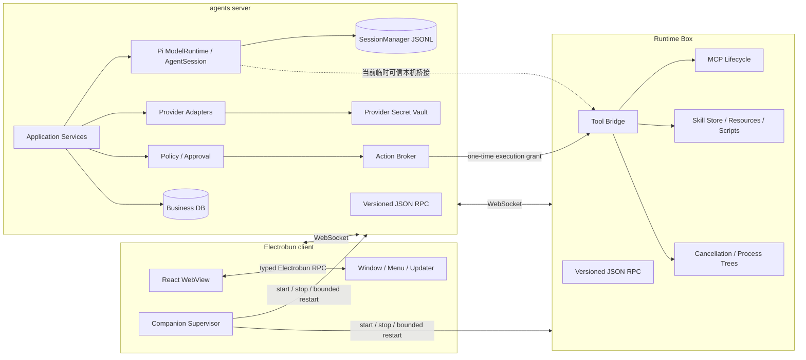
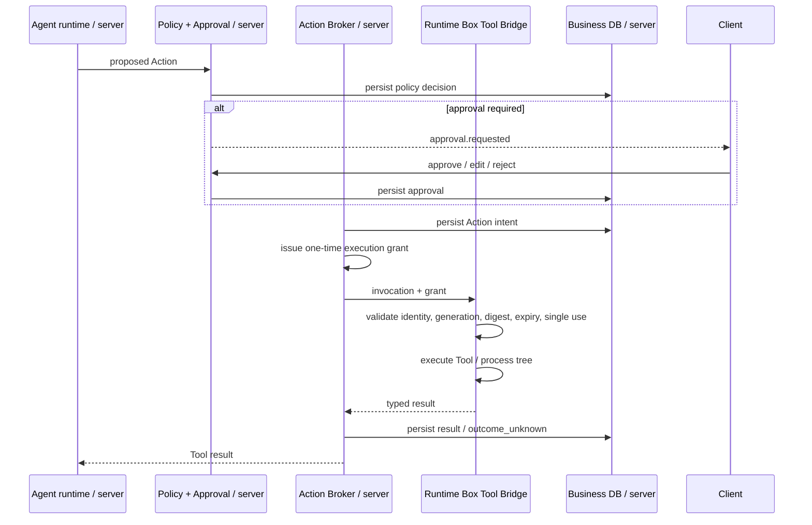

# 技术架构

> 状态：本地三角色与七个 Runtime Box-only Tool 已实现；Runtime Box 目标架构已批准，Remote 连接尚未实现
> 当前实现证据见[实施进度](./progress.md)

## 1. 架构目标

- UI、Agent 决策和本机副作用由不同应用角色承载。
- 每项持久状态和实际资源只有一个明确所有者。
- 进程断线、重启和迟到消息不能污染新的执行实例。
- 权限与审批在模型之外决定，Runtime Box 在执行前独立验证授权。
- Provider、MCP、Skills、Knowledge 和 Canvas 复用稳定协议、事件、权限和 Secret 基础设施。
- Local Runtime Box 随 desktop 交付；Remote Runtime Box 通过 Agent Server 管理的 Dev Tunnel 分阶段实现。

## 2. 术语与实现状态

本文中的“三进程”指三个**应用角色/可执行程序**：

| 角色 | 可执行程序 | 核心职责 |
| --- | --- | --- |
| Electrobun client | 桌面应用 | UI、系统集成、companion supervisor |
| agents server | Bun compiled binary | 业务数据、Provider、Agent runtime、Run、Policy/approval、Server-owned MCP |
| Runtime Box | Bun compiled binary | 设备级 Tool、Box-owned MCP、Skill；内部 Executor 管理实际进程 |

Electrobun 可另有 launcher、application worker 和 WebView 等框架进程，因此不能用 PID 数量判断架构是否正确。

当前 desktop 已监管 agents-server 和 Runtime Box 两个 compiled companion。Agent、Provider、产品 DB 和 Pi Session
在 agents server；`read`、`bash`、`edit`、`write`、`grep`、`find`、`ls` 只在 Runtime Box 执行。下图中的
Policy、Action Broker、execution grant、MCP 和 Skill 仍是目标能力；当前七工具使用第 9 节记录的临时可信本机桥接。

## 3. 总体架构



应用协议只允许：

```text
client <-> agents server <-> Runtime Box
```

client 不提供绕过 agents server 的 Runtime Box RPC，Runtime Box 也不直接读取 client 状态、产品 DB 或 Pi Session JSONL。

## 4. 角色职责

### 4.1 Electrobun client

负责：

- React WebView、路由、表单、消息、轨迹、审批、Diff、任务中心和设置 UI。
- 窗口、菜单、通知、外链、深链、Updater、Canvas BrowserView 和桌面诊断入口。
- 主 WebView 的最小 typed Electrobun RPC、View 身份和 capability 校验。
- 启动、监管和关闭一个本地 agents server 与一个本地 Runtime Box。
- 展示 server/Runtime Box 的连接、恢复、重试和 crash-loop 状态。

不负责：

- 产品数据库或 Pi Session JSONL 写入。
- Provider 调用、Agent runtime、Policy 决策或 Action intent。
- 文件、命令、Git、MCP 或 Skill 脚本的实际执行。
- 永久保存或向 WebView 返回 Secret 明文。

### 4.2 agents server

agents server 是业务事实来源，独占：

- 产品 DB、migration、backup、Pi Session JSONL 和启动 reconciliation。
- Provider/model 配置与 credential、Agent definitions/versions 及其不可变快照。
- Provider/model Secret Vault、Provider 访问和模型用量。
- 公开 Pi `ModelRuntime`、headless `AgentSession`、Run Scheduler、Run 状态和 durable event。
- Runtime Box/Agent registry、可用性投影和 Run 到 Runtime Box 的调度。
- Policy Engine、审批、Allow all、Action intent/result 和 recovery decision。
- execution grant 的签发、使用状态和审计。
- Agent 对 Runtime Box resource 的稳定引用，以及从 Runtime Box 同步得到的可替换、非权威、可丢弃 inventory/capability cache。
- Agent Server-owned MCP config、credential、Tool inventory、连接/子进程生命周期和 Agent global refs。
- Agent Server-owned prompt-only Skill installation、immutable `SKILL.md`、metadata 和 Agent global refs。

agents server 不保存可恢复的 **Runtime Box-owned** MCP/Skill config、credential/OAuth state 或 Skill 内容副本，也不直接执行文件、命令、Git 或 Skill 脚本。Server-owned MCP Tool 只能通过本地 Action dispatcher 调用。

### 4.3 Runtime Box 与内部 Executor

Runtime Box 是其安装设备上的执行与扩展资源事实来源，内部 Executor 独占：

- 内置 Tool 的实际文件、命令、Git、网络或其他 host 操作。
- Box-owned MCP config、credential/token/OAuth state、stdio/HTTP/SSE 连接和子进程生命周期。
- Box-owned Skill installation、immutable versions、content/hash、metadata、资源和脚本。
- Runtime Box private DB、Skill data root、`ExecutorSecretStore` 和相关设备数据。
- 持久化 `inventoryEpoch`、单调递增 `inventoryRevision`，以及带 deletion tombstone 的有界 inventory change log。
- invocation 取消、超时、输出限制、子进程组和进程树清理。
- 本 Runtime Box 的能力、健康状态和运行中 invocation registry。

Runtime Box 不拥有产品 DB/Pi Session JSONL、Agent definitions、Agent runtime、Provider 访问、Provider/model
credential 或 Policy/approval。它拥有自身 Box-owned MCP credential 并可在 connection/process 生命周期内加载到
内存或目标 MCP child 的最小环境；每次 Tool action 仍需 server 的一次性 execution grant。

Remote Runtime Box、Tunnel、配对、切换和跨设备恢复以
[Runtime Box 技术与实施方案](./runtime-box.md)为准。

## 5. Desktop 部署与生命周期

### 5.1 当前批准的 desktop 模式

当前 desktop 模式已经实现 companion 生命周期、认证连接和唯一 local Runtime Box 的七工具执行；持久
Agent N:1 binding 与 inventory 尚未实现：

- client 启动并监管一个本地 agents server。
- client 启动并监管一个由当前 host environment 支持的本地 Runtime Box。
- agents server 只绑定 loopback 动态端口。
- client 与 Runtime Box 都作为 WebSocket client 连接并注册到 agents server。
- agents server 只向当前已认证且已注册的唯一 Runtime Box peer 路由 Tool invocation；断线或连接替换会取消旧 peer
  上的活动调用，迟到 progress/result 不会路由到新连接。
- client 可通过 agents server 列出已注册 Runtime Box；desktop 首版通常只有一个。
- Agent 与 Provider 全局共享；每个 `agentId + runtimeBoxId` 形成 Runtime Profile，多个 profile 可引用同一 Box。

### 5.2 启动

1. client 生成新的 client `instanceId`/`generation`，启动 agents-server binary。
2. agents server 取得动态 loopback 端口，通过受控 bootstrap 返回 endpoint、protocol range 和分别绑定 client/Runtime Box 的一次性注册材料。
3. agents server 打开产品 DB 和 `agentDataDirectory`，恢复 Provider registry、Pi Session 与产品投影。
4. client 连接并用稳定 `clientId` 注册。
5. client 启动 Runtime Box；Runtime Box 生成新的 `instanceId`/`generation`，连接并用稳定 `runtimeBoxId` 注册能力。
6. agents server 先将 Runtime Box 标为 `syncing`，立即调用 `inventory.getSnapshot()` 并原子替换本地 cache。
7. full sync 成功后 agents server 才将 Runtime Box 标为 online/runnable；绑定它的 Agent 才可启动新 Run。

bootstrap 只负责发现本地 endpoint 和首个认证材料，不承载业务 RPC。

### 5.3 正常退出

1. client 请求 agents server 停止接受新 Run。
2. agents server 持久化 shutdown intent，取消或中断活动 Run，并要求 Runtime Box 停止 invocation。
3. Runtime Box 终止受管进程树、关闭 MCP/Skill 资源并回报完成。
4. agents server flush event、dispose Pi Session 并关闭产品 DB。
5. client 等待两个 companion 在有界超时内退出；只有超时后才升级终止。

client 不应在退出时把仍有副作用结果未对账的 Run 伪装为正常完成。

### 5.4 异常与重启

- companion 异常退出由 client 使用有上限的指数退避重启；每个角色分别计数。
- 达到上限后停止自动重启，进入明确的 recovery UX，允许重试、重置开发数据或导出诊断。
- agents server 重启后从产品 DB 与 Pi Session JSONL 恢复；client/Runtime Box 使用稳定 ID 和新的
  instance/generation 重新注册。
- Runtime Box 离线时，其 Agent 不能启动新 Run。已执行中的 Run 由 server 标记 interrupted/recovery-required，不假设 Tool 未发生。
- client/WebView 重连不改变 server 中的 Run 所有权；按 durable event cursor 补齐。
- 旧 instance/generation 的实时连接、callback、grant 和在线 result 一律拒绝；断线期间已执行 Action
  只能通过按 `actionId + grantId + invocationId` 去重的独立 outcome reconciliation 作为证据提交。

## 6. 身份、注册与可用性

### 6.1 身份层级

| 字段 | 生命周期 | 用途 |
| --- | --- | --- |
| `clientId` | 安装级稳定 | client 逻辑身份，重连/重启保留 |
| `runtimeBoxId` | Runtime Box 配置级稳定 | Session/Project、能力、资源和历史关联 |
| `instanceId` | 每次进程启动/连接注册新建 | 区分并发或迟到实例 |
| `generation` | 稳定身份下单调递增 | 解决新旧实例竞争 |
| `connectionId` | 单 WebSocket | 观测与连接级背压 |

server 只承认某稳定身份的最高有效 generation。`instanceId` 不复用；断线重连也必须产生新的连接身份并重新注册。

### 6.2 注册

client 注册声明 UI/API capability；Runtime Box 注册声明 host platform、Tool/MCP/Skill capability、并发限制和版本。server 校验：

- protocol/version overlap。
- bootstrap 或后续认证材料。
- stable ID、instance ID、generation 和角色。
- binary/build compatibility。
- capability Schema 和大小上限。

注册成功后 server 返回当前 server instance、协商版本、heartbeat/lease 参数和可见 registry snapshot。每次 Runtime Box connection/registration 接受后都进入 `syncing`，不能复用上次连接的 cache 直接标记 runnable。

### 6.3 Agent 与 Runtime Box

- Agent 与 Provider 全局持久化；`agentId + runtimeBoxId` 形成 Runtime Profile。
- 当前 desktop 自动创建 Local Runtime Box；目标 registry 可同时管理多个 Local/Remote Box。
- Box syncing/offline 时可以查看 Session、Project 和历史 Run，但不能启动新 Run。
- Remote 调度、配对和网络信任模型见[Runtime Box 技术与实施方案](./runtime-box.md)。

### 6.4 Inventory 同步与对账

Runtime Box 仍是其 Box-owned MCP/Skill/config/credential 的唯一 source of truth；server inventory 只是 discovery/reconciliation cache：

1. Runtime Box 在自己的 DB 中持久化 opaque `inventoryEpoch` 和该 epoch 内单调递增的 `inventoryRevision`。普通进程重启保留 epoch/revision；inventory store reset/recreate 才生成新 epoch。
2. 每次 MCP/Skill config、lifecycle descriptor、Tool schema 或 Runtime Box capability 变化时，Runtime Box 在同一持久化 transaction 中更新权威状态、递增 revision，并追加 change record；删除使用 tombstone。有界 log 可压缩，并公开最早可增量读取的 revision。
3. commit 后 Runtime Box 发送轻量 `inventory.changed` hint；payload 只含 epoch、最新 revision 和 category，不含 resource config、Tool schema body、credential、环境值或 Skill 内容。
4. server 对 hint 去抖后调用 `inventory.getChanges(sinceRevision, cursor)`，分页拉取并原子应用同一 epoch 的连续变化。
5. 无论是否收到 hint，server 都为每个 online Runtime Box 每 60 秒执行一次增量 reconciliation，并使用独立的 ±20% random jitter，即每次间隔在 48–72 秒内。
6. revision gap、change log 已压缩、epoch 变化/reset、invalid cursor 或无法证明连续性时，server 调用 `inventory.getSnapshot()` 并原子替换整个 cache。
7. Runtime Box offline 时 cache 只标记 stale，不清空。hint/poll/RPC 失败不能解释为 resource deletion；删除只来自有效 tombstone 或成功 full snapshot 的原子替换。

每次 connection/registration/reconnect 都强制立即 full sync；完成前 registry 状态是 `syncing`，assigned Agent 不 runnable。client-routed MCP/Skill mutation 返回 Runtime Box commit 后的 epoch/revision，server 随即增量拉取到该位置以 read its own write；同步暂时失败时保留 persisted mutation result，但 cache 标记 stale，不能伪造 descriptor 或删除。

cache 只可包含 stable resource ID、version/hash、MCP Tool schema、health、Runtime Box capability 和 redacted `credentialConfigured` 状态。token、sensitive env、recoverable MCP config、完整 `SKILL.md`/resources、Runtime Box secret locator 一律禁止进入 snapshot/change/hint/cache。

Run start/restore 仍通过 live Runtime Box RPC 验证每个 assigned resource 的 owner/version/hash 和当前 Tool schema。inventory polling 只用于 discovery/reconciliation，既不是授权，也不能替代 Policy/approval/execution grant。

## 7. RPC 拓扑与协议

### 7.1 Transport

- application transport 使用 WebSocket。
- payload 使用 versioned JSON RPC；请求、响应、notification 和 stream event 都由共享 Zod schema 校验。
- Product RPC 只监听 loopback 动态端口；Runtime ingress 使用独立 loopback 固定端口，并只由 Agent Server
  管理的 Dev Tunnel 暴露。
- 长 Run 由快速 `accepted` 响应加事件流表示，不用无限 RPC timeout。
- 每条连接有最大 frame、in-flight、队列和 backpressure 限制。

### 7.2 信封

```ts
interface RpcEnvelope<T> {
  protocolVersion: number;
  requestId?: string;
  method: string;
  sender: {
    role: "client" | "agents_server" | "runtime-box";
    stableId: string;
    instanceId: string;
    generation: number;
  };
  payload: T;
}
```

所有跨角色消息显式携带 correlation ID；Run/Tool/Action 消息还必须携带 `runId`、`toolCallId`、`actionId` 或 `invocationId`。角色不能依赖 UI 当前选择或连接顺序推断业务身份。

### 7.3 Remote Runtime Box 与未来扩展缝

协议允许未来：

- Runtime Box 独立启动后向既有 agents server 注册。
- Client 可列出并切换多个 Runtime Box。
- Docker、cloud VM 或 remote-server transport adapter。

当前范围包含基于 Anonymous Dev Tunnel 的 Remote Runtime Box 和 Moshu 设备配对；Mobile Client、多租户、
云调度和容器编排仍后置。Runtime ingress 不能弱化 Product RPC 的 loopback 和最小权限默认值。

### 7.4 Browser-safe RPC core（Mobile stack Layer 1）

为给未来 Mobile Client（WKWebView / Capacitor）预留 transport，RPC 实现拆成两层，保持现有 Bun
server/client 行为与 API 完全兼容：

- `@moshu/process-rpc-core`：transport-neutral、**无任何 Node/Bun 依赖**的核心。包含 protocol/envelope
  的 Zod schema、`RpcPeer`、limits、JSON structure guard、errors/callback helper、generation fence、
  WebSocket close-reason util，以及 `RpcSocketTransport` transport 接口。该包用一个 browser tsconfig
  （`lib: ["ES2023","DOM"]`、`types: []`）编译，并有运行期源码扫描测试，双重证明核心不引入
  `node:*` import、`Bun.*`、`Buffer`、`process.*` 或 raw `ws`。
- `@moshu/process-rpc`：Node/Bun **adapter**。保留 authentication（`node:crypto`）、raw TCP/TLS/ws
  client、Bun `serve` server，并从 core re-export 全部公共符号，因此所有现有 consumer 仍从
  `@moshu/process-rpc` import，零改动。
- `RpcSocketTransport` 是 core 与具体传输之间的唯一缝：Bun server、Node/Bun raw client 各自实现它；
  未来 Swift/Capacitor bridge 只需实现同一个 `send/close/terminate/isOpen` 契约即可承载 RPC 帧，无需
  引入原生 socket/crypto/WebSocket 库。本层**不**实现 iOS plugin。

## 8. Agent runtime、Provider 与持久化

### 8.1 Agent runtime

公开 Pi runtime 只运行在 agents server：

- `ModelRuntime` 动态提供 builtin/custom Provider 与模型能力；公共合同不暴露 SDK 类型。
- 默认 Chat 通过 `PiAgentRuntime` 和 `createAgentSession` 构造 headless Agent Session。固定
  `noTools: "builtin"`，并禁用 extensions、Skills、prompt templates、themes、context files 和 TUI。
- runtime 只注册七个 SDK custom proxy：`read`、`bash`、`edit`、`write`、`grep`、`find`、`ls`；启动时验证
  active/configured Tool 恰好是这七个且来源为 SDK。缺失、额外或 built-in Tool 均 fail closed。
- custom proxy 不读取文件或启动进程，只把严格参数、`runId`、`toolCallId`、`invocationId`、cwd、progress 和
  cancellation 交给 agents-server Runtime Box gateway。
- 产品 Session 保存稳定 `piSessionId`；`SessionManager` 在 `agentDataDirectory/sessions` 保存和恢复 JSONL context。
- server 的 active registry 只保存当前 runtime、abort 与 lease；产品 DB 保存 Run/event projection，Pi JSONL
  保存 conversation context。进程崩溃后的非终态 Run会被终结，不宣称中点续跑。
- Pi stream 转换为稳定 `AppRunEvent`，先持久化再推送 client；Tool 过程当前不扩展公开 UI event。

### 8.2 Provider

- builtin Provider 由 `ModelRuntime` 动态枚举；custom Provider 只允许四种已批准 public Pi API family。
- API Key/OAuth 由 public `Models` auth 操作和异步 auth attempt 驱动，不占用交互式 RPC。
- Provider credential 从 app-owned `SecretVaultCredentialStore` 按 Run scope 读取，不进入 client 或 Runtime Box。
- `ThinkingLevel` 按当前模型能力验证；能力刷新后不再支持的已保存档位在运行时安全省略。
- Server-owned MCP credential 由 server MCP SecretStore 管理；Box-owned credential/token/OAuth state 由 owning Runtime Box `ExecutorSecretStore` 管理，二者不跨 owner 复制。

### 8.3 数据所有权

```text
agentDataDirectory/
├── product.db               # agents server Product DB
├── sessions/                # Pi SessionManager JSONL
├── credentials.json         # Provider credential vault，0600
├── mcp-secrets/             # Agent Server-owned MCP SecretStore，0600
├── mcp-workspaces/          # Agent Server-owned stdio MCP 默认 cwd，0700
├── provider-registry.json   # secret-free builtin/custom preferences
├── attachments/             # agents server 管理的产品资产
├── change-blobs/            # agents server 管理的 Action 记录
├── canvas/                  # client/server 受控产品资产
├── runtime-boxes/<runtimeBoxId>/  # local Runtime Box private root，0700
│   ├── runtime-box.db          # MCP/Skill state + inventory epoch/revision/change log
│   ├── skills/              # immutable Skill version content/resources
│   └── secrets/             # local ExecutorSecretStore files，0600
└── logs/                    # 各角色独立写，诊断时汇总
```

- Product DB 和 Pi Session JSONL 都只有 agents server writer。
- Runtime Box 不打开产品 DB；`runtime-box.db` 只由 owning Runtime Box 写入，server 不把 inventory cache 当作恢复来源。
- server 先持久化 event/Action result，再向 client 发布。
- local Runtime Box root 使用 `0700`，credential file 使用 `0600`，写入采用临时文件 + atomic replace，并检查 owner；拒绝 symlink，平台支持时使用 no-follow。
- 该本地文件基线只防范其他普通 OS 用户，不防范同账户 malware、root、磁盘 snapshot 或 backup。`ExecutorSecretStore` Port 允许其他 Runtime Box 改用 Keychain、Docker Secret 或 cloud secret manager。
- 本次开发期重构无需迁移旧 runtime 数据；不兼容时明确重置，不能静默误读。

## 9. Tool Bridge、Action Broker 与授权

### 9.0 当前临时可信本机桥接

当前七工具先完成了 Runtime Box-only 执行不变量。用户级 Tool/Action **审批**已由 Layer 2 落地（见 §9.0.1）；
本节其余的最终 execution grant / Action intent / outcome recovery 流程仍在推进中：

- agents-server 将 Pi custom Tool call 直接路由到当前已认证 Runtime Box peer；Runtime Box 只接受已认证
  `agents` role 的严格版本化 RPC。
- 请求和结果由七工具 discriminated union 校验；同一连接拒绝重复 `invocationId`，progress 必须从 0
  连续递增并绑定同一 peer、Tool 和 invocation。
- Runtime Box 断线、连接替换、RPC cancel、Run cancel、shutdown 和 timeout 都会取消调用；`bash` 清理完整进程树。
- `write`/`edit` 按稳定 canonical pathname 串行化；该 key 不依赖会被 atomic rename 替换的 inode，并解析
  dangling final symlink 而不替换 link 本身。`edit` 在读取前拒绝超过 16 MiB 的目标，在提交前生成并验证有界
  结果；两者都通过同目录临时文件 atomic rename，避免失败时截断目标文件。
- 文本 `read` 流式读取有界范围；图片压缩输入限制为 32 MiB，并在 Photon 解码前从 JPEG/PNG/GIF/WebP/BMP
  header 校验 32,768 单维和 25,000,000 像素上限，再压缩到 RPC 上限。`grep` 直接消费 bundled ripgrep
  的有界行/上下文输出，不整文件载入匹配文件。
- `bash` 使用流式 UTF-8 decoder 和输出 backpressure；展示保留最后 2,000 行或 50 KiB，完整输出最多保留
  64 MiB 到 owner-only `0700` 目录和 `0600` 文件，目录总配额为 256 MiB，超过任一上限立即终止命令。
  成功、timeout、非零退出和输出上限错误保留可诊断路径；取消或无法返回路径的失败删除文件并释放配额。
- Unix 命令运行在独立 process group；Windows 命令分配到启用 `KILL_ON_JOB_CLOSE` 的 Job Object。正常退出、
  取消、timeout 和 Runtime Box shutdown 都终止残留后代。
- 相对路径基于 `agentDataDirectory/workspace`；为保持 Pi 兼容，当前允许绝对路径和 `..`，没有路径沙箱。
- desktop 启动 Runtime Box 时完整继承 `process.env`；`bash` 因而可读取 desktop 环境中的 credential。bundled
  `rg`/`fd` 使用绝对路径，不依赖该 `PATH`。
- 这是有意接受的开发期高权限边界，不是 approval 或授权实现。A3 Policy、durable intent、single-use grant、
  outcome recovery 和审计完成后，必须替换这条直接桥接，不能在其旁边再保留绕过路径。

### 9.0.1 Layer 2 真实 Tool/Action 审批（已实现）

> Mobile stack Layer 2 在 Layer 1 协议底座之上，落地了真实、durable、server-authoritative 的
> 用户级 Tool/Action 审批闭环。Desktop 与未来 iOS 客户端都能看到并决策真实审批。

- **执行门**：`DurableActionAuthorizationService.authorize` 注入可选 `ActionApprovalGate`。存在 gate 时，
  side-effecting / MCP Tool 在**签发或消费 execution grant、调用 Runtime Box 之前**先 `await gate.requireApproval(...)`；
  只读工具（read/grep/find/ls）自动放行。gate 缺省时保持 Layer 1 legacy 行为，既有测试不变。
- **权威风险分级**：由 agents-server 基于 Tool identity + 校验后的 normalized 参数用 `@moshu/action-broker`
  重新计算，**从不信任** Runtime Box 或模型自报的 tier。read/search → low（不审批）；edit/write → medium 可覆盖；
  bash/shell → **一律不可覆盖**（fail-closed：shell 的真实效果无法被 denylist 静态证明为安全，故解释器路径、
  env 包装、引号/命令替换、混淆都不能降级），命中危险模式（sudo、`rm -rf`、mkfs、`dd of=`、fork bomb、
  `curl|sh` 等）仅将 tier 由 high 抬升到 critical 并附原因；MCP → high 可覆盖。summary 的 command 是
  **fail-closed 安全预览**：脱敏 authorization/api-key/cookie/user/password/token 等 header 与 flag、URL 凭据/
  query secret、env 赋值 secret 与已知 secret 字面量；无法安全解析（命令替换/反引号/引号不平衡）时只显示
  `可执行名 [arguments hidden]`。原始参数只留在 server 侧执行路径，绝不进入 Approval 合同/事件/UI/日志。
- **持久化与并发**：approval request 与 session allow-all policy 持久到 SQLite，带 monotonic revision/CAS 与
  唯一 decision idempotency key。Action intent 与 Approval 状态转换在事务边界内，不会“决定成功但 action 未持久”。
- **决策语义**：approve → CAS decision → grant → resume；reject/expire/cancel → 持久终态并让 Tool/Run 得到
  稳定 typed 结果。两个 client 同时决定只有一个 `applied`，loser 得到 `superseded` 的 authoritative final state
  而非重复 side effect；相同 idempotency key 重试返回 `idempotent` 先前结果。
- **Session Allow all**：session-scoped、revisioned、server-owned。对可覆盖普通 action 自动通过并记录
  policy evidence（allowAllRevision）；server 判定的 non-overridable action（含**全部 shell**与 critical 高危）
  **永不被绕过**。策略在 session retire 时 reset，不跨 Session 泄漏。
- **恢复**：agents-server 重启时对 pending request 执行保守 recovery——将其 expire（无法恢复进程内 waiter），
  避免"批准了却无法执行"；已决定的 action 不重复 grant/执行。同一事务内还会将**所有 allowAll=true 的 Session
  策略 reset 为 false**（revision +1、记录 system-restart 归属，SEC-003），使旧的 Allow-all 不会在重启后继续
  自动批准新 Action；该恢复天然幂等（二次恢复不再重置）。
- **Product RPC / 事件**：新增 client-neutral 合同 `approvals.list/get/decide`、
  `sessionApprovalPolicy.get/update`（均带 expectedRevision + idempotencyKey）。approval.created/updated 与
  sessionApprovalPolicy.changed 只投递给该 Session 的已认证订阅 client；另有无 payload 的
  approvalActivityChanged 广播给所有已认证 client，供跨 Session 待办面板刷新快照（不含任何 secret/session 内容）。
  重连后依赖 durable list/snapshot 恢复，不依赖纯 live。
- **Desktop UX**：Chat 流内的等待审批卡片（Tool、目标、脱敏 command/path/operation、风险原因、时间/状态；
  Approve once / Reject / Allow all for this Session，处理 loading、已被另一端决定、冲突、离线、过期、取消）；
  侧栏全局 Activity 入口列出跨 Session 待办并可导航到 Session。
- **仍未实现**：Mobile client（ingress/pairing、apps/mobile、native plugin、通知）不在本层，属后续层。

### 9.1 请求流程



### 9.2 一次性 execution grant

grant 至少绑定：

- `grantId`、`actionId`、`invocationId`、`runId`、`toolCallId`。
- 目标 `runtimeBoxId` 及其当前 instance/generation。
- action type、参数摘要、能力、路径/网络范围和风险决策摘要。
- 签发/过期时间、单次使用 nonce 和 protocol version。

Runtime Box 必须拒绝过期、重复、目标不匹配、参数摘要变化、旧 generation 或未认证 server 连接上的 grant。执行结果必须带回 `grantId`/`invocationId`；server 才能完成 Action result。

### 9.3 恢复

- server 在发送 invocation 前持久化 intent。
- Runtime Box 断线且结果未知时，server 将 Action 标为 `outcome_unknown`。
- pure/idempotent Action 可按策略验证后重试；non-idempotent Action 不自动重放。
- grant 不跨 Runtime Box restart 复用；恢复需 server 重新决策并签发新 grant。

## 10. MCP 与 Skills

### 10.1 MCP

- MCP 使用显式双 owner：Agent Server-owned MCP 的 config/credential/inventory/lifecycle 归 agents server；Runtime Box-owned MCP 的对应状态归 owning Box。
- client 的 owner-explicit command 在 server 完成授权。Server-owned mutation 直接写 server authority；Box-owned mutation 路由到 Box，并按第 6.4 节 read-own-write reconciliation。
- Agent global profile 保存 Server-owned stable refs；`agentId + runtimeBoxId` Runtime Profile 保存该 Box 的 MCP refs。Run 合并两者并 live 校验 version/hash/schema。
- Runtime Box offline 时 Box mutation 明确失败；Server-owned MCP 仍可管理和保持连接，但当前 Session Run gate 仍要求所属 Box online。
- Agent runtime 只获得脱敏、规范化 ToolDefinition；两类调用都经过 Policy/Action。Box 调用继续使用跨进程 grant/journal/evidence，Server 调用使用绑定当前 server instance/generation 的本地单次 grant。
- credential 由 owner 的 SecretStore 加载；stdio MCP 只向目标 child 注入最小环境，不修改全局环境，也不传给无关 child/Agent。
- HTTP MCP 可在可行时按 request 注入凭证，但这是优化，不是所有 transport 的统一要求。
- query RPC、inventory、UI、prompt、日志、诊断和 export 永不返回 MCP credential。
- owner 可在 connection/process 生命周期内持有 credential reference；撤销、过期或 MCP shutdown 必须关闭资源并释放引用。JavaScript runtime 不保证可靠清零 string memory。
- MCP credential 只解决连接认证，不授予 Tool 权限；连接保持 authenticated 时，每次 Tool execution 仍需独立 Action 授权。

### 10.2 Skills

- Skill 使用显式双 owner：Agent Server-owned Skill 只允许单个非 executable `SKILL.md`；Runtime Box-owned Skill 拥有完整 package/resources/scripts。
- client 使用 owner-explicit command。Server mutation 写 Product DB metadata 与 server private content store；Box mutation 路由到 owning Box 并执行 read-own-write reconciliation。
- Agent global profile 保存 Server-owned Skill ref；Runtime Profile 只保存 owning `runtimeBoxId + stableSkillId + version + contentHash`。
- server 构建或恢复 Agent 时从各自 owner 获取 metadata 与 `SKILL.md`，验证 owner/version/hash/readiness、总 prompt 大小和 metadata name 唯一性；任何冲突、missing 或 mismatch 均 fail closed。
- fetched Skill content 只用于内存中的 prompt assembly；Agent version、Run config snapshot、Pi Session JSONL、
  event、backup、inventory 和 diagnostics 都不保存可恢复正文，恢复时重新按 ref 获取。
- server 可缓存 Box inventory/descriptor snapshot，但不能把它当作 Box-owned Skill 恢复副本；Server-owned 正文只存在 server private content store。
- references/assets/scripts 的读取或执行继续通过 Runtime Box；Skill 不能借 `allowed-tools` 绕过 Policy 或 grant。
- Runtime Box offline 时，依赖其 Skill 的 Agent 不得以缺失内容的方式静默启动。

## 11. Canvas

- 主 WebView 只编辑和展示受控产品状态。
- Web Canvas 使用独立 sandbox BrowserView/partition，不注册业务 RPC。
- Canvas 不能直接连接 Runtime Box；任何文件、网络或脚本能力都必须经 agents server Policy 和 Runtime Box grant。
- 默认断网、CSP、导航、下载和本地资源隔离仍是发布阻断项。

## 12. 构建、打包与版本

- `agents-server` 和 `Runtime Box` 都使用 TypeScript strict + Bun，编译为目标架构二进制。
- 两个 companion 与 Electrobun client 来自同一 release，随应用打包、签名、校验和更新。
- `ripgrep` 15.2.0 与 `fd` 10.3.0 按 OS/arch manifest、固定 URL 和 SHA-256 准备并随 Runtime Box 打包；
  Photon 0.3.4 WASM 与第三方许可也进入 package。
- packaged `rg`/`fd` 必须是独立可执行文件；macOS 对它们分别 codesign，最终 app 的 nested-code/resource
  allowlist 和 package verification 同时验证 companion、工具和 Photon WASM。
- 启动注册必须比较 client/server/Runtime Box build 与 protocol compatibility；未知组合 fail closed。
- stable 产物不得依赖用户安装 Bun/Node，也不得运行时下载 companion。
- package smoke 必须证明 companion 可执行权限、路径、签名、动态库、loopback 和协作退出均正常。

## 13. 安全边界

- 三角色均为受信任应用代码；拆进程提供故障和职责隔离，不等于完整 OS sandbox。
- WebView 仍按不可信处理，只能通过 client 的领域 RPC。
- 当前七工具桥接尚无 Policy/approval/grant，且 Runtime Box 完整继承 desktop 环境、允许绝对路径和 `..`；
  因此当前 Agent 拥有该 OS 用户上下文下的高权限本机执行能力。这是第 9.0 节的显式临时风险。
- agents server 的 Policy/approval 是授权事实来源；Runtime Box 的 grant validation 是执行前最后一道强制门。
- Runtime Box-owned MCP credential/config 与 execution grant 是正交状态：前者维持连接认证，后者逐次授权 Tool execution。
- Runtime Box 的文件根、命令解析、环境、网络、输出和进程树约束不能仅依赖 grant 字符串。
- RPC 加密/认证不能代替 Schema、角色、stable identity、instance/generation、capability 和业务状态校验。
- loopback 不等于可信；本机其他进程不得仅凭端口即可注册或调用。

## 14. 架构验收

旧 ARC-011“Phase 0 决定保持 in-process 或条件性 sidecar”已废止；三角色是批准基线。

| ID | 验收 |
| --- | --- |
| ARC-001 | packaged desktop 同时包含可启动的 client、agents-server 和 Runtime Box；框架额外 PID 不影响角色识别 |
| ARC-002 | 业务应用 RPC 只有 `client <-> server <-> Runtime Box`，不存在 client 直连 Runtime Box 的特权路径 |
| ARC-003 | desktop server 只绑定动态 loopback；未认证本机进程不能注册或调用 |
| ARC-004 | stable ID 在重连/重启后保持，旧 instance/generation 的消息、result 和 grant 被拒绝 |
| ARC-005 | agents server 是产品 DB/Pi Session JSONL、Provider/model、Agent、Run/event、Policy/approval/Action 的唯一写入所有者 |
| ARC-006 | MCP config/credential/lifecycle 归显式 owner；每个 Runtime Box 仍是其 Box-owned MCP、Skill immutable content/resources、Tool/进程树和 private data 的唯一 source of truth |
| ARC-007 | 一个本地 Runtime Box 可承载多个 Agent；offline 时相关 Agent 不能启动新 Run |
| ARC-008 | policy/approval/intent 先持久化，Runtime Box 只执行有效的一次性 grant，重复或篡改 grant 被拒绝 |
| ARC-009 | Agent 只引用 assigned Runtime Box 的稳定 MCP/Skill resource；server 按 version/hash 获取 Skill metadata/`SKILL.md`，missing/mismatch fail closed |
| ARC-010 | client 协作关闭两个 companion；异常退出使用 capped backoff，达到上限后进入 recovery UX |
| ARC-012 | server/Runtime Box 分别被 kill 后，Run/Action 能进入确定的 completed/interrupted/outcome_unknown 状态，不盲目重复副作用 |
| ARC-013 | 两个 TypeScript + Bun companion 在签名产物中可执行、可握手、可更新，终端用户无需安装 runtime |
| ARC-014 | 当前实现与目标差距始终在 progress 文档中明确，不用当前可信直连七工具测试替代未来 Policy/grant/MCP 架构验收 |
| ARC-015 | Provider/model credential 从不进入 Runtime Box；MCP credential 只在 owner private store/目标 process memory 中使用，永不经 query/UI/prompt/log/diagnostic/export 暴露 |
| ARC-016 | client MCP/Skill command 经 server 校验后路由；Runtime Box offline 或持久化失败时不返回成功，server snapshot 不能恢复 Runtime Box config |
| ARC-017 | 每次 Runtime Box 注册/重连先 full inventory sync；epoch/revision、hint、60 秒 ±20% poll、delta/tombstone 和 snapshot fallback 可收敛且 cache 可丢弃 |
| ARC-018 | syncing/offline cache 标为 stale 且失败 poll 不代表删除；Run start/restore 仍 live 验证 resource/version/hash，inventory 不构成授权 |
