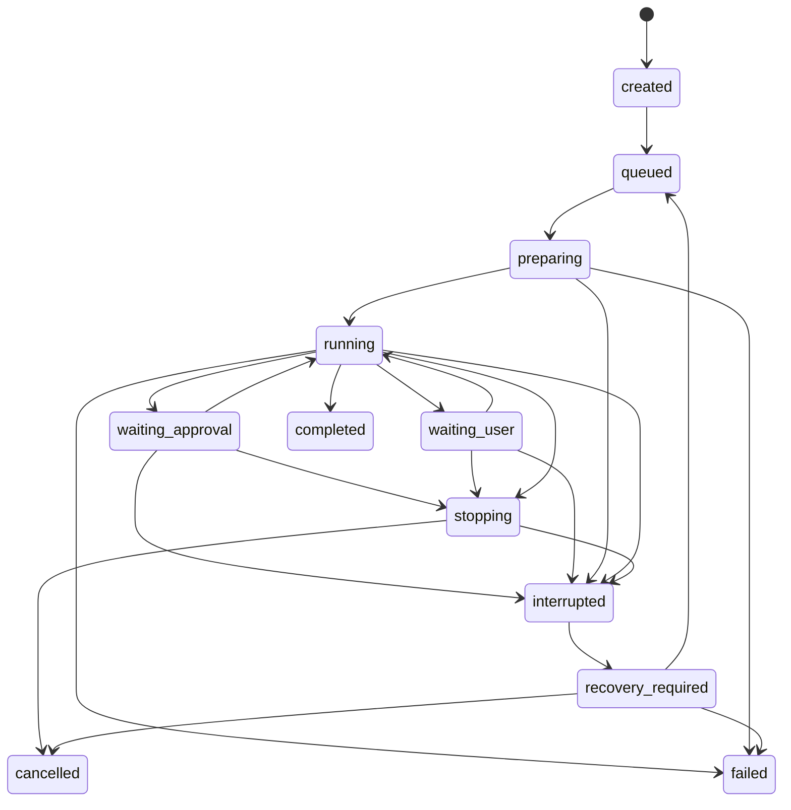

# 数据与接口契约

## 1. 目标

- Electrobun Host、in-process DeepAgentService 和 WebView UI 可按稳定模块契约独立开发。
- 上游 Deep Agents/LangChain 类型不进入数据库和 UI 公共接口。
- 所有状态变化可恢复、可审计、可按稳定 ID 关联。
- 副作用在崩溃后不会被盲目重复。
- Schema 和 RPC 可以版本化迁移。

## 2. 通用约定

| 项目 | 约定 |
| --- | --- |
| ID | UUIDv7 字符串；不使用数据库自增 ID 作为跨进程标识 |
| 时间 | 数据库使用 UTC epoch milliseconds；API 返回 ISO 8601 |
| 金额 | 整数最小货币单位或 decimal string，禁止 JS 浮点直接累计 |
| Token | 非负整数；缺失与 0 分开 |
| JSON | 写入前用 Zod 校验；存储时包含 `schemaVersion` |
| Revision | 从 1 开始的单调整数，更新使用 compare-and-swap |
| 删除 | 默认软删除，使用 `deletedAt`；物理清理由维护任务完成 |
| Secret | 公共契约只传 `secretRef` 或掩码，禁止传明文 |
| Path | Host 内保存规范化绝对路径；WebView 默认只接收展示路径 |

## 3. 错误契约

```ts
interface AppError {
  code: string;
  category:
    | "validation"
    | "permission"
    | "authentication"
    | "rate_limit"
    | "network"
    | "provider"
    | "tool"
    | "conflict"
    | "storage"
    | "runtime"
    | "unknown";
  messageKey: string;
  safeMessage: string;
  retryable: boolean;
  details?: Record<string, JsonValue>;
  causeId?: string;
}
```

- `safeMessage` 可进入 WebView 和导出。
- 原始错误、Header、请求体和堆栈只进入脱敏本地日志。
- UI 根据 `code` 和 `messageKey` 渲染，不解析 SDK 错误文本。
- 失败不得用成功形态返回；Tool、MCP、Provider 均遵守该规则。

## 4. Phase 1 领域实体

### 4.1 配置与项目

| 表 | 关键字段 | 说明 |
| --- | --- | --- |
| `app_settings` | key, value_json, revision | 语言、主题、并发、通知等 |
| `provider_connections` | id, type, name, endpoint, secret_ref, status | Provider 连接；不存明文 Key |
| `model_profiles` | id, provider_connection_id, model_id, capabilities_json, pricing_json | 模型能力与价格 |
| `projects` | id, name, canonical_path, real_path, git_root, status, revision | 本地 Project |
| `project_settings` | project_id, default_agent_version_id, default_model_profile_id, exclusions_json | Project 覆盖 |
| `project_env_vars` | id, project_id, name, secret_ref, is_secret | 命令环境变量引用 |
| `agent_definitions` | id, builtin_key, name, current_version_id, disabled_at | 内置/自定义 Agent 容器 |
| `agent_versions` | id, agent_id, version, config_json, config_hash, created_at | 不可变版本 |

Phase 1 只提供内置 Agent，但从一开始使用 `agent_versions` 快照，以免 Phase 2 迁移历史 Session。

### 4.2 会话与消息

| 表 | 关键字段 | 说明 |
| --- | --- | --- |
| `sessions` | id, kind, project_id, title, mode, agent_version_id, model_profile_id, status, revision | 普通或 Project Session |
| `session_drafts` | session_id, content_json, revision | 输入草稿 |
| `messages` | id, session_id, run_id, role, content_json, sequence, status | 用户/Agent/Tool 可展示消息 |
| `attachments` | id, session_id, original_name, stored_path, mime, size, sha256 | 会话只读副本 |
| `session_tombstones` | session_id, deleted_at, purge_after | 删除与恢复 |

约束：

- `kind=normal` 时 `project_id` 必须为空。
- 消息 `sequence` 在 Session 内单调递增。
- Agent 消息可先以 `streaming` 创建，结束后转为 `complete`；刷新时未完成消息从 Run event 重建。
- Session 只保存下一次提交默认 mode；每个 Run 另存实际 mode。

### 4.3 Run、事件与用量

| 表 | 关键字段 | 说明 |
| --- | --- | --- |
| `runs` | id, session_id, parent_run_id, mode, status, queue_priority, agent_snapshot_json, model_snapshot_json | 一次执行 |
| `run_recovery` | run_id, thread_id, checkpoint_id, durable_event_seq, recovery_status | checkpoint 引用与对账 |
| `run_events` | id, run_id, seq, type, visibility, payload_json, created_at | 规范化 append-only 轨迹 |
| `usage_events` | id, run_id, subagent_run_id, source_namespace, provider, model, kind, input_tokens, output_tokens, cost_json | 模型/Embedding 用量，可归属子 Agent |
| `run_artifacts` | id, run_id, kind, uri, metadata_json | 文件、导出、Canvas 等产物引用 |
| `subagent_runs` | id, run_id, parent_subagent_id, name, namespace, status | 子 Agent 可视状态 |

索引：

- `runs(session_id, created_at desc)`。
- `runs(status, queue_priority, queued_at)`。
- `run_events(run_id, seq)` 唯一。
- `usage_events(run_id, created_at)`。
- `usage_events(subagent_run_id, created_at)`。
- `subagent_runs(run_id, namespace)`。

`run_events` 用于 UI 轨迹和恢复诊断，但不替代规范化业务表；审批、Tool 和文件变更仍有独立表。

### 4.4 Tool、审批与副作用

| 表 | 关键字段 | 说明 |
| --- | --- | --- |
| `tool_calls` | id, run_id, subagent_run_id, tool_name, state, args_redacted_json, risk, idempotency_class | Tool 生命周期 |
| `approval_requests` | id, run_id, tool_call_id, state, action_snapshot_json, risk_reason, expires_at | 不可变审批请求 |
| `approval_decisions` | id, approval_request_id, decision, edited_action_json, feedback, decided_at | 用户决定 |
| `action_executions` | id, tool_call_id, idempotency_key, state, intent_json, result_json, started_at, finished_at | 实际副作用 |
| `file_changes` | id, action_execution_id, project_id, path, operation, before_hash, after_hash, patch_uri | 变更日志 |
| `command_executions` | id, action_execution_id, executable, args_redacted_json, cwd, exit_code, output_uri | 命令结果 |
| `permission_audit` | id, run_id, action_type, decision, policy_rule, scope_json | Policy Engine 决策 |
| `session_grants` | id, session_id, app_instance_id, type, enabled_at, revoked_at | Allow all 审计 |

`session_grants` 可持久记录，但有效性必须同时满足 `app_instance_id` 等于当前启动实例。应用启动生成新实例 ID，因此不会恢复 Allow all。

## 5. Phase 2 实体

| 表 | 说明 |
| --- | --- |
| `mcp_servers` / `mcp_tools` | MCP 连接、作用域、能力、风险覆盖和内容哈希 |
| `oauth_accounts` | OAuth 元数据和 Secret Ref，不存 Token 明文 |
| `skills` / `skill_versions` / `skill_bindings` | Skill 来源、版本、校验结果、作用域和绑定 |
| `knowledge_bases` / `knowledge_sources` / `index_jobs` | 知识源、索引状态、Embedding 配置 |
| `canvases` / `canvas_files` / `canvas_versions` | Canvas 草稿、文件和不可变版本 |
| `agent_dependencies` | Agent 版本引用的 MCP、Skill、Knowledge 和子 Agent |

向量数据由 `KnowledgeIndexStore` 管理，不把特定向量引擎内部 Schema 暴露到 `app.db`。

## 6. Run 状态机



规则：

- `completed`、`failed`、`cancelled` 为终态。
- 进程异常后，非终态 Run 不直接变 `failed`，先变 `interrupted`。
- `waiting_approval` 和 `waiting_user` 具有 durable checkpoint。
- 用户可以从 `waiting_approval`/`waiting_user` 停止；Runtime 异常时二者进入 `interrupted`，不得永久悬挂。
- 恢复前必须经过 Tool Recovery Resolver。
- 每次状态转换与对应 `run.status_changed` 事件在同一业务 DB transaction 内完成。

## 7. Tool 与 Action 状态机

### 7.1 ToolCall

```text
proposed
  → policy_check
  → denied
  → waiting_approval → rejected
                     → approved
  → executing
  → succeeded | failed | cancelled | outcome_unknown
```

### 7.2 ActionExecution

```text
intent_persisted
  → executing
  → succeeded | failed | cancelled | outcome_unknown
```

`outcome_unknown` 用于以下情况：

- 外部 MCP/HTTP 操作可能已成功，但结果落库前进程退出。
- 命令创建后台子进程后失去跟踪。
- 文件系统返回异常，无法确认原子替换是否完成。

`outcome_unknown` 永远不自动重放非幂等动作。

## 8. 审批契约

```ts
interface ApprovalRequest {
  id: string;
  runId: string;
  toolCallId: string;
  action: RedactedActionSnapshot;
  risk: "low" | "medium" | "high";
  reasonCodes: string[];
  allowedDecisions: Array<"approve" | "edit" | "reject" | "respond">;
  preview?: ApprovalPreview;
  policyVersion: string;
  createdAt: string;
}
```

规则：

- Request 创建后不可修改；参数变化产生新 Request 并 supersede 原请求。
- Decision 与 Request 一一对应。
- `edit` 后重新经过 Schema 和 Policy Engine 校验。
- 拒绝反馈明确告诉 Agent 动作未发生。
- 高风险动作不提供“本 Session 始终允许”。
- 批量 UI 仍逐项提交 Decision，顺序与 interrupt action request 一致。

## 9. Run Event 契约

```ts
interface AppRunEvent<T extends RunEventType = RunEventType> {
  schemaVersion: 1;
  id: string;
  runId: string;
  sessionId: string;
  seq: number;
  type: T;
  source: {
    kind: "main_agent" | "subagent" | "tool" | "system" | "user";
    id?: string;
    namespace?: string[];
  };
  visibility: "user" | "debug";
  payload: RunEventPayloadMap[T];
  createdAt: string;
}
```

### 9.1 Phase 1 事件类型

```text
run.queued
run.started
run.status_changed
run.completed
run.failed
run.interrupted
run.recovery_required

message.started
message.delta
message.completed

plan.submitted
plan.revised
plan.approved
todo.updated

subagent.started
subagent.progress
subagent.completed
subagent.failed

tool.proposed
tool.waiting_approval
tool.started
tool.completed
tool.failed
tool.outcome_unknown

approval.requested
approval.decided

file.changed
command.output
command.completed

context.summarized
usage.recorded
artifact.created
warning.raised
```

### 9.2 Delta 与最终消息

- `message.delta` 可高频到达，落库前按 20–50 ms 或字符阈值合并为 chunk event。
- `message.completed` 保存完整内容和校验哈希。
- UI 优先用 delta 实时展示，刷新后可以用完整消息快速加载。
- Debug-only 原始事件不默认进入导出。

## 10. Host ↔ WebView RPC 契约

### 10.1 三类接口

| 类型 | 语义 | 示例 |
| --- | --- | --- |
| Command | 修改状态，返回确认或业务结果 | `run.start`、`approval.decide` |
| Query | 读取快照，可分页 | `session.get`、`run.events.list` |
| Subscription | 推送增量，支持断线补齐 | `run.events.subscribe`、`tasks.subscribe` |

### 10.2 请求信封

```ts
interface RpcRequest<T> {
  apiVersion: 1;
  requestId: string;
  clientInstanceId: string;
  method: string;
  payload: T;
}

type RpcResponse<T> =
  | { requestId: string; ok: true; data: T }
  | { requestId: string; ok: false; error: AppError };
```

Electrobun RPC Schema 提供编译期类型，Host 仍必须执行以下运行时验证：

- 请求来自已登记的主 WebView ID、窗口角色和预期 `views://` origin；Canvas BrowserView 不注册该 RPC。
- `apiVersion`、method 和 payload Schema。
- 当前页面不作为授权依据；权限基于 Session/Run/Project 数据。
- Request ID 和可重试 Command 的 idempotency key。
- payload、响应和事件的大小上限；大文件和二进制只传受控 handle，不内联 RPC。
- Command/Query 有有限 deadline；`runs.start/resume` 返回 accepted 后通过事件跟踪，禁止用无限 RPC timeout 等待整个 Agent Run。

### 10.3 Phase 1 API 面

```text
settings.get / settings.update
providers.list / providers.save / providers.test / models.list
projects.list / projects.add / projects.get / projects.update / projects.remove
sessions.list / sessions.create / sessions.get / sessions.update
sessions.archive / sessions.restore / sessions.delete / sessions.export
messages.list
runs.start / runs.stop / runs.resume / runs.retry / runs.get
runs.events.list / runs.events.subscribe
approvals.listPending / approvals.decide
tasks.list / tasks.reorder / tasks.subscribe
files.preview / files.diff / files.revert
git.status / git.diff
attachments.add / attachments.remove
usage.summary
diagnostics.export
```

WebView client 暴露具体方法，不暴露通用 `request(method, payload)`；生成的底层 RPC client 只在 adapter 内使用。

### 10.4 订阅与补齐

```ts
subscribeRunEvents({
  runId,
  afterSeq
}, onEvent): Unsubscribe
```

- Host 先查询 `seq > afterSeq` 的 durable events，再切换 Electrobun message stream。
- 切换过程使用当前 high-water mark，避免丢失或重复。
- WebView 按 `(runId, seq)` 去重。
- 慢消费者触发批量发送；超过缓冲上限时要求重新 Query，不无限占内存。

## 11. DeepAgentService 应用契约

Deep Agents JS 默认直接运行在 Electrobun application worker。该边界是可测试的 TypeScript application service，不是跨进程 RPC。

### 11.1 命令

```ts
interface DeepAgentService {
  start(input: StartRunInput): Promise<RunAccepted>;
  resume(input: ResumeRunInput): Promise<RunAccepted>;
  cancel(input: CancelRunInput): Promise<void>;
  disposeSession(sessionId: string): Promise<void>;
  shutdown(reason: ShutdownReason): Promise<void>;
}

interface RunAccepted {
  runId: string;
  threadId: string;
  executionId: string;
  acceptedAt: string;
}
```

- `start/resume` 只完成校验、持久化初始状态和注册执行，必须快速返回；模型输出通过 `AppRunEvent` 异步发布。
- 输入显式包含 Session/Project/Agent/Model identity，不读取 WebView 的 active selection。
- `cancel` 通过当前 execution 的 `AbortController` 传播到 graph、Provider、subagent 和 Tool；完成取消前保持 Run 为 `stopping`。

### 11.2 Run Registry

```ts
interface ActiveRun {
  runId: string;
  threadId: string;
  executionId: string;
  appInstanceId: string;
  abortController: AbortController;
  pendingInterruptIds: Set<string>;
  startedAt: string;
}
```

- Registry 只保存活动对象，不保存到数据库；checkpoint、Run 状态、事件和 interrupt 才是可恢复事实来源。
- 同一 Session 同时最多一个副作用 Run；同步 subagent 属于父 Run，但仍计入 Provider/资源信号量。
- 每个异步 callback 在写状态前校验 `runId + executionId + appInstanceId`，取消或恢复后的迟到 callback 不得污染新执行。
- 终态、Session 删除和应用 shutdown 都必须删除 Registry entry 并释放 Provider、stream、临时文件和进程句柄。

### 11.3 HITL 与事件

- Deep Agents stream 先转换为稳定 `AppRunEvent`，写入 `app.db` 后再通过 Electrobun message 推送。
- LangGraph interrupt 先保存 checkpoint、`approval_requests` 和 `interruptId`；不能用只存在内存的 pending Promise 等待 UI。
- 审批恢复使用同一 `threadId`、graph config 和 `Command({ resume })`，支持 batched action requests 的 approve/edit/reject/respond。
- WebView reload 只会断开订阅；重新连接后按 `afterSeq` 补齐，Run 与 interrupt 不依赖原页面存活。

### 11.4 可选 sidecar adapter

只有隔离 ADR 明确选择 sidecar 时，才把同一 `DeepAgentService` interface 映射为进程协议。该 adapter 必须补充长度分帧、协议/runtime 版本握手、随机启动凭证、Schema、generation、背压、超时、heartbeat、crash loop、Secret channel、协作式 shutdown、process-tree kill 和 checkpoint writer ownership；不能把这些复杂度加入默认实现。

## 12. Action Request 契约

```ts
interface ActionRequest<TAction extends ActionType = ActionType> {
  schemaVersion: 1;
  id: string;
  runId: string;
  sessionId: string;
  toolCallId: string;
  actionType: TAction;
  args: ActionArgsMap[TAction];
  idempotencyKey: string;
  requestedCapabilities: string[];
  agentContext: {
    agentVersionId: string;
    subagentId?: string;
  };
}
```

Policy Engine 不信任模型或 Tool wrapper 提供的 `risk`、路径范围或是否需要审批；这些全部根据 action 和持久配置重新计算。

## 13. 幂等与恢复

### 13.1 分类

| 分类 | 示例 | 恢复 |
| --- | --- | --- |
| pure | 读文件、Git status | 可安全重试 |
| idempotent | 按目标哈希写固定内容 | 验证后重试 |
| conditionally_idempotent | 应用 Patch、移动文件 | 检查 before/after 状态 |
| non_idempotent | 发消息、部署、远程创建记录 | 状态不明时人工处理 |

### 13.2 Write-ahead intent

副作用执行顺序：

1. 校验授权和参数。
2. 在 `action_executions` 写入 `intent_persisted`。
3. 执行动作。
4. 写结果、文件日志和 Tool 状态。
5. 返回 DeepAgentService。

DeepAgentService 不可自行假设 Tool 成功；只接受 Action Broker 返回的 typed result。

### 13.3 启动恢复器

应用启动时：

1. 找出非终态 Run。
2. 将旧 app instance 的 Allow all grant 失效。
3. 失效旧 `appInstanceId` 的 active execution lease，并清空内存 Registry。
4. 对 `executing` Action 运行 Recovery Resolver。
5. 对照 checkpoint id 和 durable event seq。
6. 标记 `recovery_required` 并给出安全选项。

## 14. Checkpoint 契约

- 一个 Session 使用稳定 LangGraph `thread_id`；每个执行分支使用 `checkpoint_ns` 或独立 thread 策略，Phase 0 POC 后冻结。
- `run_recovery` 保存当前可恢复 checkpoint。
- `BunSqliteSaver` 实现 `BaseCheckpointSaver` 的 `getTuple`、`list`、`put`、`putWrites` 和 `deleteThread`，并复用 LangGraph serializer。
- saver 的私有 Schema 单独版本化；每次 LangGraph 升级运行 `BaseCheckpointSaver` 行为 contract 与项目的 WAL/崩溃 fixture。
- checkpoint 数据不直接供 WebView 查询或导出。
- Agent/Tool 配置快照保存在业务 DB，恢复时不使用已被编辑的最新配置。
- 删除 Session 时调用 saver 的 `deleteThread`，并在失败时保留清理任务。
- Deep Agents/LangGraph 升级前，用真实旧版 checkpoint fixture 验证读取和继续执行。

## 15. 文件变更与撤销

### 15.1 变更记录

每项写动作记录：

- Project ID 和相对路径。
- 操作类型：create/update/delete/move。
- before/after hash、size、mode。
- unified patch（适合文本时）。
- before/after blob URI（必要且在大小限制内）。
- Action、Tool、Run 和审批 ID。
- 外部变更检测时间。

### 15.2 撤销规则

- 当前 hash 等于 `after_hash`：可直接应用反向 Patch/恢复 before blob。
- 当前 hash 等于 `before_hash`：视为已经撤销，幂等成功。
- 其他 hash：进入 conflict，不覆盖；展示三方 Diff。
- 删除恢复时目标路径已存在：必须选择新路径或手工合并。
- 多文件撤销先生成完整计划，逐项执行并报告部分成功。

### 15.3 Project 锁

- 读不加独占锁。
- 写按 canonical path 加锁。
- move 同时锁定源和目标，按稳定排序获取，避免死锁。
- Git reverse patch 与多文件操作获取 Project transaction lock。
- 锁只在进程内提供并发协调，外部编辑依靠 hash 检测。

## 16. Secret Vault

`secret_records` 只在 Host 使用；Secret 值由 `SecretVault` Port 保存到操作系统存储，不写入 `app.db`：

| 字段 | 说明 |
| --- | --- |
| id | Secret Ref |
| kind | provider_key / oauth_token / env / header |
| vault_handle | 不含 Secret 值的 Keychain item handle |
| metadata_json | 掩码、Provider、更新时间，不含值 |
| created_at / updated_at | 审计 |

规则：

- WebView Schema 中不存在读取、解密或枚举 vault handle 的 API。
- 首发 macOS adapter 通过经审查的 Bun FFI/native bridge 调用 Keychain；service/account 命名包含应用 ID 和 Secret Ref。
- DeepAgentService 只按 Run scope 读取当前 Provider 需要的 Secret；值不得进入 WebView RPC、事件总线或调试 trace。
- Secret 不进入 Agent prompt、checkpoint、事件或错误。
- 导出配置只包含缺失凭证占位符。
- Keychain 或 adapter 不可用时连接进入 blocked，并返回明确错误；不使用明文、可逆本地密钥或弱加密回退。
- 删除连接时同步删除 Keychain item；失败则保留可重试清理任务和不含值的审计记录。

## 17. 数据库迁移

- Drizzle 生成版本化 SQL migration，发布包只执行已审查 migration。
- 启动顺序：获取单实例锁 → 备份 app.db/WAL → integrity check → migration → 启动窗口服务。
- 大迁移分为 expand/backfill/contract，避免长时间阻塞首次窗口。
- 迁移失败时保留原 DB 和备份，应用进入只读恢复页。
- `checkpoints.db` 使用项目维护的 `BunSqliteSaver` Schema；应用管理其 migration、WAL 备份、兼容测试和 thread 清理。
- 不在同一发布中同时进行不可逆业务 DB 迁移和 Deep Agents 大版本升级。

## 18. 导出契约

### Markdown

- 用户/Agent 可见消息、计划、引用和产物链接。
- 默认不含 debug 事件、完整 Tool 输出、绝对路径和 Secret。

### JSON

```ts
interface SessionExportV1 {
  schemaVersion: 1;
  exportedAt: string;
  session: ExportedSession;
  messages: ExportedMessage[];
  runs: ExportedRun[];
  events: ExportedEvent[];
  artifacts: ExportedArtifact[];
  redactionReport: RedactionSummary;
}
```

- 只导出 `visibility=user` 的事件，除非用户显式选择诊断导出。
- 所有路径经过 Project 相对化或掩码处理。
- 导出前运行中央 Secret Redactor。

## 19. 契约验收

| ID | 验收 |
| --- | --- |
| CON-001 | 所有 Electrobun RPC 和 DeepAgentService 边界输入通过共享 Schema 校验 |
| CON-002 | 每个 Run event 的 seq 唯一、连续或能明确识别缺口 |
| CON-003 | 重复提交同一可重试 Command 不产生重复副作用 |
| CON-004 | 取消、恢复或应用重启后的迟到 callback 不会写入新 execution/app instance |
| CON-005 | 非幂等 Action 结果不明时不会自动重放 |
| CON-006 | 文件被外部修改后撤销不会覆盖当前内容 |
| CON-007 | Allow all grant 在新 app instance 中无效 |
| CON-008 | 旧版 DB 和 checkpoint fixture 可迁移并恢复 |
| CON-009 | Secret 不出现在 WebView payload、事件、checkpoint、日志或导出 |
| CON-010 | WebView reload 或应用重启不会丢失 durable interrupt；恢复使用同一 thread/config 与显式 resume command |
| CON-011 | `BunSqliteSaver` 与锁定 LangGraph 版本的 checkpoint 行为契约一致 |
| CON-012 | Run 终态、Session 删除和应用退出都会 abort/dispose 活动资源；Registry 不无限增长 |
