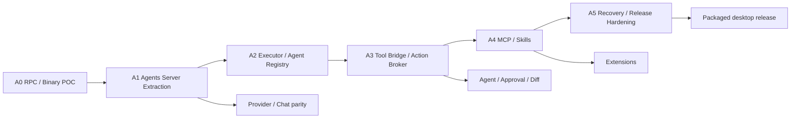

# 工程交付计划

> 本文维护目标、依赖和阶段出口，不直接表示完成度。当前状态见[实施进度](./progress.md)。
> 三应用角色及所有权以[技术架构](./architecture.md)和[数据契约](./data-contracts.md)为准。

## 1. 计划口径

本次架构迁移按依赖顺序交付，不以页面数量或日历时间结束。每个阶段都必须产生可在 CI 和 packaged desktop 中验证的垂直结果。

| 尺寸 | 典型工作量 | 适用 |
| --- | --- | --- |
| S | 2–5 工程日 | 单个 Schema、adapter 或明确 UI |
| M | 1–2 工程周 | 一组 contract 或完整组件 |
| L | 3–4 工程周 | 跨角色垂直切片 |
| XL | 5–8 工程周 | 高风险协议、执行或恢复能力，必须再拆 |

估算包含实现、测试和直接相关文档；不包含证书、外部账号或 App Review 等等待时间。

## 2. 强制交付主线

**旧 F0-16“条件性 sidecar POC”已取消。** 三角色不是运行时失败后的备选方案，而是批准的实现基线。旧 DEC-004/ARC-011 的 in-process/conditional-sidecar 判定门也不再适用。

功能流可以在不破坏所有权的前提下与迁移重叠，但不能：

- 在 client 保留新的 Agent/Provider/DB 业务实现。
- 增加 client 直连 executor 的临时通道。
- 让 executor 写产品 DB/Pi Session JSONL 或自行批准 Action。
- 用当前 no-tools Ask 测试替代尚未实现的 Tool/MCP/Skill 验收。

## 3. A0：RPC / Companion Binary POC

**目标：** 证明两个 TypeScript + Bun companion 能作为桌面应用正式组成部分被启动、注册、通信、关闭和打包。

### 3.1 工作包

| ID | 工作包 | 产出 | 尺寸 |
| --- | --- | --- | --- |
| A0-01 | Companion skeleton | `agents-server`、`executor` TypeScript entry、Bun compile、版本输出 | M |
| A0-02 | Desktop bootstrap | client 启动 server、动态 loopback endpoint、一次性注册材料 | L |
| A0-03 | Versioned JSON RPC | WebSocket request/response/notification、Zod、错误、deadline、背压 | L |
| A0-04 | Role registration | stable ID、instance ID、generation、connection ID、method allowlist | L |
| A0-05 | Supervisor POC | 两个 companion 的 start/health/cooperative shutdown/capped backoff | L |
| A0-06 | Package smoke | companion 复制、可执行权限、签名路径、无系统 Bun 依赖 | L |

### 3.2 POC 场景

1. client 启动 server，读取受控 bootstrap，不解析普通业务日志发现端口。
2. server 只监听动态 loopback；未持有注册材料的本机进程被拒绝。
3. client/executor 各自注册，断线重连生成新 instance/generation。
4. request/response、event、取消、超时、超限 frame 和慢消费者行为可重复测试。
5. client 请求协作关闭；server/executor 均在有界时间退出。
6. companion 连续崩溃时达到 restart cap 后停止循环并进入恢复状态。

### 3.3 A0 出口

- [x] 开发构建和 packaged app 都能启动两个编译 companion。
- [x] `client <-> server <-> executor` 是唯一应用 RPC 拓扑。
- [x] protocol/version/role/identity Schema 冻结到首个可迁移版本。
- [x] 旧 generation 的连接和消息无法覆盖新实例。
- [x] stable package 不包含固定 token、调试端口或通用 method forwarder。
- [x] 终端用户未安装 Bun/Node 时 package smoke 仍通过。

## 4. A1：agents-server Extraction

**目标：** 把当前已实现 Ask Chat 的业务所有权从 Electrobun Application Host 提取到 agents server，并保持用户行为等价。

### 4.1 迁移顺序

| ID | 工作包 | 产出 | 依赖 | 尺寸 |
| --- | --- | --- | --- | --- |
| A1-01 | Server composition root | 配置、日志、lifecycle、共享 contract wiring | A0 | M |
| A1-02 | Business DB extraction | SessionCatalog、RunJournal、migration/reset、单 writer | A1-01 | L |
| A1-03 | Pi Session extraction | `SessionManager` JSONL、stable ID、restore/dispose/cleanup、单 writer | A1-02 | L |
| A1-04 | Provider extraction | dynamic builtin/custom registry、auth attempt、credential vault | A1-01 | L |
| A1-05 | Ask runtime extraction | public Pi headless no-tools Ask、stream/cancel、Run Registry | A1-03,A1-04 | XL |
| A1-06 | Client API adapter | 现有 UI 通过 client-server RPC 读取/订阅，不改产品语义 | A1-02,A1-05 | L |
| A1-07 | Parity cleanup | 移除 client 中已迁移 writer/runtime 和双写兼容层 | A1-06 | M |

迁移使用一次一个领域的 strangler adapter；过渡期允许 client 调用 server fake，但不允许 DB 双写。当前处于开发阶段，旧 app data 可明确重置，不为本阶段增加旧 schema migration。

当前 A1 no-tools Ask 不依赖 executor Tool capability；A2 再建立持久 Executor/Agent binding 与完整 capability gate。

### 4.2 A1 出口

- [x] Provider 设置、普通 Chat、Session 管理、stream、stop 和 restart 后读取行为等价。
- [x] Pi runtime、Provider adapter、产品 DB 和 Pi Session JSONL 只存在于 agents server runtime。
- [x] client 不打开产品 DB/Pi Session JSONL，不读取 Provider Key，不创建 Agent runtime。
- [x] event 由 server 先落库后推送；client 重连可按 cursor 补齐。
- [x] server restart 后识别并安全终结非终态 orphan Run，不伪装 runtime resume。
- [x] Ask service/package/WebView 测试已迁移为跨角色 contract，没有永久旧 transport 路径。

## 5. A2：Executor / Agent Registry

**目标：** 建立可持久稳定身份和当前 desktop 的单 local executor / 多 Agent 模型。

### 5.1 工作包

| ID | 工作包 | 产出 | 依赖 | 尺寸 |
| --- | --- | --- | --- | --- |
| A2-01 | Executor identity | `executorId` 持久化、instance/generation、capability register | A0,A1 | L |
| A2-02 | Client identity | `clientId` 持久化、重连注册、server registry projection | A0 | M |
| A2-03 | Executor registry | syncing/online/offline、lease、注册后 capability full snapshot 和查询 API | A2-01 | L |
| A2-04 | Agent binding | Agent version 绑定 executor、当前 local default、N:1 校验 | A2-03 | L |
| A2-05 | Availability UX | client 列表、离线状态、重试/诊断、Run start gate | A2-03,A2-04 | M |
| A2-06 | Run dispatch identity | Run snapshot 记录 executor stable ID 和执行 generation | A2-04 | L |

### 5.2 A2 出口

- [ ] client 与 executor stable ID 跨进程重启保留。
- [ ] 每次启动/注册使用新的 instance ID 和 generation；并发旧实例被拒绝。
- [ ] 一个 local executor 下可配置多个 Agent。
- [ ] client 能列出 server 已注册 executor，不直接探测 executor 进程。
- [ ] 每次 executor 注册/重连先 full capability inventory sync；成功前保持 syncing，Agent 不 runnable。
- [ ] executor offline 时相关 Agent 无法启动新 Run，并返回 `EXECUTOR_OFFLINE`。
- [ ] 文档/API 允许未来独立注册，但当前没有 remote/Docker/cloud transport 实现或承诺。

## 6. A3：Tool Bridge / Action Broker

**目标：** 完成 server 决策、executor 执行的可审计副作用闭环。

### 6.1 工作包

| ID | 工作包 | 产出 | 依赖 | 尺寸 |
| --- | --- | --- | --- | --- |
| A3-01 | Tool contract | ActionRequest、Tool metadata、typed result、幂等分类 | A1,A2 | L |
| A3-02 | Server Policy/Approval | 模式工具集、风险、审批、Allow all、durable interrupt | A3-01 | XL |
| A3-03 | Action journal | intent/result、outcome unknown、recovery resolver | A3-02 | L |
| A3-04 | Execution grant | 单次、短时、executor instance/args/scope 绑定、审计 | A3-03 | XL |
| A3-05 | Executor Tool Bridge | 文件、命令、Git adapter；grant validation | A3-04 | XL |
| A3-06 | Cancellation/process tree | timeout、输出上限、进程组、协作/升级终止 | A3-05 | L |
| A3-07 | Diff/revert integration | server change journal、client Diff、hash conflict | A3-05 | XL |

### 6.2 A3 出口

- [ ] 未经 server Policy/approval/intent 的 Action 无法获得 grant。
- [ ] executor 拒绝过期、重复、篡改、错误 executor 或旧 generation grant。
- [ ] executor 不打开业务 DB；server 不直接执行 Tool。
- [ ] 文件/命令/Git 的实际动作、取消和进程树只在 executor。
- [ ] non-idempotent Action 在结果不明时不会自动重放。
- [ ] executor kill、server kill、网络断开覆盖 intent 前后和 result 前后 kill points。
- [ ] Ask/Plan/Agent 和 Allow all 不能绕过相同强制边界。

## 7. A4：MCP / Skills

**目标：** 在不改变三角色所有权的前提下增加扩展能力。

A4 先交付 backend ownership、协议和安全 gate，默认保持 feature flag 关闭；自定义 Agent/MCP/Skills 的完整管理 UI 和公开产品能力仍属于产品 Phase 2。

### 7.1 工作包

| ID | 工作包 | 产出 | 依赖 | 尺寸 |
| --- | --- | --- | --- | --- |
| A4-01 | Executor data root | executor DB、private Skill store、persisted inventory epoch/revision/change log、`0700`/`0600`/owner/no-follow/atomic replace | A2 | XL |
| A4-02 | Inventory reconciliation | registration snapshot、delta/tombstone、hint debounce、60 秒 ±20% poll、snapshot fallback、stale cache | A4-01 | XL |
| A4-03 | Routed MCP/Skill API | full client UI command -> server auth -> selected executor；mutation revision/read-own-write、offline failure | A4-02 | XL |
| A4-04 | MCP lifecycle | executor-owned config、stdio/HTTP/SSE lifecycle、Tool schema/inventory | A4-01,A4-02 | XL |
| A4-05 | MCP auth | executor-owned `ExecutorSecretStore`、OAuth/token、minimal child env、cleanup | A4-04 | XL |
| A4-06 | MCP Tool bridge | stable resource ref、live validation、ToolDefinition、grant、typed error | A4-04,A3 | L |
| A4-07 | Immutable Skill store | executor install/validate/version/hash/content/resources/uninstall | A4-01 | XL |
| A4-08 | Agent resource refs | server 只存 assigned executor resource refs；按 version/hash 获取 metadata/`SKILL.md` | A4-06,A4-07 | L |
| A4-09 | Skill execution | resources/scripts 通过 executor grant 使用 | A4-07,A3 | L |

### 7.2 A4 出口

- [ ] 每个 executor 是自身 MCP config/credential/OAuth/lifecycle 与 Skill immutable content/resources 的唯一 source of truth。
- [ ] server 只保存 Agent resource refs 和 replaceable/non-authoritative/disposable redacted inventory cache；产品 DB/backup 不含 recoverable MCP/Skill config、content 或 credential。
- [ ] executor 持久化 epoch/revision 与有界 change log/deletion tombstone；每次注册/重连 full sync 成功前 Agent 不 runnable。
- [ ] `inventory.changed` 只含 revision/category；server 去抖增量拉取，并每 60 秒 ±20% jitter 独立 polling。
- [ ] gap、compaction、epoch reset 或 invalid cursor 触发 full snapshot atomic replace；offline/failed poll 只标 stale，不解释为 deletion。
- [ ] cache 只含 stable ID/version/hash、Tool schema、health/capability 和 credential-configured boolean，不含 recoverable config、secret、sensitive env 或 Skill body。
- [ ] 完整 client MCP/Skill UI 所需的 command path 经 server 校验后路由；只有 executor 持久化成功才返回 success/epoch/revision，并立即 read-own-write；offline 不排队伪成功。
- [ ] MCP Tool 与 Skill script 使用 A3 的 grant，不建立扩展专用旁路。
- [ ] Agent 只能引用 assigned executor 的稳定 resource version/hash；Run start/restore live 验证，polling 不替代授权；server 按 ref 获取并校验 Skill metadata/`SKILL.md`。
- [ ] executor offline、resource missing/hash mismatch 或 MCP Schema 变化会 fail closed。
- [ ] Provider/model credential 不进入 executor；MCP credential 只在 executor private secret store 和目标 connection/process 可达，不进入 query/UI/prompt/log/diagnostic/export、全局环境或无关 child/Agent。
- [ ] local root/credential file 权限、owner、atomic replacement、symlink/no-follow 通过测试，并明确不能防同账户 malware、root 或 disk snapshot/backup。
- [ ] executor-owned MCP credential 不替代一次性 execution grant；保持认证的 connection 上每次 Tool 仍独立授权。

## 8. A5：Recovery / Release Hardening

**目标：** 把三角色生命周期、故障恢复和正式发布路径收敛为 release gate。

### 8.1 工作包

| ID | 工作包 | 产出 | 依赖 | 尺寸 |
| --- | --- | --- | --- | --- |
| A5-01 | Supervisor hardening | 独立 restart budget、capped backoff、crash-loop UX | A0-A4 | L |
| A5-02 | Connection recovery | client event replay、executor invocation reconciliation、registration full inventory sync 和 periodic delta reconciliation | A2-A4 | XL |
| A5-03 | Shutdown protocol | stop admission、Run interruption、进程树清理、DB flush | A3 | L |
| A5-04 | Fault matrix | client/server/executor/WebView/Tool/MCP kill 与 sleep/network/disk | A5-02 | XL |
| A5-05 | Diagnostics | 三角色日志关联、版本/identity/registry/DB integrity 导出 | A5-01 | L |
| A5-06 | Signed package | companion 签名、公证、Updater、安装/升级、无外部 Bun | A0,A5-03 | XL |
| A5-07 | Packaged E2E | 正式入口驱动的启动、注册、Action、恢复和退出 | A5-04,A5-06 | XL |

### 8.2 A5 出口

- [ ] server/executor 各自 crash 后按预算重启；达到 cap 后不无限循环。
- [ ] client 正常退出协作关闭两个 companion，持久化完成且无遗留受管进程树。
- [ ] client/WebView 重连不丢 durable event；executor 重连不重复 non-idempotent invocation。
- [ ] executor reconnect 在 full inventory sync 前保持 syncing；missed hint、compacted log、epoch reset 和 poll failure 都按合同收敛。
- [ ] signed/notarized package 包含兼容的两个 companion，版本握手和更新原子性通过。
- [ ] release package 无测试后门、固定 token、调试 listener 或系统 runtime 依赖。
- [ ] recovery UX 能区分可重试、需人工确认、数据 reset 和不可恢复状态。

## 9. 与产品阶段的映射

| 产品能力 | 最低架构依赖 |
| --- | --- |
| Provider 设置、普通 Chat、Session 管理 | A1 |
| Project/Agent registry 可见性 | A2 |
| Ask 只读 Tool、Plan、Agent、审批、Diff/撤销 | A3 |
| 后台任务、崩溃恢复、外部分发 | A5 |
| 自定义 Agent 绑定 executor | A2 + 产品 Agent Editor |
| MCP、Skills | A4 |
| Canvas 触发本机能力 | A3；Preview 隔离另行验收 |
| 未来 remote/Docker/cloud executor | A0–A5 后的新 ADR，不属于当前范围 |

产品 Phase 1 可在 A1 完成后继续只读 UI/Provider 工作，但任何副作用能力必须等待 A3；外部 Alpha/Beta 必须等待 A5。产品 Phase 2 的 MCP/Skills 必须等待 A4；A4 backend 完成不等于对应产品功能已发布。

## 10. 当前实现迁移映射

| 当前已实现组件 | 目标归属 | 迁移阶段 |
| --- | --- | --- |
| React WebView、路由、设置和 Chat UI | client | 保留，A1 改 transport |
| Application Host `ChatService` | agents server application service | A1 |
| public Pi no-tools Ask runtime | agents server | A1（已迁移） |
| dynamic builtin/custom Provider registry + auth | agents server | A1（已迁移） |
| SessionCatalog / RunJournal | agents server | A1 |
| Pi `SessionManager` JSONL | agents server | A1（已迁移） |
| 当前无 Tool Ask guard | server effective Tool policy | A1 保持，A3 泛化 |
| 文件/命令/Action Broker | executor + server Action Broker | A3 新增 |
| MCP/Skills | executor-owned config/secret/content + server-routed UI/resource refs | A4 新增 |

该表同时记录已迁移组件与后续新增组件；完成度以[实施进度](./progress.md)为准。

## 11. Definition of Ready / Done

### 11.1 Ready

- 有明确角色所有者和禁止访问方。
- 输入/输出、error、取消、超时、重连和版本 Schema 已定义。
- stable ID、instance/generation、correlation 和幂等规则明确。
- Secret、临时凭证、日志和数据外发已评估。
- 有正常、断线、旧实例、kill point 和 packaged 验收场景。

### 11.2 Done

- 实现、targeted test、跨角色 contract 和直接相关文档完成。
- 没有双写、通用 RPC、直连 executor 或无 grant 执行。
- 错误保持失败语义，取消能传播并完成资源清理。
- 当前实现状态更新到 progress，不把 POC 写成完整阶段完成。
- 对应 packaged gate 在可发布阶段运行。

## 12. ADR 清单

| ADR | 最晚完成 |
| --- | --- |
| ADR-001 Three application roles and ownership | A0 开始前；已批准 |
| ADR-002 WebSocket + versioned JSON RPC | A0 |
| ADR-003 Desktop bootstrap and local authentication | A0 |
| ADR-004 Stable identity / instance / generation | A0 |
| ADR-005 Companion supervisor and shutdown | A0 |
| ADR-006 Product DB / Pi Session JSONL single writer | A1（已完成） |
| ADR-007 Executor / Agent registry | A2 |
| ADR-008 Action Broker / execution grant | A3 |
| ADR-009 Tool cancellation and process trees | A3 |
| ADR-010 Executor-owned MCP config/credential/lifecycle、`ExecutorSecretStore` 与 routed command | A4 |
| ADR-011 Executor-owned immutable Skill store、Agent resource ref 与 prompt fetch | A4 |
| ADR-012 Recovery, restart budget and reconciliation | A5 |
| ADR-013 Companion signing/update/diagnostics | A5 |
| ADR-014 Future remote transport | 当前范围外，启动远程工作前 |

## 13. 主要风险

| 风险 | 触发信号 | 预案 |
| --- | --- | --- |
| 本机未授权连接 server | 其他进程可猜端口并注册 | 动态 loopback、一次性 bootstrap、角色认证、method allowlist |
| 旧实例污染新状态 | restart 后迟到 result/event 被接受 | stable ID + instance/generation + invocation correlation |
| 迁移期双写 | client/server DB 状态分叉 | 单领域切换、单 writer assertion、无长期 compatibility path |
| grant 被重放/篡改 | executor 重复执行或参数变化 | 短 TTL、单次 nonce、args/scope digest、目标 generation |
| executor 丢失结果 | Tool 已发生但 server 未落 result | intent-first、reconcile、`outcome_unknown`、非幂等不自动重放 |
| companion crash loop | 启动后连续退出 | capped backoff、停机状态、诊断和用户控制重试 |
| Bun compile/package 差异 | dev 可用、签名包不可执行 | A0 package smoke、目标架构 matrix、同 release 版本握手 |
| MCP/Skill 形成旁路或双 owner | 扩展绕过 grant、server 留 recoverable copy、secret 泄露到全局环境 | routed command、统一 grant、executor-private store、server-copy scan 与 credential canary |
| 过早远程化 | 当前 desktop 被 TLS/多租户复杂度拖慢 | 只保留接口 seam，remote ADR 延后 |

## 14. 发布节奏

| 里程碑 | 进入条件 |
| --- | --- |
| Architecture POC | A0 出口 |
| Server-backed Dogfood | A1 出口，现有 Ask parity |
| Registry Preview | A2 出口 |
| Controlled Action Preview | A3 出口 |
| Extensions Preview | A4 出口 |
| Private Alpha | A5 核心恢复/签名门 + 产品 Alpha 范围 |
| Public Beta | A5 全部出口 + 对应产品阶段出口 |

不为 A0–A5 写固定发布日期；任何阶段都不能通过删除安全、恢复或 packaged test 来压缩。
