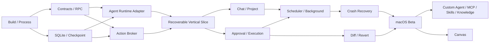

# 工程交付计划

## 1. 估算口径

本计划提供依赖和容量基线，不是固定发布日期。

### 1.1 工作量

| 尺寸 | 典型工作量 | 适用 |
| --- | --- | --- |
| S | 2–5 工程日 | 单模块、小契约、明确 UI |
| M | 1–2 工程周 | 一个完整组件或 Adapter |
| L | 3–4 工程周 | 跨进程垂直切片 |
| XL | 5–8 工程周 | 高风险跨域能力，必须拆里程碑 |

工作量包含实现、单元/集成测试和必要文档，不包含等待外部账号、证书或 App Review 的时间。

### 1.2 参考团队

| 角色 | 人数 | 主要职责 |
| --- | --- | --- |
| Tech Lead / Agent Runtime | 1 | 架构、Deep Agents、checkpoint、运行时 |
| Desktop / Security | 1 | Electrobun runtime、RPC、Application Host、Action Broker、签名 |
| Data / Integrations | 1 | SQLite、Provider、MCP、Knowledge |
| Frontend Engineer | 2 | Chat、轨迹、设置、Diff、Canvas |
| QA / SDET | 1 | 自动化、故障注入、兼容与发布验证 |
| Product + Design | 各 1，共享 | 规格、交互、可用性与验收 |

若只有 3 名工程师，应保持相同关键路径并将参考周期乘以约 1.8–2.2；不应通过删除安全、恢复和自动化来压缩时间。

## 2. 总体依赖

**关键路径：** Build/Process → Contracts/Storage → Runtime + Action Broker → 可恢复垂直切片 → 审批执行 → Scheduler；随后“恢复”和“Diff/撤销”并行收敛到发布加固。

## 3. Phase 0：技术底座与高风险验证

**参考周期：4–6 周，其中前 2–3 周为 Electrobun application runtime Go/No-Go。**  
**目标：** 先证明 Deep Agents JS 可直接运行在锁定 Electrobun `1.18.1` 的 application worker，并验证持久化、Secret、Canvas 和打包，再用一条真实垂直切片证明架构；不得先做完整 UI 后补运行时验证。

### 3.1 工作包

| ID | 工作包 | 产出 | 依赖 | 尺寸 | 主责 |
| --- | --- | --- | --- | --- | --- |
| F0-01 | Workspace 与质量基线 | Bun workspace、`bun.lock`、strict TS、lint/format/test、依赖精确锁定 | 无 | M | Tech Lead |
| F0-02 | Electrobun 构建与运行时骨架 | Application Host、React WebView、in-process service、Electrobun/Vite 开发启动与 package runtime 探测 | F0-01 | L | Desktop |
| F0-03 | UI 基线 | Router、HeroUI、Tailwind、主题、i18n、Icon wrapper；验证核心组件覆盖与 React Aria 语义 | F0-01 | M | Frontend |
| F0-04 | Contracts 与 RPC | Electrobun typed RPC + Zod、View capability 校验、DeepAgentService、Command/Query/Subscription POC | F0-02 | L | Desktop |
| F0-05 | 业务 SQLite | `bun:sqlite` + Drizzle Schema、Repository、WAL、迁移、备份 POC | F0-01 | L | Data |
| F0-06 | LangGraph checkpoint | `BunSqliteSaver`、`BaseCheckpointSaver` 行为 contract、thread/recovery fixture、WAL 分库 | F0-02,F0-05 | L | Runtime |
| F0-07 | Deep Agents in-process POC | 在 Electrobun application worker 中验证 import/bundle、真实 Provider stream、todo、同步 subagent、HITL、取消、`AsyncLocalStorage`、3 Run 并发 | F0-04,F0-06 | XL | Runtime |
| F0-08 | Provider POC | OpenAI 或 Anthropic 连接、流式、Tool call、用量 | F0-07 | M | Data |
| F0-09 | Secret Vault | `SecretVault` Port、macOS Keychain FFI/native adapter、Secret Ref、WebView 泄露测试 | F0-04,F0-05 | L | Desktop |
| F0-10 | Action Broker POC | Brokered file read/write、结构化命令、Policy、审批 | F0-04,F0-05 | XL | Desktop + Runtime |
| F0-11 | 可恢复垂直切片 | Project → Agent 改文件 → 审批 → Diff → checkpoint | F0-07,F0-08,F0-09,F0-10 | XL | 全队 |
| F0-12 | Runtime 生命周期与故障注入 | WebView reload、最后窗口关闭、application 强退/重启、Registry dispose、durable interrupt、命令进程树清理 | F0-11 | L | QA + Runtime |
| F0-13 | Canvas 隔离 POC | sandbox `BrowserView`、独立 partition、CSP、RPC/本地文件/子资源网络拒绝 | F0-02,F0-04 | XL | Frontend + Desktop |
| F0-14 | 打包与签名 POC | 直接加载 Deep Agents/Provider、`bun:sqlite`、Keychain、BrowserView、ASAR 可选项、签名/公证、Updater | F0-02,F0-05,F0-06,F0-09 | XL | Desktop |
| F0-15 | 桌面自动化 POC | typed-RPC 测试驱动、packaged smoke、崩溃和更新测试 harness | F0-02,F0-04,F0-14 | L | QA + Desktop |
| F0-16 | 条件性 sidecar POC | 仅 DG-09 触发时验证 bundled runtime、framed RPC、监管、资源限制、checkpoint ownership、签名和更新 | F0-07,F0-12 | XL | Desktop + Runtime |

`F0-07`、`F0-10` 和 `F0-11` 是 Phase 0 核心。参考实现的 Pi SDK 构建成功不能替代 `F0-07`。直接运行失败时先判定当前基线 No-Go，再由 DG-09 决定是否投入 `F0-16`；不能用 polyfill、关闭并发上下文或“先把 UI 做完”掩盖。`F0-16` 不计入 4–6 周基线；一旦触发，先形成 ADR，再按打包、协议、安全和跨平台验证范围重新估算。

### 3.2 建议迭代

| 周次 | 重点 |
| --- | --- |
| 1 | Bun workspace、Electrobun/Vite、WebView/Application Host、直接 import Deep Agents、版本矩阵 |
| 2 | typed RPC、DeepAgentService/RunRegistry、App DB、BunSqliteSaver、Keychain |
| 3 | Deep Agents 真实 Provider、stream/HITL/subagent/AsyncLocalStorage/并发 Go/No-Go |
| 4 | 审批写文件垂直切片、持久轨迹 |
| 5 | application 强退/恢复、窗口生命周期、Canvas 断网、packaged E2E、签名产物 |
| 6 | 预留问题修复、ADR 冻结和 Phase 1 计划校准 |

可在 4 周完成时提前结束，但不得跳过出口测试。

### 3.3 Phase 0 出口

- [ ] 签名或准签名 package 可直接加载 Deep Agents/Provider、`bun:sqlite`、Keychain 和 BrowserView Preview。
- [ ] WebView 无 API Key、application runtime、文件或 Shell 直接访问。
- [ ] Deep Agents 在 Electrobun application worker 内通过真实 Provider stream、HITL、取消、同步 subagent、`AsyncLocalStorage` 和 3 Run 并发矩阵。
- [ ] `BunSqliteSaver` 通过 checkpointer contract、旧 fixture、WAL 崩溃和删除 thread 测试。
- [ ] Agent 不能绕过 Broker 写文件或执行命令。
- [ ] Run event 落库后再显示，窗口刷新可重建轨迹。
- [ ] application 强退/重启后 Run 进入恢复流程；WebView reload 不丢 Run/interrupt，退出会清理命令进程树且不重复写操作。
- [ ] checkpoint fixture 可跨应用重启继续。
- [ ] Web Canvas 恶意页面无法访问应用 RPC、本地文件或默认网络，包括 iframe、图片、字体、CSS、fetch/WebSocket 等子资源。
- [ ] 外部 packaged E2E harness 可经正式入口驱动启动、审批、application 强退、恢复和更新失败场景；stable 产物不包含 test driver。
- [ ] HeroUI 覆盖 Chat、表单、Modal、菜单和键盘/读屏语义；缺口使用 React Aria primitives + 同一设计 Token，不引入第二套 UI 框架。
- [ ] DG-01 至 DG-09 有书面 ADR 结论；未触发 sidecar 时不实施 F0-16。

## 4. Phase 1：核心 MVP

**参考周期：14–18 周。**  
**目标：** 完成 PRD E2E-01 至 E2E-07，发布 macOS 外部 Beta。

### 4.1 Stream A：应用壳与 Provider

| ID | 工作包 | 产出 | 依赖 | 尺寸 |
| --- | --- | --- | --- | --- |
| P1-A01 | App Shell | 完整路由、侧栏、空状态、全局错误和通知 | F0-03 | L |
| P1-A02 | Provider Domain | Adapter Port、能力注册表、错误归一化 | F0-08 | L |
| P1-A03 | 六类云 Provider | OpenAI、Anthropic、Gemini、DeepSeek、Kimi、智谱 | P1-A02 | XL |
| P1-A04 | Compatible Endpoints | OpenAI-compatible、Claude-compatible | P1-A02 | L |
| P1-A05 | Provider Settings | 添加/编辑/测试/模型选择/掩码 Secret | P1-A02,F0-09 | L |
| P1-A06 | Usage 与预算 | Token 归一化、费率、日/月聚合和提醒 | P1-A02,F0-05 | L |

实施顺序：先完成 OpenAI/Anthropic 两条 contract suite，再让其余 Provider 复用；禁止六人分别复制一套 UI 和错误处理。

### 4.2 Stream B：Chat 与 Project

| ID | 工作包 | 产出 | 依赖 | 尺寸 |
| --- | --- | --- | --- | --- |
| P1-B01 | Session Domain | Session/Message/Run Repository、分页和 revision | F0-05 | L |
| P1-B02 | 普通 Chat | 新建、流式消息、Markdown、代码、停止 | P1-B01,F0-07 | XL |
| P1-B03 | 附件 | 安全复制、类型/大小校验、上下文引用 | P1-B02 | M |
| P1-B04 | Project 管理 | 选择目录、真实路径、Git 检测、失效状态 | F0-10,P1-B01 | L |
| P1-B05 | Project Chat | Project 上下文、按需文件引用、多个 Session | P1-B02,P1-B04 | XL |
| P1-B06 | 会话管理 | 标题、搜索、重命名、归档、删除、恢复 | P1-B01 | L |
| P1-B07 | 导出 | Markdown/JSON、路径与 Secret 脱敏 | P1-B06 | M |

### 4.3 Stream C：Agent 执行

| ID | 工作包 | 产出 | 依赖 | 尺寸 |
| --- | --- | --- | --- | --- |
| P1-C01 | 有效 Agent 配置 | 内置 Agent version、mode/tool/model resolution | F0-07,P1-A02 | L |
| P1-C02 | Ask 模式 | 只读工具集和运行时拒绝测试 | P1-C01,P1-B02 | M |
| P1-C03 | Plan 模式 | 结构化 Plan、revision、编辑、批准后执行 Run | P1-C01,P1-B05 | L |
| P1-C04 | Agent 模式 | 文件/命令 Tool、todo、同步 subagent | P1-C01,F0-10 | XL |
| P1-C05 | 轨迹 UI | Plan、todo、subagent、Tool、压缩、错误事件 | P1-B02,P1-C04 | XL |
| P1-C06 | 审批中心 | 审批卡、编辑/拒绝、批量决定、恢复 | P1-C04,P1-C05 | L |
| P1-C07 | Allow all | app-instance grant、风险边界、持续状态提示 | P1-C06 | M |

### 4.4 Stream D：文件、命令与 Git

| ID | 工作包 | 产出 | 依赖 | 尺寸 |
| --- | --- | --- | --- | --- |
| P1-D01 | Brokered Filesystem | read/glob/grep/write/edit、realpath、软链接防护 | F0-10 | XL |
| P1-D02 | File Journal | before/after hash、Patch、blob、原子写和冲突 | P1-D01,F0-05 | L |
| P1-D03 | Command Runner | direct exec、shell command、env、timeout、cancel | F0-10 | XL |
| P1-D04 | Command Policy | 风险分类、审批预览、禁止规则和审计 | P1-D03,P1-C06 | L |
| P1-D05 | Git Adapter | status/diff、禁 pager/外部 diff、安全参数 | P1-D01 | M |
| P1-D06 | Diff Viewer | Git/非 Git Diff、文件和 hunk 导航 | P1-D02,P1-D05 | L |
| P1-D07 | Revert | 单文件/变更块反向操作、hash 冲突与部分成功 | P1-D02,P1-D06 | XL |

### 4.5 Stream E：后台、恢复和系统能力

| ID | 工作包 | 产出 | 依赖 | 尺寸 |
| --- | --- | --- | --- | --- |
| P1-E01 | Run Scheduler | 1–5 Session 并发、默认 3、FIFO、Session 写锁、全局/per-Provider 模型调用限流（含子 Agent） | P1-B01,P1-C04 | XL |
| P1-E02 | Runtime Lifecycle Manager | RunRegistry、execution token、abort/dispose、窗口/应用退出、stale callback、进程树清理 | F0-12,P1-E01 | L |
| P1-E03 | Recovery Resolver | Tool 幂等分类、unknown outcome、对账 UI | P1-D02,P1-D03,P1-E02 | XL |
| P1-E04 | 任务中心 | 运行、排队、待审批、失败和操作入口 | P1-E01,P1-C05 | L |
| P1-E05 | 桌面通知 | 完成/失败/审批/用户输入，隐私预览 | P1-E01 | M |
| P1-E06 | URL Reader | SSRF 防护、内容限制、引用 | F0-10 | L |
| P1-E07 | Web Search | 一个 BYOK Adapter、引用和设置 | P1-A02 | L |

### 4.6 Stream F：质量与发布

| ID | 工作包 | 产出 | 依赖 | 尺寸 |
| --- | --- | --- | --- | --- |
| P1-F01 | i18n 完整化 | 中英文、locale 格式、缺失 key 检查 | P1-A01 | L |
| P1-F02 | 可访问性 | 键盘、焦点、读屏、动态事件公告 | P1-A01,P1-C05 | L |
| P1-F03 | 性能 | 虚拟消息/事件列表、流合并、数据库索引 | 各核心流 | L |
| P1-F04 | 安全加固 | RPC/DeepAgentService/path/command/secret/Canvas/SSRF 自动化与审查 | 各核心流 | XL |
| P1-F05 | 数据迁移/恢复页 | backup、integrity、migration failure UX | F0-05 | L |
| P1-F06 | macOS Release | Electrobun 签名/公证、自解压产物/DMG、Updater 通道、SBOM | F0-14,F0-15 | XL |
| P1-F07 | Beta 运营 | 诊断导出、反馈入口、已知问题和回滚手册 | P1-F06 | M |

### 4.7 Phase 1 迭代波次

| 波次 | 参考周 | 可演示结果 |
| --- | --- | --- |
| W1 Read-only | 1–4 | Provider 设置、普通 Chat、附件、Session 保存 |
| W2 Project | 3–7 | 添加 Project、Ask/Plan、文件读取、轨迹 |
| W3 Controlled action | 6–10 | Agent 写文件、命令审批、Allow all、Diff |
| W4 Resilience | 9–13 | Scheduler、后台任务、通知、崩溃恢复 |
| W5 Completion | 12–15 | Git/非 Git 撤销、搜索/URL、用量、导出 |
| W6 Hardening | 15–18 | E2E、安全、性能、i18n、签名、公证、Beta |

波次允许重叠，但 W3 不能在 Policy/Action Contract 未冻结时大规模开发。

### 4.8 Phase 1 场景映射

| PRD 场景 | 主要工作包 |
| --- | --- |
| E2E-01 Provider | P1-A02–A06、F0-09 |
| E2E-02 普通 Chat | P1-B01–B03、P1-C02、P1-E06/E07 |
| E2E-03 Plan → Agent | P1-B04/B05、P1-C01/C03/C04 |
| E2E-04 审批/Diff/撤销 | P1-C06、P1-D01–D07 |
| E2E-05 Allow all | P1-C07、P1-D04、P1-F04 |
| E2E-06 并行/排队 | P1-E01、P1-E04/E05 |
| E2E-07 崩溃恢复 | P1-E02/E03、P1-F05 |

### 4.9 Phase 1 出口

- [ ] E2E-01 至 E2E-07 在 release package 上通过。
- [ ] 六类 Provider 至少完成 mock contract tests；发布支持项完成 live smoke。
- [ ] 3 个并发 Session 持续运行、UI 响应、application 强退恢复和 Registry/进程清理测试通过。
- [ ] Ask/Plan/Allow all 越权测试全部通过。
- [ ] Git 和非 Git 项目均能安全撤销，冲突不覆盖。
- [ ] 数据库升级失败可进入恢复页并恢复备份。
- [ ] 中英文和键盘核心流程通过验收。
- [ ] macOS 签名、公证、安装、更新或手工升级路径通过。

## 5. Phase 2A：Agent 与扩展

**参考周期：12–16 周，可与 Phase 2B 并行。**

| ID | 工作包 | 产出 | 依赖 | 尺寸 |
| --- | --- | --- | --- | --- |
| P2-A01 | Agent Editor | 可视配置、校验、版本、复制和停用 | P1-C01 | XL |
| P2-A02 | Agent Package | 无 Secret 导入导出、依赖修复 | P2-A01 | L |
| P2-A03 | MCP Core | stdio/HTTP/SSE、Tool 转换、生命周期 | P1-D04 | XL |
| P2-A04 | MCP Auth | Header/Bearer/API Key/OAuth 2.1 | P2-A03,F0-09 | XL |
| P2-A05 | MCP UI/Import | 配置导入、测试、日志、Tool 级启停 | P2-A03 | L |
| P2-A06 | Skill Store | 安装、规范校验、版本、作用域和启停 | P1-C01 | XL |
| P2-A07 | Skill Runtime | progressive loading、激活事件、脚本策略 | P2-A06,P1-D04 | L |
| P2-A08 | Knowledge Ingest | parser、chunk、job、增量和云 Embedding | P1-A02 | XL |
| P2-A09 | Vector Store | POC 选型、持久化、搜索、迁移 | P2-A08 | XL |
| P2-A10 | Knowledge Retrieval | Agent Tool、引用、来源 UI | P2-A09,P2-A01 | L |
| P2-A11 | Local Models | Ollama、LM Studio | P1-A02 | L |
| P2-A12 | Local Embedding | 本地模型、下载/资源/隐私验证 | P2-A08 | XL |
| P2-A13 | Async subagent ADR | Agent Protocol vs Local Task Broker POC | P1-E01 | L |

Phase 2A 出口对应 E2E-08 至 E2E-11。

## 6. Phase 2B：Canvas

**参考周期：10–14 周，可与 Phase 2A 并行。**

| ID | 工作包 | 产出 | 依赖 | 尺寸 |
| --- | --- | --- | --- | --- |
| P2-B01 | Canvas Domain | Canvas/file/revision/version/Patch contract | F0-13 | L |
| P2-B02 | Editor Shell | CodeMirror、文件树、草稿、快捷键 | P2-B01 | L |
| P2-B03 | Markdown | GFM、Mermaid、预览和导出 | P2-B02 | L |
| P2-B04 | Code | 语言、Diff、格式化 Port | P2-B02 | M |
| P2-B05 | Diagram | Mermaid、Vega-Lite、SVG/PNG | P2-B02 | L |
| P2-B06 | Web Preview | sandbox BrowserView、`views://` wrapper、CSP、partition、console | F0-13,P2-B01 | XL |
| P2-B07 | Version/Diff | 自动/命名版本、恢复、跨文件 Diff | P2-B01 | L |
| P2-B08 | Agent Canvas Tools | read/create/patch/render/version | P2-B01,P1-C04 | L |
| P2-B09 | Conflict UX | base revision、三方合并、部分接受 | P2-B07/P2-B08 | XL |
| P2-B10 | Project Link | 文件关联、外部变化、写回审批 | P2-B07,P1-D02 | L |
| P2-B11 | Export | MD/HTML/PDF/source/ZIP/SVG/PNG | P2-B03–B06 | L |
| P2-B12 | Preview Security | 恶意样本、资源限制、网络 allowlist | P2-B06 | XL |

Phase 2B 出口对应 E2E-12。

## 7. 工作流管理

### 7.1 每个工作包的 Definition of Ready

- 对应 PRD requirement/E2E。
- 有用户流程或无 UI 说明。
- 有稳定输入/输出 Schema。
- 有权限、风险、Secret 和数据外发评估。
- 有错误、取消和恢复行为。
- 有验收测试清单。
- 依赖工作包已完成或有可用 fake。

### 7.2 Definition of Done

- 实现和自动化测试合入。
- 没有绕过共享 Contract/Policy 的临时接口。
- 错误映射、日志脱敏和取消行为完成。
- 中英文文案和无障碍标签完成。
- 数据变更包含 migration 和 downgrade/恢复说明。
- 对应 E2E 或 contract test 可在 CI 运行。
- 用户文档/设置帮助在功能需要时更新。

### 7.3 Feature Flag

以下能力默认使用本地 feature flag 分阶段开放：

- Project 写入和命令。
- Allow all。
- 多 Run 并发 >1。
- Web Search。
- MCP、Skills、Knowledge。
- Web Canvas 网络。
- 自动更新。

Flag 不能替代权限；关闭只是隐藏/禁用能力，开启后仍经过 Policy Engine。

## 8. ADR 清单

| ADR | 最晚完成 |
| --- | --- |
| ADR-001 Electrobun Application Host/WebView/in-process topology | F0-02 |
| ADR-002 Electrobun/Vite/package/sign/update | F0-14 |
| ADR-003 `bun:sqlite` App DB 与 `BunSqliteSaver` 分库 | F0-06 |
| ADR-004 Electrobun RPC 与 DeepAgentService contract | F0-04 |
| ADR-005 Action Broker 与命令模型 | F0-10 |
| ADR-006 Run event durability | F0-11 |
| ADR-007 Runtime lifecycle、RunRegistry 与后台窗口策略 | F0-12 |
| ADR-008 Canvas isolation | F0-13 |
| ADR-009 Update channel | P1-F06 |
| ADR-010 Vector store | P2-A09 |
| ADR-011 Local async subagent | P2-A13 |
| ADR-012 macOS Keychain adapter | F0-09 |
| ADR-013 Desktop E2E harness | F0-15 |
| ADR-014 Conditional sidecar isolation | DG-09 触发时、F0-16 前 |

## 9. 主要风险与预案

| 风险 | 触发信号 | 预案 |
| --- | --- | --- |
| Electrobun runtime 路线变化 | `1.18.1` Bun 与上游 Cottontail/JSC 行为或 API 不同 | 精确锁定并探测 package runtime；跨 runtime 升级必须重跑全部 contract |
| Deep Agents 与 application runtime 不兼容 | import/bundle/stream/HITL/subagent/取消/AsyncLocalStorage contract 失败 | 固定兼容组合并向上游反馈；先 No-Go，再由 ADR 决定是否接受 sidecar 成本 |
| in-process Agent 阻塞或资源泄漏 | RPC/UI 延迟、Registry 增长、窗口关闭后 pending interrupt 无人处理 | event-loop/heap profile、dispose/idle TTL、durable interrupt；超预算才评估 sidecar |
| 自研 checkpoint saver 漂移 | LangGraph 升级后 fixture/contract 失败 | 隔离 adapter、复用 serializer、锁版本并阻断升级 |
| Canvas 子资源无法默认断网 | iframe/fetch/WebSocket/DNS 绕过策略 | 仅开放清理后的静态 Canvas；受控代理通过前不运行任意 Web 内容 |
| Keychain adapter 不可靠 | FFI 崩溃、签名后权限或数据迁移失败 | 缩小 native/FFI 表面并单独测试；不可用时阻止保存连接，不明文回退 |
| 桌面自动化能力不足 | 无法稳定驱动 package/RPC/BrowserView | 维护应用内测试 driver + package smoke；CDP/Playwright 仅在 POC 证明后采用 |
| Deep Agents 事件变化 | 升级后轨迹缺失 | Adapter contract fixture，锁版本 |
| checkpoint 与业务状态分叉 | 恢复出现重复/缺失动作 | reconciliation、intent journal、manual recovery |
| 命令策略误判 | 高风险动作被低估 | 复杂 Shell 默认确认、禁止自动 allow |
| Provider 差异过大 | Tool/usage/stream 不一致 | Adapter contract matrix，按能力降级 |
| 并发文件冲突 | 同 Project 多 Run 修改同文件 | path lock + hash CAS + conflict UI |
| Phase 2 过度并行 | MCP/Knowledge/Canvas 同时重构核心 | 冻结 contracts，两个工作流独立发布 flag |

## 10. 发布节奏

| 里程碑 | 受众 | 进入条件 |
| --- | --- | --- |
| Developer Preview | 工程团队 | Phase 0 垂直切片 |
| Internal Dogfood | 产品/设计/受邀内部用户 | Phase 1 W3 |
| Private Alpha | 少量技术用户 | Phase 1 W4，恢复与安全基线通过 |
| Public Beta | 公开下载 | Phase 1 全部出口 |
| v1 Stable | 广泛用户 | Beta 指标、崩溃、安全和迁移达标 |
| Extensions Beta | 扩展用户 | Phase 2A 出口 |
| Canvas Beta | 创作用户 | Phase 2B 出口 |
