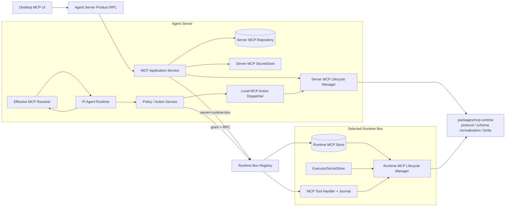
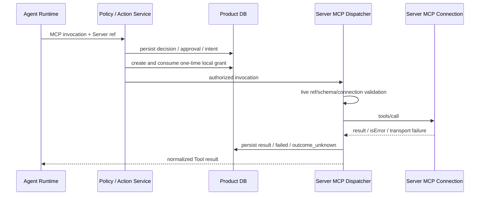

# MCP 双归属接入技术设计

> 状态：已实施  
> 更新日期：2026-07-29  
> 范围：Agent Server-owned MCP、Runtime Box-owned MCP、Agent Tool 装配与调用链路  
> 首期非目标：MCP Resources/Prompts、OAuth 2.1/DCR、跨设备 MCP 配置迁移、团队共享

## 1. 背景与结论

本设计启动时，仓库已经有一条 **Runtime Box-owned MCP POC**：

- Runtime Box 持久化 MCP config、静态 credential、Tool inventory 和 lifecycle state。
- Runtime Box 支持 stdio、Streamable HTTP 和兼容 SSE。
- Agent Server 路由 MCP 配置请求、同步脱敏 inventory、保存 Runtime Profile ref，并为 Tool 调用签发 grant。
- Pi Agent runtime 将 Runtime Box MCP Tool 转换为 SDK `ToolDefinition`。
- Desktop 已有随 active Runtime Box 切换的 MCP 设置页。

改造前模型只有一种所有权：所有 MCP 都属于某个 Runtime Box。当前实现已在保留该链路的基础上增加第二种所有权：

1. **Agent Server-owned MCP**
   - config、credential、Tool inventory、连接和子进程均由 Agent Server 管理。
   - 启用后连接不随 active Runtime Box 切换而重建或失效。
   - MCP 仍需被 Agent 显式选择，不会因为启用而自动暴露给所有 Agent。
2. **Runtime Box-owned MCP**
   - 继续由 owning Runtime Box 管理。
   - 只可被同一 Runtime Box 的 Runtime Profile 引用和执行。

两类 MCP 使用统一 ToolDefinition、Policy/Action 和结果规范，但执行目标、持久化事实源、credential 所有者及恢复协议不同。不得把 Agent Server-owned MCP 伪装成 Local Runtime Box 资源。

## 2. 已确认需求

| 主题 | 决策 |
| --- | --- |
| Agent Server MCP 生效语义 | 全局保持连接，但仍由每个 Agent 显式选择可用 MCP |
| Runtime Box 切换 | 不影响 Agent Server-owned MCP 的 enabled、connection 和 inventory |
| Agent 绑定 | Server-owned MCP ref 属于 Agent 全局配置；Box-owned MCP ref 属于 `agentId + runtimeBoxId` Runtime Profile |
| Transport | 首期同时支持 stdio、Streamable HTTP、SSE |
| stdio 执行位置 | 在 Agent Server 所在主机启动，不在当前 Runtime Box 启动 |
| Runtime Box 离线 | 暂不改变现有 Run gate；即使只使用 Server-owned MCP，也禁止在离线 Box 的 Session 上启动 Run |
| 首期认证 | stdio env 与远程静态 Header/Bearer/API Key；OAuth 2.1/PKCE/DCR 后置 |
| MCP 能力范围 | 首期只接 Tools；Resources 和 Prompts 后置 |

## 3. 目标与非目标

### 3.1 目标

1. 同一 Agent 可同时使用 Server-owned 和当前 Runtime Box-owned MCP Tool。
2. Server-owned MCP 不依赖 active Runtime Box，也不进入 Runtime Box inventory。
3. Box-owned MCP 不泄漏到其他 Runtime Box 的 Runtime Profile。
4. 两类 Tool 都经过 Agent 显式选择、live version/schema 校验、Policy/Action、审计和取消。
5. credential 只存在于资源 owner 的 SecretStore 和目标连接/子进程中。
6. MCP 协议实现、Tool schema 规范化和结果限制尽量复用，避免 Agent Server 与 Runtime Box 两套实现分叉。
7. 配置变更、连接状态、Agent 绑定和执行目标在 UI 与审计中明确可见。

### 3.2 非目标

- 不把 Server-owned MCP 复制到每个 Runtime Box。
- 不在 Runtime Box 离线时放宽现有 Session/Run 约束。
- 不自动把已启用 MCP 加入所有 Agent。
- 不自动把现有 Box-owned MCP 提升为 Server-owned MCP。
- 不在首期实现 MCP OAuth、MCP Sampling、Resources、Prompts 或 server-to-client roots。
- 不借 MCP 接入同时替换当前 MCP 协议实现或引入新的 SDK；先完成所有权重构，再单独评估官方 SDK。

## 4. 改造前实现分析

本节保留双归属改造开始时的基线，用来解释后续设计选择；它不是当前实现状态。当前能力以第 5 节之后和
[实现状态](./progress.md)为准。

### 4.1 Runtime Box 权威状态

`apps/runtime-box/src/runtime-resource-store.ts` 当前负责：

- `mcp_configs`、secret locator、health 和 `tools_json`。
- command idempotency、expected version、secret 文件补偿清理。
- inventory epoch/revision/change log/tombstone。
- MCP config mutation 与 inventory change 的同事务提交。

`apps/runtime-box/src/mcp-lifecycle-manager.ts` 监听 config change，管理连接、关闭和指数退避重连。

`apps/runtime-box/src/mcp-client.ts` 实现：

- stdio JSON-RPC。
- Streamable HTTP。
- legacy SSE。
- initialize、tools/list 分页、tools/call、session cleanup。
- 消息大小、超时、取消、MCP `isError` 和 outcome unknown 区分。

`apps/runtime-box/src/mcp-tool-handler.ts` 在 Runtime Box 内执行 MCP Tool，并与 invocation journal、grant 和 result evidence 结合。

### 4.2 Agent Server 当前职责

`apps/agents-server/src/runtime-box-registry.ts` 当前：

- 将 MCP list/upsert/setEnabled/delete 路由到指定 Runtime Box。
- 对 Box inventory 做 full snapshot、delta、hint、poll 和 stale projection。
- 调用前签发绑定目标 Runtime Box instance/generation 的 grant。
- 在调用后完成 evidence ack、receipt 和断线恢复。

`apps/agents-server/src/product-rpc.ts` 的 MCP 产品 API 始终解析到 active 或显式 `runtimeBoxId`，没有 owner 概念。

`packages/database/src/runtime-profile-repository.ts` 强制所有 resource ref 携带同一个 `runtimeBoxId`，因此不能表达 Server-owned ref。

### 4.3 Agent runtime 当前职责

`packages/agent-runtime/src/mcp-tools.ts` 将 Runtime Box inventory 转为 Pi SDK Tool，并固定通过：

```text
RuntimeBoxMcpToolGateway.invokeMcpForRuntimeBox(runtimeBoxId, ...)
```

`packages/agent-runtime/src/pi-agent-runtime.ts` 以 Runtime Box resource fingerprint 决定是否重建 Agent Session。它已经提供了在每次 Run 前按资源变化重建 ToolDefinition 的基础，但 Tool 来源目前只有 Runtime Box。

### 4.4 Desktop 当前职责

`apps/desktop/src/views/main/app/settings/runtime-resources-page.tsx`：

- 页面数据始终取 active Runtime Box。
- active Box online 时读取 live list，offline 时读取 stale inventory。
- “Add to profile” 只更新 `moshu.default + runtimeBoxId` 的 Runtime Profile。
- 切换 Runtime Box 会整体切换 MCP 列表和 Agent 绑定。

### 4.5 现有模型的缺口

| 缺口 | 影响 |
| --- | --- |
| MCP ref 必须含 `runtimeBoxId` | 无法表达 Agent Server-owned MCP |
| Lifecycle 只在 Runtime Box 启动 | Server 无法保持全局连接 |
| Tool gateway 固定为 Runtime Box RPC | Server-owned Tool 无合法执行路径 |
| Action target 固定为 Runtime Box | 无法正确审计 Server 本地 MCP 执行 |
| Product API 默认 active Box | UI 无法明确选择 MCP owner |
| Tool 名不含 owner namespace | 两种 owner 下相同 resource/tool ID 可能冲突 |
| Server 无 MCP SecretStore | Server-owned static credential 无安全落点 |
| Agent 只有 Runtime Profile | 无全局 MCP 选择面 |

## 5. 核心语义

### 5.1 enabled、assigned 与 ready

三者必须分开：

| 状态 | 含义 |
| --- | --- |
| `enabled` | owner 是否应该维持 MCP 连接/进程 |
| `assigned` | 某 Agent 是否选择该 MCP |
| `ready` | 当前连接是否可用，引用的 Tool schema 是否已加载 |

一个 MCP Tool 进入某次 Run 的有效工具集，必须同时满足：

```text
enabled && assigned && ready && resource ref 匹配 && Tool schema 匹配
```

启用不等于分配给 Agent；连接成功也不等于 Tool 已通过执行授权。

### 5.2 Runtime Box 切换

- 发起 Client 的 active Runtime preference 只影响列表默认筛选、新建 Session/Project 和 Box-owned MCP 管理面。
- Server-owned MCP manager 不订阅 active Runtime Box change。
- 已有 Session 仍绑定原 `runtimeBoxId`。
- 新 Run 的有效 MCP Tool 为：

```text
Agent 全局 Server-owned MCP refs
UNION
Agent 在 Session.runtimeBoxId 上的 Runtime Profile MCP refs
```

- 当前阶段仍先校验 Session Runtime Box online；校验通过后才解析两类 MCP。

### 5.3 更新与引用

配置并发控制和 Agent 资源引用使用不同版本：

- `configRevision`：每次配置、secret presence、enabled intent 变更时递增，用于 CAS。
- `resourceVersion + contentHash`：执行目标或 Tool schema 改变时更新，用于 Agent ref 和 Run live validation。

以下变更不应让 Agent ref 失效：

- 显示名称。
- start/stop。
- credential value 轮换。
- transient health 变化。

以下变更必须更新 `resourceVersion/contentHash`：

- command、args、cwd、URL、非敏感 Header/env 名称等执行目标变化。
- MCP Server 返回的 Tool 增删。
- Tool input/output schema 变化。

这样 credential 轮换和临时重连不会要求重新配置所有 Agent，而执行目标和 Tool schema 漂移仍 fail closed。

## 6. 目标架构



### 6.1 新增组件

| 组件 | 位置 | 职责 |
| --- | --- | --- |
| `@moshu/mcp-runtime` | `packages/mcp-runtime` | Transport、initialize、Tool discovery/call、结果限制、lifecycle 通用逻辑 |
| `AgentServerMcpRepository` | `packages/database` | Server-owned MCP config、CAS、descriptor 和 command idempotency |
| `AgentServerMcpSecretStore` | `apps/agents-server` 或独立 package | Server-owned MCP 静态 credential |
| `AgentServerMcpService` | `apps/agents-server` | Product command/query、lifecycle 编排 |
| `EffectiveMcpResolver` | `apps/agents-server` | 合并 Agent global refs 与 Runtime Profile refs |
| `McpActionDispatcher` | `apps/agents-server` | 按 owner 分发本地或 Runtime Box MCP Action |
| `AgentGlobalProfileRepository` | `packages/database` | 当前默认 Agent 的全局 Server-owned MCP refs |

### 6.2 复用策略

将 `apps/runtime-box/src/mcp-client.ts` 和生命周期状态机中的 owner-neutral 部分提取到 `packages/mcp-runtime`，不复制一份到 Agent Server。

共享 package 不得依赖产品 DB、Runtime Box inventory、ActionRepository 或具体 SecretStore。通过 Port 注入：

```ts
interface McpConfigProvider {
  listEnabled(): readonly McpConnectionConfig[];
  get(stableResourceId: string): McpConnectionConfig;
  updateObservedState(input: McpObservedStateUpdate): void;
  subscribe(listener: (change: McpConfigChange) => void): () => void;
}

interface McpProcessSpawner {
  spawn(command: string, args: readonly string[], options: McpSpawnOptions): McpChildProcess;
}
```

Runtime Box adapter 继续把 observed Tool change 写入 inventory transaction；Agent Server adapter 写入 Server-owned MCP repository。

stdio process spawner 必须保留现有 Unix process group / Windows Job Object 清理能力。不能直接使用一个只 kill parent PID 的裸 `Bun.spawn` 替代。

## 7. 所有权与数据模型

### 7.1 Owner contract

新增显式 owner union：

```ts
type McpOwner =
  | { kind: "agent-server" }
  | { kind: "runtime-box"; runtimeBoxId: string };

type McpResourceRef =
  | {
      owner: { kind: "agent-server" };
      stableResourceId: string;
      resourceVersion: string;
      contentHash: string;
    }
  | {
      owner: { kind: "runtime-box"; runtimeBoxId: string };
      stableResourceId: string;
      resourceVersion: string;
      contentHash: string;
    };
```

现有 Skill 继续使用 `RuntimeBoxResourceRef`，不因本方案变成 Server-owned。

### 7.2 Agent 绑定

当前只有 `moshu.default` Agent，可先增加：

```ts
interface AgentGlobalProfile {
  agentId: string;
  revision: number;
  serverMcpRefs: AgentServerMcpResourceRef[];
  createdAt: string;
  updatedAt: string;
}
```

- `AgentGlobalProfile.serverMcpRefs` 只能包含 `owner.kind = "agent-server"`。
- `RuntimeProfile.resources` 继续只包含同一 Runtime Box 的 MCP/Skill ref。
- 删除或改变执行目标前，必须检查所有 global/runtime profile 引用。
- 自定义 Agent/immutable Agent version 落地后，global refs 应进入 Agent version config snapshot；当前表作为过渡的全局配置投影，不把 ref 写入 Pi Session JSONL。

### 7.3 Effective resource

Agent runtime 只接收经过解析、无 credential 的统一描述：

```ts
interface EffectiveMcpResource {
  ref: McpResourceRef;
  displayName: string;
  tools: readonly McpToolDescriptor[];
}
```

禁止把 transport config、secret locator、credential value 或 OAuth state传给 Agent runtime。

### 7.4 Tool 名称

LLM 可见的 Tool SDK name 使用 provider-safe、最多 63 字符的格式：

```text
mcp_<serverSlug:24>_<toolSlug:29>_<hash:4>
```

- slug 只使用小写 ASCII 字母、数字和下划线。
- server/tool slug 共享 53 字符总预算，24/29 只是基础配额；任一侧不足基础配额时，未使用字符全部让给另一侧。
- 4 字符 hash 使用 SHA-256 的 Base64URL 前缀，提供 24-bit 空间。
- hash 输入为无歧义 tuple：`ownerKind + NUL + ownerId + NUL + fullServerId + NUL + fullStableToolId`。
- Runtime Box-owned MCP 的 `ownerId` 是完整 `runtimeBoxId`；Agent Server-owned MCP 的 `ownerId` 为空。
- owner 不直接拼入 Tool name，但完整参与 hash；运行时仍保留最终名称碰撞检测并 fail closed。

UI label 仍使用 MCP 原始 Tool name，并显示 `Agent Server` 或 Runtime Box 名称 badge。

## 8. Agent Server-owned 持久化

### 8.1 Product DB 表

新增：

```text
agent_server_mcp_servers
├── id TEXT PRIMARY KEY
├── config_revision INTEGER NOT NULL
├── resource_version TEXT NOT NULL
├── content_hash TEXT NOT NULL
├── display_name TEXT NOT NULL
├── enabled INTEGER NOT NULL
├── transport_json TEXT NOT NULL
├── secret_locator TEXT NULL
├── credential_configured INTEGER NOT NULL
├── health TEXT NOT NULL
├── tools_json TEXT NOT NULL
├── last_error_code TEXT NULL
├── created_at_ms INTEGER NOT NULL
└── updated_at_ms INTEGER NOT NULL

agent_server_mcp_command_results
├── command_id TEXT PRIMARY KEY
├── operation TEXT NOT NULL
├── request_digest TEXT NOT NULL
├── result_json TEXT NOT NULL
└── created_at_ms INTEGER NOT NULL

agent_global_profiles
├── agent_id TEXT PRIMARY KEY
├── revision INTEGER NOT NULL
├── server_mcp_refs_json TEXT NOT NULL
├── created_at_ms INTEGER NOT NULL
└── updated_at_ms INTEGER NOT NULL

```

约束：

- `transport_json` 只保存 command/args/cwd/URL 与 env/header **名称**，不保存 value。
- `tools_json` 使用现有 Tool 数量、单 schema 和总 payload 上限。
- `secret_locator` 是 Agent Server 内部 opaque locator，不进入 query、event、diagnostic 或 export。
- command result 有界保留，用于 `commandId` 幂等重放。
- secret-bearing command 使用 SecretStore-private HMAC key 生成幂等指纹，DB 中不保存可离线猜测 secret 的裸 SHA。
- Server-owned MCP 不进入 `runtime_box_inventory_*`，也不创建伪 `runtimeBoxId`。

### 8.2 SecretStore

新增 `AgentServerMcpSecretStore`：

- local desktop 首期可使用 `agentDataDirectory/mcp-secrets/`。
- parent `0700`、file `0600`、owner check、symlink rejection、atomic replace 和 fsync。
- key namespace 与 Provider SecretVault 分开，避免 MCP child 获得 Provider credential。
- secret rotation 采用“写新 generation -> DB commit -> 删除旧 generation”的补偿流程。
- DB commit 失败时删除新 secret；旧 secret 删除失败时进入 retained-secret GC，不静默丢失引用。
- list/get/result 只返回 `credentialConfigured`。

未来 Agent Server 部署到其他环境时，可通过同一 Port 切换 Keychain、OS vault 或 cloud secret manager。

### 8.3 Runtime Box store 演进

现有 `mcp_configs.version` 同时承担 config CAS 和 resource ref，建议升级为：

```text
config_revision
resource_version
content_hash
```

Box inventory 继续只投影 `resourceVersion/contentHash` 和脱敏 descriptor。Server-owned MCP 不需要 inventory epoch/revision，因为 authority 与 consumer 都在 Agent Server 内；其 observed state 通过 repository revision 和产品事件发布。

## 9. 配置与生命周期

### 9.1 Server-owned MCP 启动

Agent Server 启动顺序：

1. 打开 Product DB 和 MCP SecretStore。
2. 执行 action startup recovery。
3. 创建 Server MCP repository adapter 和 lifecycle manager。
4. 对所有 `enabled=true` 配置并行 reconcile，使用 `Promise.allSettled`。
5. 单个 MCP 失败只将该资源标为 `error/reconnecting`，不能阻止 Agent Server 启动。
6. Product RPC ready 后发布完整脱敏 MCP snapshot。

Server MCP lifecycle 不依赖 Runtime Box registry 是否有 online entry。

### 9.2 enable/connect

`enabled` 表示持久 desired state：

- `setEnabled(true)` 先原子持久化 intent，再启动连接。
- response 明确区分 `persisted=true` 与 observed `connectionState`。
- 握手失败时返回“配置已保存、连接失败”的 typed result，不把连接伪装成 ready。
- `setEnabled(false)` 必须停止重连、取消或排空连接上的 invocation、关闭 HTTP session/stdio process，再发布 stopped。

首期沿用现有每资源串行 reconcile 和 capped exponential backoff。连接失败保持 `enabled=true + health=error` 并重试；后续可增加显式 `suspended`/manual retry 状态，不得高频拉起坏进程。

### 9.3 Runtime Box-owned MCP

继续使用当前 routed mutation 和 inventory read-own-write：

```text
client -> Agent Server auth -> target Runtime Box commit
       -> inventory revision
       -> Agent Server reconcile to revision
       -> UI
```

Box offline 时 mutation 明确失败，不排队。Server-owned MCP mutation 不应因为 active Box offline 而失败。

### 9.4 Tool schema change

任一 owner 重新握手发现 Tool inventory 变化时：

1. 规范化 Tool descriptor 并计算 schema hash。
2. 原子更新 tools、resource version 和 content hash。
3. 发布 resource changed event。
4. 已加载 Pi Agent Session 在下一次 Run 解析新 fingerprint 时重建。
5. 旧 Agent ref 在重新确认前 fail closed。
6. 正在执行的调用继续绑定调用开始时的 schema hash；新调用使用新 schema。

## 10. 有效 Tool 解析

Run 启动保持以下顺序：

```text
1. 校验 Session.runtimeBoxId online/ready。
2. 读取 AgentGlobalProfile 的 Server MCP refs。
3. 读取 agentId + Session.runtimeBoxId 的 Runtime Profile。
4. 从 Agent Server authoritative repository live 校验 Server MCP refs。
5. 通过 RuntimeBoxRegistry.resources.validate live 校验 Box refs。
6. 合并并检查 SDK Tool name collision、Tool schema、Provider tool capability。
7. 构造本次 EffectiveMcpResource[] 和 resource fingerprint。
8. 创建或按 fingerprint 重建 Pi Agent Session。
```

任何 assigned resource 出现 missing、disabled、not ready、version/hash/schema mismatch 时，Run 创建失败并返回具体 owner/resource。不得静默丢弃单个 MCP 后继续运行。

Server MCP ready 不替代步骤 1 的 Runtime Box online gate，这是本期已确认的兼容行为。

## 11. Tool 调用、Policy 与 Action

### 11.1 统一调用合同

将 Agent runtime gateway 从 Runtime Box-specific 接口改为：

```ts
interface McpToolGateway {
  invoke(
    target: McpResourceRef,
    input: McpToolInvokeInput,
    options?: { signal?: AbortSignal },
  ): Promise<McpToolInvokeOutput>;
}
```

`McpToolInvokeInput` 继续绑定：

- `invocationId`、`runId`、`toolCallId`。
- owner + stable resource ID。
- resource version/content hash。
- stable Tool ID + schema hash。
- validated JSON arguments。

Agent runtime 不接收或构造 authorization。

### 11.2 Action target 泛化

当前 `action_intents.runtime_box_id` 实际表示执行目标，需改为：

```ts
type ExecutionTarget =
  | {
      kind: "agent-server";
      targetId: string;
      instanceId: string;
      generation: number;
    }
  | {
      kind: "runtime-box";
      targetId: string;
      instanceId: string;
      generation: number;
    };
```

数据库增加 `target_kind`、`target_id`，不把 Server-owned invocation 记到当前 Session 的 Runtime Box 名下。

### 11.3 Server-owned 调用



即使执行发生在同一 Agent Server 进程，也必须从 Action dispatcher 进入：

- one-time grant 绑定当前 Agent Server instance/generation、参数摘要和 Tool schema。
- grant 在发出 MCP request 前由 repository 原子消费。
- lifecycle manager 的 `callTool` 不直接暴露给 Agent runtime 或 Product RPC。
- MCP `isError` 记为 failed，不包装成成功。
- request 可能已被远端接收但连接丢失时记为 `outcome_unknown`。

Server 本地调用不需要 Runtime Box journal/evidence receipt；结果由同一进程直接持久化。Agent Server 崩溃恢复时，遗留 `running` 的 Server MCP Action 一律先标 `outcome_unknown`，non-idempotent Tool 不自动重放。

### 11.4 Runtime Box-owned 调用

保留现有：

```text
Policy/intent -> Runtime Box grant -> Box journal -> MCP call
-> evidence -> server ack -> Box receipt
```

grant 必须继续绑定 owning Runtime Box instance/generation。切换发起 Client 的 preference 不改变已启动调用的 target。

### 11.5 Tool 风险

MCP Tool descriptor 自身不能决定授权。当前 POC 对未知 MCP Tool 统一使用
`high + remote + non_idempotent` 并走 Action；后续 Policy 阶段增加 owner/schema-bound risk metadata：

- 默认未知 MCP Tool：`high + remote + non_idempotent`。
- 可由可信内置规则或用户覆盖为更低风险，保留 `source`。
- override 必须绑定 owner/resource/tool/schema hash；schema 变化后旧 override 不自动继承。
- 双所有权链路不得绕开当前 Policy/Approval/Action 授权接口。

## 12. RPC 设计

### 12.1 Client -> Agent Server

新增 owner-explicit v2 产品 API：

```text
moshu.v2.mcp.list
moshu.v2.mcp.upsert
moshu.v2.mcp.setEnabled
moshu.v2.mcp.delete
moshu.v2.agentGlobalProfile.get
moshu.v2.agentGlobalProfile.update
```

所有 MCP API 都要求：

```ts
owner:
  | { kind: "agent-server" }
  | { kind: "runtime-box"; runtimeBoxId: string }
```

mutation 还要求：

- `commandId`。
- `expectedConfigRevision`，create 时省略。
- secret set/clear 使用 command-only payload。

不得再用“未传 `runtimeBoxId` 就取 active Box”推断 mutation owner。query 可由 UI 显式传 active Box，但协议层不隐式决定。

### 12.2 Agent Server -> Runtime Box

现有 runtime protocol 保留：

```text
runtimeBox.mcpServers.list
runtimeBox.mcpServers.upsert
runtimeBox.mcpServers.setEnabled
runtimeBox.mcpServers.delete
runtimeBox.mcpTool.invoke
inventory.getSnapshot / getChanges / changed
```

Server-owned operation 不发往 Runtime ingress。Remote Runtime Box 可继续按独立 protocol version 升级。

### 12.3 Summary DTO

统一 UI summary：

```ts
interface McpServerSummary {
  owner: McpOwner;
  stableResourceId: string;
  configRevision: number;
  resourceVersion: string;
  contentHash: string;
  displayName: string;
  enabled: boolean;
  health: "stopped" | "ready" | "error";
  credentialConfigured: boolean;
  tools: McpToolDescriptor[];
  stale: boolean;
  lastErrorCode?: string;
}
```

- Server-owned summary 的 `stale` 恒为 false，因为读取 authority。
- Box-owned summary 在 Box offline 时可来自 stale cache，但 mutation 和 Run validation 仍需 live Box。
- DTO 不返回 command、args、cwd、URL、header/env value 或 secret locator；编辑配置使用用途受限的 redacted detail DTO。

### 12.4 Typed errors

至少包含：

```text
MCP_OWNER_NOT_AVAILABLE
MCP_CONFIG_REVISION_CONFLICT
MCP_RESOURCE_IN_USE
MCP_RESOURCE_VERSION_MISMATCH
MCP_TOOL_SCHEMA_MISMATCH
MCP_NOT_READY
MCP_CONNECT_FAILED
MCP_CREDENTIAL_REQUIRED
MCP_ACTION_OUTCOME_UNKNOWN
RUNTIME_BOX_UNAVAILABLE
```

## 13. Desktop UX

MCP 设置页分成两个明确作用域：

1. **Agent Server**
   - 辅助文案：“在 Agent Server 所在设备运行；切换 Runtime Box 后仍保持连接。”
   - stdio 显示实际执行主机和 cwd，不使用当前 Project/Runtime Box cwd。
   - active Runtime Box offline 时仍可管理。
2. **Runtime Box**
   - 明确显示当前 Box 名称、Local/Remote、online/stale。
   - 切换 Box 后只切换本区列表。
   - offline 时只读，不自动回退 Local Box。

每个卡片显示：

- owner badge。
- enabled/connection state。
- Tool count。
- credential configured。
- assigned Agent 数量。
- last safe error。

Agent 配置分两组：

- “所有 Runtime Box 可用”：选择 Server-owned MCP。
- “当前 Runtime Box 可用”：选择 Box-owned MCP。

删除被引用 MCP 时默认拒绝，并列出引用 Agent。后续可提供显式“从所有 Agent 移除并删除”事务，但首期不自动级联。

导入或复制：

- 导入必须先选 owner。
- “复制到 Agent Server/Runtime Box”创建新 stable resource，不移动原资源。
- secret 不复制，用户必须重新填写。
- Box path/cwd 复制到 Agent Server 前必须重新确认其在 Server host 上的含义。

## 14. 安全设计

### 14.1 Secret 隔离

| MCP owner | Secret owner | 可注入目标 |
| --- | --- | --- |
| Agent Server | `AgentServerMcpSecretStore` | 对应 Server MCP HTTP request 或 stdio child |
| Runtime Box | `ExecutorSecretStore` | 对应 Box MCP HTTP request 或 stdio child |

禁止：

- Server MCP child 继承 Provider SecretVault credential。
- Box MCP credential 发送到 Agent Server。
- secret value 进入 Product DB、Runtime Box inventory、Pi Session、Run snapshot、日志、diagnostic、export 或 WebView response。
- 一个 MCP 的 secret 注入其他 MCP child。

### 14.2 stdio

- Server-owned stdio 在 Agent Server host 启动，属于高权限本地执行面。
- 默认 cwd 使用私有 `agentDataDirectory/mcp-workspaces/<serverId>`，不使用 active Project。
- 显式 cwd 必须是 Agent Server host 路径，并在 UI 中确认。
- 环境只保留受控 `PATH/HOME/TMP/SystemRoot/ComSpec` 与该 MCP secret env。
- 使用 process group / Job Object，shutdown、disable、update 和 crash recovery 都清理进程树。
- MCP config mutation 只能由用户产品 API 发起，不能作为 Agent Tool 暴露。

### 14.3 HTTP/SSE

- 继续只允许 HTTPS，loopback 可显式允许 HTTP。
- redirect 使用 manual policy，并重新校验 origin。
- URL 不得含 userinfo。
- 连接与每次 request 都执行 timeout、响应大小和 content-type 校验。
- 后续网络策略应增加 DNS rebinding、link-local/private network 和代理规则；在该 gate 完成前，添加非 loopback endpoint 必须显示目的地。

### 14.4 不可信内容

- MCP Tool name、description、schema 和 result 都按不可信输入处理。
- schema 有大小、深度和字段数量上限。
- Tool result 保持现有文本、图片、总 payload 和 block 数限制。
- MCP 返回内容不能新增 Tool、改变 owner、修改 risk override 或授予权限。

## 15. 故障与恢复

| 场景 | Server-owned MCP | Box-owned MCP |
| --- | --- | --- |
| 切换 active Box | 无影响 | 设置页切到新 Box；已有 Run 不迁移 |
| Agent Server 重启 | enabled 配置重连；running Action -> unknown | Box 重连后 full inventory sync 和 invocation reconcile |
| Runtime Box 离线 | MCP 连接可继续，但当前规则仍禁止新 Run | cache stale、mutation/new Run 失败 |
| stdio child 退出 | health error/reconnect/suspend | 现有 Box lifecycle 处理 |
| HTTP session 丢失 | 重建 session；已发送 Tool 结果未知时不自动重放 | 现有 Box journal/evidence 路径 |
| Tool schema 变化 | rotate resource ref，Agent 需重新确认 | inventory change，Runtime Profile ref mismatch |
| credential revoked | 关闭连接、释放 runtime ref、标 auth error | owning Box 执行同样处理 |
| disable/delete | 先停止 lifecycle，再完成 mutation publication | routed commit + inventory tombstone |

## 16. 代码改造映射

| 当前文件 | 改造 |
| --- | --- |
| `apps/runtime-box/src/mcp-client.ts` | owner-neutral 协议逻辑迁到 `packages/mcp-runtime`；保留 Runtime Box process adapter |
| `apps/runtime-box/src/mcp-lifecycle-manager.ts` | 迁为共享 manager + Runtime Box store adapter |
| `apps/runtime-box/src/runtime-resource-store.ts` | 增加 config/resource 双版本；继续维护 Box inventory transaction |
| `packages/contracts/src/runtime-resources.ts` | 增加 `McpOwner`、统一 summary/ref、global profile 与 v2 API schema |
| `packages/contracts/src/executor-tools.ts` | 增加 owner-aware MCP invocation；保留 Runtime Box wire adapter |
| `packages/agent-runtime/src/mcp-tools.ts` | 改为 owner-neutral gateway 与 collision-safe Tool name |
| `packages/agent-runtime/src/pi-agent-runtime.ts` | fingerprint 同时包含 global 和 Box refs |
| `apps/agents-server/src/create-agents-server.ts` | 初始化 Server MCP store/secret/lifecycle/resolver/dispatcher |
| `apps/agents-server/src/runtime-box-registry.ts` | 只保留 Box owner gateway，不承载 Server MCP |
| `apps/agents-server/src/action-authorization-service.ts` | Action target 泛化；按 owner 分发 |
| `apps/agents-server/src/product-rpc.ts` | 增加 owner-explicit MCP v2 API 和 Agent global profile API |
| `packages/database/src/schema.ts` | 增加 Server MCP/global profile/policy 表并泛化 Action target |
| `apps/desktop/.../runtime-resources-page.tsx` | 增加 owner 分区，不再让整个页面隐式跟随 active Box |

## 17. 实施阶段

### M0：合同与共享 MCP runtime

1. 增加 owner/ref/summary/global profile contract。
2. 提取 `packages/mcp-runtime`。
3. Runtime Box 通过 adapter 继续跑现有 MCP 测试，行为不变。
4. 增加 collision-safe Tool naming。

**出口：** 现有 Box-owned MCP 全部通过，Agent Server 尚不启用新能力。

### M1：Server-owned store 与 lifecycle

1. 新增 Server MCP repository、SecretStore 和 schema。
2. 接入三种 transport、启动/停止/重连/shutdown。
3. 实现 owner-explicit list/get/upsert/setEnabled/delete/test。
4. 确认 Server MCP child 不继承 Provider credential。

**出口：** 不依赖 Runtime Box 可创建、连接和管理 Server-owned MCP，但尚未暴露给 Agent。

### M2：Agent 全局绑定与有效资源解析

1. 新增 `AgentGlobalProfileRepository`。
2. 合并 global refs 与 Runtime Profile refs。
3. Run start 执行两类 live validation。
4. Pi runtime 使用统一 ToolDefinition/fingerprint。

**出口：** Agent 可同时看到两种 owner 的 Tool，切 Box 不改变 global Tool。

### M3：Action target 与调用

1. 泛化 Action target schema/repository。
2. 增加 Server local MCP dispatcher。
3. 保留 Box grant/journal/evidence 路径。
4. 增加 `outcome_unknown`、cancel 和 startup recovery 测试。

**出口：** 两类 Tool 都只能通过 Policy/Action 调用，审计目标准确。

### M4：Desktop 与安全加固

1. MCP 设置页按 owner 分区。
2. Agent 全局/Box profile 分组。
3. 引用保护、typed error、脱敏 diagnostics。
4. fault、process tree、secret、package smoke。

**出口：** 用户可理解并可靠管理两种 MCP 作用域。

## 18. 测试与验收

### 18.1 Contract/Repository

- owner union 拒绝缺失/额外 `runtimeBoxId`。
- global profile 拒绝 Box ref；Runtime Profile 拒绝 Server ref。
- config CAS、command replay、resource version 语义。
- DB/DTO/event/log 不含 secret value。
- schema change 使旧 ref 失效；credential rotation 不使 ref 失效。

### 18.2 Lifecycle

- Agent Server 与 Runtime Box adapter 运行同一 transport conformance suite。
- stdio/HTTP/SSE initialize、分页 list、call、close、timeout、cancel。
- disable/update/shutdown 清理 process tree/session。
- reconnect backoff、jitter 和 suspend。
- Agent Server 启动时单个坏 MCP 不阻塞服务。

### 18.3 有效 Tool 集

准备两个 Runtime Box A/B：

```text
Server MCP: S
Box A MCP: A
Box B MCP: B
```

验收：

| Session Box | Agent assignments | 有效 MCP |
| --- | --- | --- |
| A | S + A | S、A |
| B | S + B | S、B |
| A | S + B | Run validation 失败，不能跨 Box 使用 B |
| B offline | only S | 当前阶段仍禁止启动 Run |

切换 active Box A -> B 时：

- S connection ID/process PID 不变化。
- A 不出现在 B Runtime Profile。
- 已在 A 上运行的 invocation 不迁移。

### 18.4 Action/Recovery

- Server MCP Action target 为 `agent-server`，不伪记为 Session Runtime Box。
- Box MCP grant 仍绑定正确 instance/generation。
- 同 owner 下 duplicate invocation 拒绝。
- cancellation before dispatch、during request、after possible remote acceptance 分别落正确状态。
- Agent Server crash 后 Server MCP running Action 为 `outcome_unknown`，不自动重放。
- Runtime Box disconnect 继续走现有 evidence reconciliation。

### 18.5 Security

- Server stdio child 看不到 Provider API key 和其他 MCP secret。
- HTTP header、stdio env、secret locator 不出现在 query、renderer、event、diagnostic 和 export。
- URL/userinfo/redirect/response-size gate。
- malicious Tool description/schema/result 不改变权限。
- 两个 owner 下同名 resource/tool 生成不同稳定 SDK name。

## 19. 文档决策修订

实现已同步修订原有“所有 MCP 均归 Runtime Box”的表述：

- `docs/implementation/README.md` 的 DEC-017/018/022/023。
- `docs/implementation/architecture.md` 的角色所有权、数据目录和 MCP 章节。
- `docs/implementation/data-contracts.md` 的数据所有权、resource ref、MCP credential 和 RPC。
- `docs/product/agents-integrations.md` 的 MCP 作用域和 Runtime Profile。
- `docs/product/security-data.md` 的 MCP Secret 所有者。
- `docs/implementation/runtime-box.md` 保留 Box-owned 规则，并明确它不覆盖 Server-owned MCP。

修订后的总原则应为：

> MCP config、credential、inventory 和 lifecycle 归其显式 owner：Agent Server-owned MCP 归 Agent Server；Runtime Box-owned MCP 归 owning Runtime Box。Agent Server 始终拥有 Agent 绑定、Policy、approval、Action intent/result 和审计。
