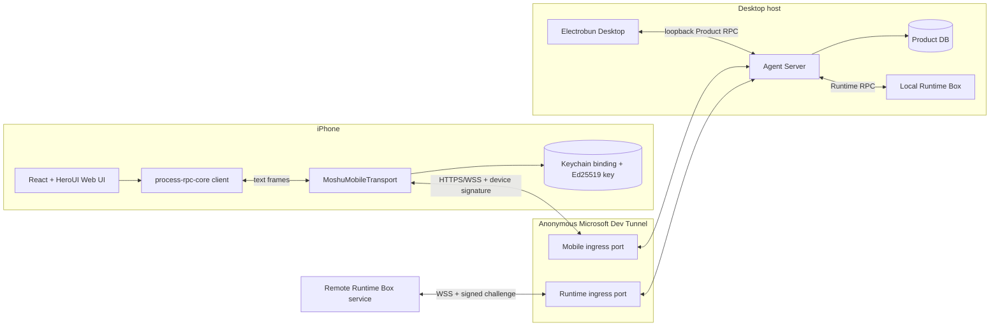
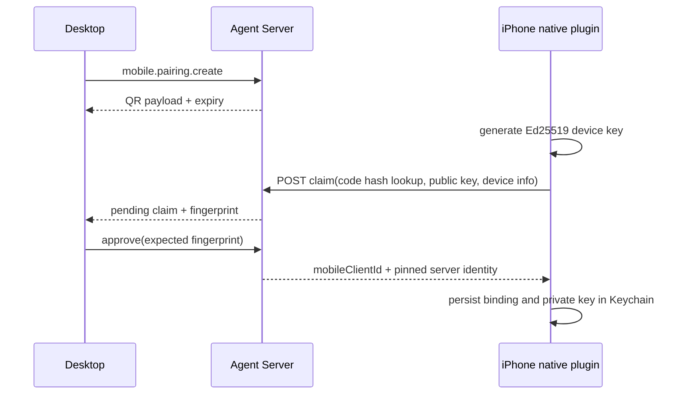

# iOS Mobile Client 实现

> 状态：已实现
> 更新日期：2026-08-03
> 范围：iPhone Client、独立 Mobile ingress、设备配对与认证、审批、durable 未读、本地通知和本地 Xcode 安装

## 1. 目标与边界

`apps/mobile` 是墨枢的 iPhone 操作界面。它连接 Desktop 启动的 Agent Server，复用同一份
Session、Project、Run、Approval 和 Runtime Box 业务状态，但不托管 Agent runtime、Provider credential、
产品数据库或 Tool execution。

首版已实现：

- 普通 Chat 与 Project Chat 的列表、创建、历史、文本发送、流式回复和停止；
- Agent Server 已配置模型与 thinking level 的选择；
- Runtime Box 的 client-scoped 选择，Desktop 与 iPhone 互不影响；
- Tool/Action 审批、拒绝和当前 Session Allow all；
- Activity、durable attention/unread 恢复和 best-effort 本地通知；
- 二维码配对、Ed25519 设备身份、吊销、generation fence 和自动重连；
- Capacitor Web UI、本地 Swift 安全传输、Keychain 单 Server binding 和 Xcode 真机安装。

明确不包含：

- Provider、MCP、Skill、Remote Access 或 Project path 的移动端管理；
- 离线消息队列、业务数据本地缓存或多 Agent Server 聚合；
- 云 Push Relay、APNs remote/silent push 或后台伪保活；
- Noise 应用层端到端加密、iPad 专用布局和 App Store 自动发布。

Desktop、Agent Server 和 Dev Tunnel 必须在线。App 被 suspended/terminated 时不保证通知；恢复连接后从
Agent Server 的 durable attention feed 补齐未读。

## 2. 总体架构



Mobile ingress 与 Runtime ingress 是 Agent Server 上两个独立的 loopback listener 和 Tunnel port：

| 入口 | Path | 远端角色 | 权限 |
| --- | --- | --- | --- |
| Product RPC | `/rpc` | Desktop `client` | 本地完整产品 API |
| Runtime ingress | `/runtime` | `runtime-box` | Tool、inventory、MCP/Skill 与 invocation |
| Mobile ingress | `/mobile` | `mobile-client` | Mobile MVP allowlist |

Product RPC 不进入 Tunnel。Mobile ingress 不能调用 Runtime Box method，也不能访问 Provider credential、
Remote Access 控制、Runtime Box 配对、MCP/Skills、Project mutation 或 diagnostics。

## 3. 代码结构

```text
apps/mobile/
├── src/
│   ├── app/                  # shell、连接、主题、i18n、键盘和 attention provider
│   ├── components/           # tab bar、approval card、布局
│   ├── screens/              # Chats、Projects、Activity、Settings、连接状态
│   ├── rpc/                  # handshake、Product client、replay、attention、notification tap
│   └── native/               # Capacitor plugin TypeScript surface
├── native/MoshuMobile/       # 无 Capacitor 依赖的 Swift core + XCTest
├── ios/App/                  # Capacitor 8 SPM iOS 工程
├── scripts/                  # canonical vectors、版本同步、release gate
├── capacitor.config.ts
└── release.config.json

apps/agents-server/src/
├── mobile-ingress-auth.ts
├── mobile-ingress-generation-fence.ts
├── mobile-ingress-handlers.ts
├── mobile-ingress-composition.ts
└── mobile-attention-drainer.ts

packages/
├── contracts/src/mobile.ts
├── process-rpc-core/
└── database/src/
    ├── mobile-device-repository.ts
    ├── mobile-pairing-repository.ts
    ├── mobile-attention-repository.ts
    └── mobile-attention-outbox-repository.ts
```

## 4. Web UI 与原生边界

Web UI 使用 React 19、Vite、HeroUI 和 React Router HashRouter。生产资源以 `base: "./"` 构建到 `dist/`，
再由 Capacitor 复制进 App；没有 `server.url`，Agent Server 只传业务数据，不远程托管 UI。

iPhone 布局使用：

- `viewport-fit=cover`、`100dvh` 和 `env(safe-area-inset-*)`；
- WebView `contentInset: "never"`、关闭外层 scroll，由内部容器负责滚动；
- `VisualViewport` 键盘避让、触控尺寸、VoiceOver label、横屏兼容；
- 底部 Chats、Projects、Activity、Settings 四个 Tab。

业务数据只保存在 React memory。断线后清空 Session、Project、Message 和 Approval 状态，只显示
offline/reconnecting；不写 localStorage、Preferences 或 Keychain，也不自动发送未知结果的消息。
只有语言和主题可持久化。

## 5. 配对与设备认证

### 5.1 配对



配对 code 至少 128-bit 熵、5 分钟过期、server 只保存 hash 且单次使用；claim token 同样只保存 hash。
二维码只包含 Mobile URL、pairing ID、一次性 code、Agent Server identity/public key/fingerprint、expiry 和
协议区间，不包含长期 credential。只有本地 Desktop 能 approve/reject/revoke。

Remote Access 必须处于 enabled，且 Mobile ingress 已 ready 并有 exact public URL；否则
`pairing.create` 在写入任何 durable state 前返回 `MOBILE_INGRESS_NOT_READY`。

### 5.2 认证连接

原生 plugin 使用 CryptoKit `Curve25519.Signing` 生成 Ed25519 **软件密钥**。private key 与单 Server
binding 存在 Keychain，使用 `kSecAttrAccessibleWhenUnlockedThisDeviceOnly`，不进 JavaScript、不经 iCloud 同步。

每次连接：

1. Keychain 原子递增持久 generation，并生成新的 `instanceId`；
2. 请求 `/mobile-auth/challenge`；
3. 使用二维码固定的 Agent Server public key 验证 server challenge 签名；
4. 对绑定 `agentServerId + mobileClientId + deviceKeyId + instanceId + generation + nonce + protocol`
   的 canonical payload 签名；
5. 通过 `URLSessionWebSocketTask` 自定义 `x-moshu-*` Upgrade headers 建立 WSS；
6. process-rpc hello 使用完全相同的 canonical `mobile-client` identity。

Agent Server 持久化 generation high-water。旧 generation、并行冲突、已吊销 key、重放/过期 challenge、
identity mismatch 和不兼容协议全部 fail closed。设备吊销会关闭现有 peer，并阻止后续 challenge/upgrade。

Swift 与 TypeScript 共用 canonical JSON test vectors，验证 SPKI DER、base64url、challenge 和 authentication
payload 字节一致。TLS 只使用系统信任链；当前信任 Microsoft Relay TLS，未启用 Noise，Relay 可见应用 payload。

## 6. RPC、事件与恢复

`@moshu/process-rpc-core` 是无 Node/Bun 依赖的 transport-neutral 核心。Swift plugin 负责认证 socket 和 text
frame，JavaScript 负责 process-rpc hello、请求、响应、Zod 校验和 Product domain。

Mobile allowlist 只开放：

- Runtime info/list 和 client-scoped switch；
- Project list/get/sidebar；
- model list；
- Session list/get/create/setModel；
- Chat send/cancel/replay/subscribe/unsubscribe；
- Approval list/get/decide 和 Session policy get/update；
- attention list/ack。

多 Client live event 使用 Session subscription。恢复顺序固定为：

```text
subscribe
  -> buffer live
  -> replay durable run cursors
  -> dedupe by runId + seq
  -> drain event and retirement queues
  -> ready
```

`chat.send` 使用持久 request ID reservation。响应丢失或网络中断属于 ambiguous，用户重试同一 draft 时复用
request ID，由 server 幂等去重；只有 definitive rejection、用户丢弃或修改内容才生成新 ID。

Runtime Box 选择保存为 client-scoped preference，因此 Desktop 与 iPhone 可独立选择。Session、Project 和 Run
仍永久保存自己的 `runtimeBoxId`，执行路由不依赖当前 UI 选择。

## 7. 审批与安全展示

Agent Server 是风险和审批的唯一事实来源：

- read/grep/find/ls 等只读工具按策略自动放行；
- edit/write 等可覆盖 Action 可被当前 Session Allow all 自动批准；
- shell/bash 一律不可被 Allow all 绕过；
- Approval、decision、policy revision 和 idempotency key 持久化并使用 CAS；
- 多个 Client 同时决定时只有一个 applied，其余得到 authoritative final state。

公开 shell 摘要固定为：

```text
shell [arguments hidden]
```

原始 command 只留在 server-side Action intent，不进入 Approval contract、event、UI 或日志。

## 8. Attention、生命周期与通知

Approval pending 与 Run terminal transition 在同一个 SQLite transaction 中写
`mobile_attention_outbox`。幂等 drainer 将其投影到 `mobile_attention_events`；失败保留重试，不会因进程崩溃
永久丢失未读。

每个 `mobileClientId` 有 server-side 单调 ack cursor。`mobile.attention.list` 提供 cursor pagination、
`unreadCount`、`latestSeq` 和 `resyncRequired`；设备不保存业务 attention。Retention 为 30 天且每 client
最多 500 条，cursor 落后于 retention 时明确要求 resnapshot。

生命周期规则：

- active：连接或恢复，并刷新 Session/Runtime/attention snapshot；
- background：停止新重连，仅允许现有 socket 在有限 UIKit background task 内存活；
- expiration：关闭当前精确 socket 并结束 task；
- foreground：即使 socket 存活也执行 non-notifying refresh；
- fatal auth/protocol/identity error：停止盲重连。

本地通知需要用户在 Settings 显式开启。仅当 App 非 active 且短后台 socket 实际收到
`attention.changed` 时发送 generic notification；不包含 prompt、command、path 或 secret。Tap 只携带校验过的
opaque ID 或 `safeActivity` marker，并在 authenticated reconnect + fresh snapshot 后才导航。

没有 APNs token、remote/silent push entitlement、VoIP/audio/background-processing 保活或云服务。
App 被 suspended/terminated 时没有通知保证，重连后只恢复 badge，不补发历史系统通知。

## 9. 本地开发与 iPhone 安装

要求：

- macOS、Bun 1.3.14；
- 支持 iOS 15+ deployment target 的 Xcode；
- 已开启 Developer Mode 并信任当前 Mac 的 iPhone；
- Apple ID 对应的 Personal Team 或开发 Team。

```bash
bun install --frozen-lockfile
bun run --cwd apps/mobile build
bun run --cwd apps/mobile cap:sync
bun run --cwd apps/mobile cap:open
```

在 Xcode 中：

1. 选择 `App` target；
2. 在 Signing & Capabilities 开启 Automatically manage signing；
3. 选择本人的 Team，并设置一个唯一开发 Bundle ID；
4. 选择已连接的 iPhone；
5. 点击 Run 安装。

免费 Personal Team 可以真机安装，但 provisioning 通常需要周期性重新签名。安装后先保持 Desktop 在线，在
Desktop 的 Mobile Access 设置中启用 Remote Access、生成二维码，再由 iPhone 扫码并确认指纹。

## 10. 验证与发布门

常用命令：

```bash
bun run --cwd apps/mobile typecheck
bun run --cwd apps/mobile test
bun run --cwd apps/mobile build
bun run --cwd apps/mobile cap:sync
bun run --cwd apps/mobile release:gate
swift test --package-path apps/mobile/native/MoshuMobile
```

`release:gate` 检查：

- 无 remote UI、Node builtin、`Buffer`、`ws` 或 secret 样本；
- 无宽泛 ATS、APNs entitlement、禁用的 background mode、Local Network/Bonjour；
- TypeScript/Swift canonical vectors 与版本一致；
- `dist` 与 iOS `public` 的递归 path/size/SHA-256 manifest 一致；
- release bundle ID 不是 `dev.moshu.mobile`，并与 Xcode Release build settings 一致。

仓库提交的是开发 Bundle ID `dev.moshu.mobile`，不包含 `DEVELOPMENT_TEAM`、证书或 provisioning。正式发布仍需：

- 永久 Bundle ID 和 `MOSHU_MOBILE_RELEASE_BUNDLE_ID`；
- Apple Team、签名与 provisioning；
- CryptoKit Ed25519 + TLS 的出口合规问卷确认；
- 真实 Dev Tunnel 探针和 App Store review 提交流程。

仅通过 Xcode 安装到连接的 iPhone 不需要 App Store 发布，但仍需要本机开发签名。

## 11. 相关文档

- [技术架构](./architecture.md)
- [数据与接口契约](./data-contracts.md)
- [质量与发布](./quality-release.md)
- [实现状态](./progress.md)
- [Runtime Box 架构与实现](./runtime-box.md)
- [`apps/mobile` 开发说明](../../apps/mobile/README.md)
