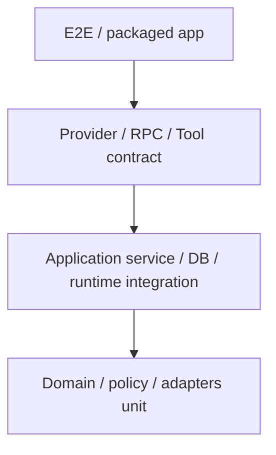

# 质量与发布计划

## 1. 质量目标

| 目标 | 发布要求 |
| --- | --- |
| 正确性 | 状态机、事件、审批和副作用关联无歧义 |
| 可恢复 | DeepAgentService、窗口或应用异常后不盲目重复副作用 |
| 安全 | WebView、Canvas、网页、MCP 和 Skill 无越权路径 |
| 兼容 | 支持的 Provider 在声明能力范围内行为一致 |
| 性能 | 长会话、流式事件和 3 个并发 Run 下 UI 可交互 |
| 可迁移 | 数据库和 checkpoint 升级失败有备份与恢复路径 |
| 可发布 | macOS 签名、公证、安装、升级和回滚可复现 |

## 2. 测试分层



| 层 | 运行频率 | 工具 | 重点 |
| --- | --- | --- | --- |
| Unit | 每次提交 | `bun test`/Vitest | 状态机、Policy、路径、费用、脱敏 |
| Integration | 每个 PR | Bun test runner + 真实 `bun:sqlite`/子进程 | DB、BunSqliteSaver、DeepAgentService、Broker |
| Contract | 每个 PR + nightly | 本地 fake server/fixture | Provider、Electrobun RPC、DeepAgentService、Tool、MCP |
| WebView | 每个 PR | Vitest + React Testing Library | 路由、焦点、表单、状态 |
| Desktop E2E | 每个 PR 核心集，nightly 全集 | Phase 0 冻结的 typed-RPC test driver + UI automation | Host/WebView/in-process Deep Agents 完整流程 |
| Package smoke | 主分支/nightly/release | Electrobun artifact + 外部启动/探针脚本 | 自解压、ASAR 可选项、bundled runtime、签名产物 |
| Live compatibility | nightly/发布前 | 低预算真实账号 | Provider API 漂移 |
| Security/Chaos | nightly/发布前 | 专项 harness | 越权、崩溃、恢复、恶意内容 |

## 3. Unit 测试清单

### 3.1 Domain

- Run、Tool、Approval 状态机只接受合法转换。
- Session/Canvas revision compare-and-swap。
- Queue 优先级、并发槽和同 Session 写锁。
- Allow all grant 必须匹配当前 app instance。
- Plan 批准前不能转换为执行状态。

### 3.2 Policy Engine

- Ask/Plan/Agent 有效工具集。
- 文件路径、Project 边界、排除规则和敏感路径。
- `..`、Unicode、大小写、软链接和不存在目标路径。
- 命令 direct exec、复杂 Shell、网络、删除、权限提升。
- Allow all 可放行与不可放行矩阵。
- MCP/Skill 声明不能提高应用权限。

使用 property-based tests 生成路径、参数和状态转换边界；高风险策略不只靠固定样例。

### 3.3 数据与事件

- AppRunEvent Schema 和 payload mapping。
- sequence 分配、重复事件去重和缺口识别。
- Provider 用量、缓存 Token、费用 decimal 累计。
- Secret、Header、路径和命令输出脱敏。
- 导出只包含允许字段。

## 4. Integration 测试

### 4.1 SQLite

- 新数据库建库和所有 migration。
- 每一个已发布 Schema 版本升级到当前版本。
- WAL、并发读、单写和 busy timeout。
- 事务中断、磁盘满、只读目录和损坏数据库。
- 迁移前备份和失败恢复页。
- Tombstone 清理不删除 Project 原文件。

### 4.2 Checkpoint

- `BunSqliteSaver` 的 `getTuple/list/put/putWrites/deleteThread` 行为 contract。
- interrupt → app restart → resume。
- todo、subagent 和 message state 恢复。
- checkpoint 领先业务事件。
- 业务事件领先 checkpoint。
- Deep Agents/LangGraph 旧版 fixture 在升级后读取。
- 删除 Session 后 thread 清理。

### 4.3 RPC

- 每个 Host/WebView method 的请求/响应 Schema。
- 未登记 View ID、错误窗口角色/origin 和销毁窗口调用被拒绝。
- WebView 不能调用未在领域 client 暴露的方法；Canvas BrowserView 没有应用 RPC。
- Subscription 从 `afterSeq` 补齐、实时切换、去重和慢消费者。
- DeepAgentService 的 start 快速接受、事件发布、cancel、dispose 和 shutdown。
- 旧 execution/app instance 的迟到 callback 被丢弃。
- durable interrupt 在 WebView reload 后可补齐，并用同一 thread/config 恢复。
- Run 完成、Session 删除和 shutdown 后 Registry 归零；重复打开/关闭会话不持续增长 heap、订阅或 Provider client。
- 仅 sidecar ADR 被采用时增加握手、协议版本、frame、背压、heartbeat 和 crash-loop suite。

### 4.4 Action Broker

- 文件读写、原子替换、hash CAS、冲突和撤销。
- 命令 cwd、环境、超时、输出截断和取消进程树。
- Action intent 在副作用前落库。
- Broker 返回错误后 DeepAgentService 不生成成功 ToolMessage。
- 同一路径写锁和 move 双锁无死锁。

## 5. Provider Contract Suite

每个 Chat Provider Adapter 必须通过统一测试：

| 能力 | 测试 |
| --- | --- |
| Authentication | 有效、无效、缺失和撤销 Key |
| Basic invoke | 文本请求和最终响应 |
| Streaming | delta 顺序、取消和连接断开 |
| Tool call | Schema、参数、多个 Tool、无效 Tool |
| Usage | input/output/cache/reasoning 字段归一化 |
| Error | 401、403、404 model、429、5xx、timeout |
| Capability | 不支持 Tool/图片/参数时在运行前拒绝 |
| Endpoint | Base URL、版本、Header 和代理字段 |
| Redaction | 请求/错误/日志不含 Key |

### 5.1 本地 Fake Provider

维护 OpenAI-compatible 和 Anthropic-compatible fake HTTP Server：

- 可脚本化返回 streaming、Tool、usage 和错误。
- PR 测试不依赖外网或真实费用。
- Kimi、智谱和自定义 Endpoint 复用兼容协议 suite，再增加品牌默认值测试。

### 5.2 Live Smoke

- 只在受保护 CI 环境和低预算账号运行。
- 每个正式支持 Provider 至少测试一次文本、stream 和 Tool call。
- 失败阻止 release，不阻止普通社区 PR。
- 日志只保留 Provider、模型、状态、耗时和用量，不保留内容/Key。
- 模型下线时先在能力目录标记，不静默替换用户模型。

## 6. Electrobun 桌面 E2E

Electrobun 当前没有 Playwright Electron 的等价官方入口。Phase 0 必须冻结可长期维护的测试驱动：

- test 构建可启用最小 typed-RPC driver，用随机启动 token 和仅限本机的 pipe/socket 驱动假 Provider、故障注入和状态查询。
- driver 通过编译时条件完全排除在 stable release；CI 扫描产物确认无测试 method、监听端口或固定 token。
- 用户可见交互由 React Testing Library 和目标平台 UI automation 覆盖；CDP/Playwright 只有在 packaged POC 证明稳定时才可作为实现。
- release package smoke 只能依赖正式入口、外部进程状态和公开诊断结果，不依赖测试后门。

### 6.1 核心 PR 集

- 首次启动和空状态。
- 保存 fake Provider 并开始普通 Chat。
- 添加临时 Project 并运行 Ask。
- Plan 生成、批准和执行。
- 文件写审批、拒绝和允许。
- 窗口 reload 后轨迹恢复。
- Session 搜索、归档和导出。

### 6.2 Nightly 全集

- PRD E2E-01 至 E2E-07。
- 3 个并发 Session 和第 4 个排队。
- application runtime 强制退出并重启恢复。
- WebView reload/关闭后后台 Run 与 durable interrupt 行为。
- 关闭最后窗口后按策略继续/取消，重新打开可恢复任务中心且无永久 pending approval。
- 文件外部并发修改与撤销冲突。
- 语言/主题切换和键盘核心流程。
- package artifact 安装后的相同流程。

### 6.3 Phase 2

- PRD E2E-08 至 E2E-12。
- MCP stdio/HTTP/OAuth fake servers。
- 恶意 Skill fixture。
- 知识索引中断、增量和引用。
- Canvas revision 冲突和恶意 Preview。

## 7. 故障注入与恢复

### 7.1 Kill points

对每类副作用自动注入以下中断点：

1. Tool proposed 后。
2. Approval 决定后。
3. Action intent 落库后、执行前。
4. 副作用完成后、result 落库前。
5. result 落库后、DeepAgentService 收到 typed result 前。
6. checkpoint 更新前后。
7. Run 标记 completed 前。

### 7.2 预期

| Action | 恢复预期 |
| --- | --- |
| 读文件/搜索 | 可重试 |
| 固定内容写入 | 根据 after hash 判定成功或重试 |
| Patch | 检查 before/after hash，否则冲突 |
| 命令 | 无法确认时显示 unknown，不自动重跑 |
| 远程副作用 MCP | unknown，要求人工验证 |
| Agent 消息 stream | 使用 completed message 或 durable delta 重建 |

### 7.3 进程故障

- WebView crash/reload。
- DeepAgentService 在 stream、Tool、checkpoint 或 `waiting_approval`/`waiting_user` 时抛错/取消。
- Electrobun application worker/原生 launcher 正常退出和强制退出。
- 关闭最后窗口但 Host 按后台策略继续运行，再重新打开窗口。
- application 退出后仍存活的命令进程树。
- 设备休眠/唤醒。
- 网络中断与恢复。
- 磁盘空间不足。
- Keychain/SecretVault adapter 暂时不可用或返回交互拒绝。

## 8. 安全测试

### 8.1 WebView 与 RPC

- XSS payload 放入模型消息、Markdown、文件名、Tool 结果和错误。
- CSP 违规、任意导航、新窗口和外部协议。
- 直接构造 RPC、伪造 View ID/role 和越权 Project/Session ID。
- WebView client 枚举确认无通用 request、fs、shell、secret 方法。
- 伪造 Session/Run/execution ID、过期 callback、事件洪泛和无界订阅。

### 8.2 文件

- 路径穿越、绝对路径、NUL、Unicode normalization。
- 软链接指向 Project 外。
- 先校验后替换软链接的 TOCTOU 场景。
- 大文件、特殊文件、FIFO、socket 和设备文件。
- `.env`、SSH、浏览器 Profile 和应用数据目录。
- Case-insensitive filesystem 的别名路径。

### 8.3 命令

- 参数注入、`--` 边界、恶意文件名。
- 管道、重定向、命令替换、变量展开和子 Shell。
- `sudo`、权限修改、系统配置、磁盘工具。
- 背景进程、daemon、fork bomb 和大量输出。
- Secret 通过 env、stdout/stderr 和错误泄露。
- Allow all 无法绕过高风险策略。

### 8.4 Web

- URL Reader SSRF：localhost、私网、link-local、云 metadata、IPv6、DNS rebinding。
- 重定向从公网跳转私网。
- 超大响应、压缩炸弹、非文本和慢速响应。
- Prompt injection 不改变工具权限。

### 8.5 Canvas

- 尝试读取 Electrobun RPC、Bun/Node 对象和父窗口。
- `file://`、`views://` 特权页面、localhost 和未授权域名。
- 导航、popup、下载、clipboard、camera、microphone。
- 通过 iframe、图片、CSS、字体、fetch、WebSocket、EventSource、DNS rebinding 和 service worker 外联。
- 无限循环、内存增长和日志洪泛。
- HTML/SVG/Markdown/Mermaid 注入。

### 8.6 Phase 2 扩展

- MCP Tool 名称/Schema/结果注入。
- OAuth redirect/state/PKCE、Token 隔离和撤销。
- stdio Server 环境变量与 cwd 泄露。
- Skill 路径、压缩包穿越、脚本和更新内容变化。
- 知识文档中的 prompt injection 和伪造引用。

## 9. Secret 泄露验证

测试使用唯一 canary secret，自动扫描：

- WebView RPC payload 和 state dump。
- `app.db` 非 Secret Vault 字段。
- `checkpoints.db`。
- Run events/messages。
- 日志和崩溃报告。
- Session/Agent/诊断导出。
- Canvas 与附件目录。
- 命令审批卡和输出。

canary 只允许存在于测试 Provider 和 macOS Keychain item data。`app.db` 仅可出现不含值的 `secretRef/vaultHandle`；其他任意命中均为发布阻塞。

## 10. 性能预算

基线设备：Apple Silicon、16 GB RAM、release build、无调试工具。Phase 0 记录 M1/M2 实测并冻结最终阈值。

| 指标 | 初始预算 |
| --- | --- |
| 冷启动到窗口可交互 | p95 ≤ 3 秒 |
| 已有数据库启动 | p95 ≤ 4 秒 |
| 路由切换/本地 Query | p95 ≤ 150 ms |
| 流式 delta 到 UI | p95 ≤ 100 ms（不含网络） |
| 10,000 条轨迹初次可见 | ≤ 500 ms，使用分页/虚拟化 |
| 持续 30 event/s | 无 >100 ms WebView long task |
| application worker 响应 | 3 Run 并发时 typed RPC ping p95 ≤ 100 ms，无 >500 ms 非预期阻塞 |
| 空闲内存 | 记录并控制回归，初始目标 <350 MB |
| 3 个活跃 Run | 应用自身内存初始目标 <1.2 GB，不含外部命令 |
| 100 次 Session 打开/关闭 | Registry、订阅、Provider client 回到基线；heap 无持续线性增长 |
| 模型调用并发 | 主 Agent 与同步子 Agent 均受全局/per-Provider 上限约束 |
| App DB 常用 Query | p95 ≤ 100 ms |
| 停止命令到进程终止 | p95 ≤ 2 秒；顽固进程有升级终止 |

预算不以牺牲正确性和安全为代价。超标必须有 profile 和修复计划，不能只提高阈值。

## 11. 可访问性与 i18n

### 自动化

- 组件级 axe 检查。
- 路由、Modal、审批卡和 Canvas 的焦点顺序。
- 缺失翻译 key 和硬编码用户文案扫描。
- 中英文截图和溢出检查。

### 人工

- 仅键盘完成 Provider → Chat → Project → Approval → Diff。
- VoiceOver 验证消息新增、任务状态和审批。
- Reduced motion、缩放 200%、高对比度。
- 中英文日期、Token、价格和复数。

## 12. CI 流水线

### Pull Request

```text
bun install --frozen-lockfile
  → format/lint
  → typecheck
  → unit
  → integration
  → provider fake contract
  → WebView tests
  → core desktop E2E
  → dependency/license checks
```

### Default branch / Nightly

```text
all PR checks
  → full desktop E2E
  → chaos/recovery
  → security fixtures
  → performance smoke
  → package arm64
  → package smoke
  → live Provider smoke
```

### Release

```text
clean tagged commit
  → reproducible install
  → tests
  → version/migration checks
  → package target architectures
  → sign
  → notarize
  → verify signature/notarization/runtime/updater metadata
  → install/upgrade smoke
  → generate SBOM/checksums/NOTICE
  → publish draft
  → manual approval
  → release/update metadata
```

## 13. 供应链

- lockfile 必须提交，CI 使用 frozen install。
- 生产依赖许可证必须与项目许可证兼容。
- 生成 SBOM、第三方 NOTICE 和 artifact checksum。
- Secret scanning、dependency audit 和恶意包检查。
- install scripts 只允许已审查依赖；Bun native/FFI 模块和动态库清单固定。
- Release 只来自受保护 tag/commit 和受保护 CI environment。
- Apple 证书、notary credentials 和 Provider live-test Key 彼此隔离。

## 14. macOS 打包与发布

### 14.1 Artifact

- Electrobun 自解压分发/更新产物：正式更新链的事实来源。
- Electrobun 自动生成包含自解压应用的 DMG；CI 同时验证 DMG 安装和展开后的 `.app`。
- arm64 为首发必需；x64/Universal 是否同步发布由 Phase 0 的 Electrobun application runtime、Deep Agents/Provider、Keychain 和用户调研决定。

### 14.2 签名与公证

- Hardened Runtime 和 entitlements 最小化。
- 签名后验证原生 launcher、Electrobun `1.18.1` 包内 application runtime、编译后的 Deep Agents entry/dependencies 和 Keychain bridge。
- 提交 Apple notarization 并 staple。
- CI 安装产物后执行 Gatekeeper 和启动 smoke。

### 14.3 更新

使用 Electrobun `Updater` 与其 stable/canary metadata/差分产物协议；发布源可选 GitHub Releases 或受控静态源，但不能切换到与客户端校验不兼容的通用文件下载器。

无论实现：

- Beta/Stable 分通道。
- 只接受来源、完整性和版本规则均通过校验的签名更新。
- Host、原生 launcher、application runtime 和 Deep Agents bundle 必须来自同一 release；启动时记录实际 runtime 版本，未知组合拒绝恢复 Run。
- 下载失败不影响本地数据和当前版本。
- 更新前完成 DB 备份。
- 有运行中 Run 或待审批时不强制重启。
- Release notes 明确 migration 和已知问题。

## 15. 数据迁移与回滚

### 15.1 升级

1. 检查剩余磁盘空间。
2. 关闭新 Run 调度。
3. 备份 `app.db`、checkpoint DB 和关键配置。
4. integrity check。
5. 执行业务 migration。
6. 启动 DeepAgentService，探测 application runtime 并验证 checkpoint compatibility。
7. 标记升级完成。

### 15.2 失败

- 不删除备份。
- 启动只读恢复页，显示安全错误和日志导出。
- 支持恢复备份后运行旧版本。
- 不自动把新 Schema DB 交给旧版本。

### 15.3 回滚

- 每个 Stable Release 保留前一版本 artifact。
- 不可逆 migration 必须延迟到至少一个稳定版本后 contract。
- 若 checkpoint 格式不兼容，Release 不得上线。
- 自动更新服务可撤回 update metadata，但不能假设已安装用户自动降级。

## 16. 本地可观察性

### 16.1 日志

- JSON line，包含 timestamp、level、process、component、correlation IDs 和 error code。
- 默认不记录 prompt、文件内容、完整 URL query、Tool raw args 或 Secret。
- 日志轮转和保留期在 Phase 1 冻结。
- Debug 模式需要用户主动开启，并在 UI 持续提示。

### 16.2 指标

默认仅本地记录：

- 启动、崩溃、application restart 和 Run 恢复。
- Run 状态、耗时、队列等待和恢复结果。
- Provider 错误类别和 latency。
- Tool/Approval 数量，不含内容。
- DB migration 和 integrity。
- WebView long task 和 Application Host/DeepAgentService heap/event-loop 采样。

遥测上传默认关闭；开启前展示字段清单。

### 16.3 诊断包

用户主动导出：

- 应用/OS/架构版本。
- 脱敏配置摘要。
- 指定时间范围日志。
- DB integrity 和 migration 版本。
- Run/Event ID，不含消息正文。
- Secret redaction report。

## 17. 发布阻塞条件

任一项成立即阻止发布：

- P0 自动化失败或 flaky 未归因。
- Secret canary 泄露。
- Ask/Plan/Allow all 越权。
- DeepAgentService/application crash 后重复非幂等副作用。
- 文件撤销覆盖外部修改。
- 数据库 migration 无备份或不可恢复。
- package 中 Deep Agents/Provider、`bun:sqlite`、Keychain bridge 或 BrowserView 在目标架构失败。
- Electrobun application worker 内 Deep Agents stream/HITL/subagent/取消/上下文传播 contract 失败。
- `BunSqliteSaver` contract、WAL 崩溃恢复或旧 checkpoint fixture 失败。
- 签名、公证、Updater 完整性、application runtime 探测或回滚校验失败。
- test driver、固定 token 或调试监听入口出现在 stable release。
- 正式声明支持的 Provider 核心 live smoke 失败且无明确下线决策。
- Canvas/MCP/Skill（启用阶段）存在已知高危越权。

## 18. 发布检查表

### 功能

- [ ] 对应阶段全部 E2E 场景通过。
- [ ] 功能 Flag 默认状态确认。
- [ ] 中英文和无障碍验收完成。

### 数据

- [ ] 所有已发布 DB fixture 迁移通过。
- [ ] checkpoint 兼容和恢复通过。
- [ ] 备份/恢复/磁盘满演练完成。

### 安全

- [ ] Threat model 更新。
- [ ] Secret canary 扫描无命中。
- [ ] RPC、DeepAgentService、Path、Command、SSRF、Canvas/扩展测试通过。
- [ ] 依赖审计、SBOM 和 NOTICE 完成。

### 发布

- [ ] Version、changelog、许可证和源码 tag。
- [ ] 签名、公证、staple、Gatekeeper。
- [ ] 干净设备安装与上版本升级。
- [ ] Update channel 和回滚元数据。
- [ ] 诊断、支持和已知问题文档。

## 19. 质量责任

- 功能作者负责 Unit/Integration 和错误/取消路径。
- QA/SDET 维护跨模块 E2E、chaos 和 package smoke。
- Desktop/Security 负责人批准 Electrobun RPC、Application Host、Action Broker、Canvas 和 release 安全变更。
- Runtime 负责人批准 Deep Agents/LangChain 升级和 checkpoint 兼容。
- Data 负责人批准 migration、备份和 Provider contract。
- 发布负责人拥有最终 checklist；任何负责人可因安全或数据风险阻止发布。
