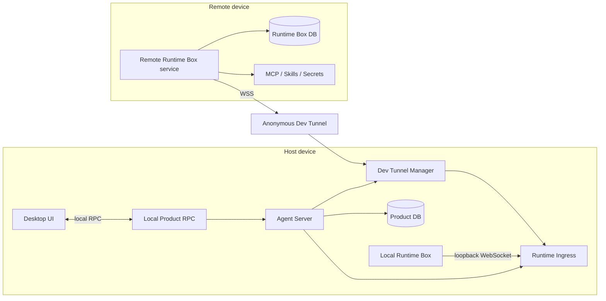
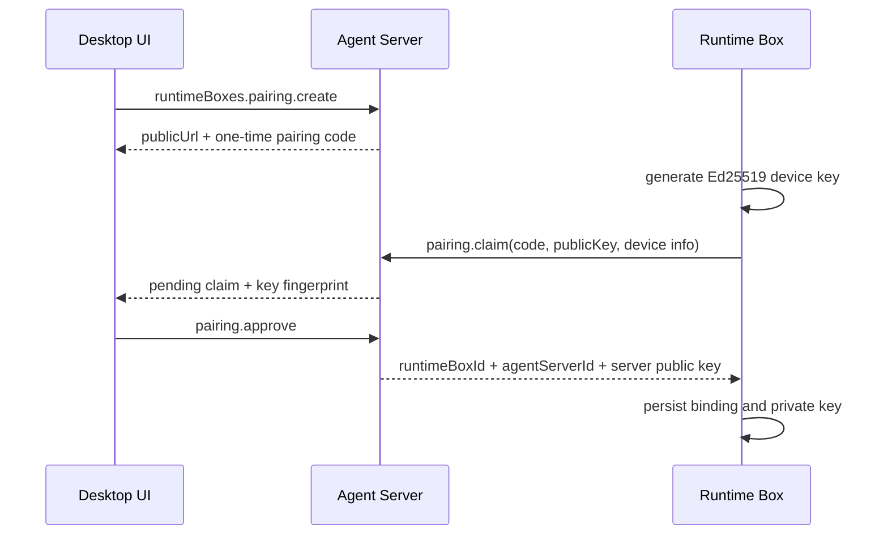
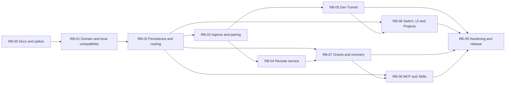

# Runtime Box 技术与实施方案

> 状态：已批准，分阶段实施
> 更新日期：2026-07-28
> 范围：Local Runtime Box、Remote Runtime Box、Agent Server 管理的 Dev Tunnel
> 非目标：Mobile Client、团队共享、云端 Agent Server、多 Agent Server 绑定

本文定义 `apps/runtime-box` 的产品边界、远程连接、安全模型、数据所有权和实施依赖。`Executor` 只表示
Runtime Box 内部 Tool/进程执行组件；产品级稳定身份统一使用 `runtimeBoxId`。

本文中的 MCP 均指 **Runtime Box-owned MCP**。Agent Server-owned MCP 的全局连接、Agent 绑定和本地 Action
链路见 [MCP 双归属接入技术设计](./mcp-integration.md)。

## 1. 已确认决策

| 主题 | 决策 |
| --- | --- |
| 顶层概念 | `Runtime Box`；`Executor` 保留为 Box 内部 Tool/进程执行组件 |
| 控制面 | 一个 Agent Server 同时管理多个 Runtime Box |
| Local Box | 随 desktop 打包，由 desktop supervisor 启停 |
| Remote Box | 单二进制、普通用户级后台服务，支持 Linux/macOS/Windows |
| 连接方向 | Runtime Box 主动建立到 Agent Server 的 WebSocket |
| Tunnel 所有者 | Agent Server 管理 Microsoft 登录、Tunnel 配置、Host 连接和状态 |
| Desktop | UI 与 Agent Server 进程 supervisor；不拥有 Tunnel 或 Runtime Box 业务状态 |
| Host 生命周期 | Desktop 退出时 Agent Server、Tunnel Host 一起停止；Remote Box 保持安装并重连 |
| Tunnel 访问 | Anonymous Dev Tunnel；Moshu 自己承担设备身份、吊销、防重放和入口限流 |
| 首版加密 | 信任 Dev Tunnels TLS；应用层 Noise 端到端加密后置 |
| Session/Project | Agent Server 持久化并永久归属一个 `runtimeBoxId`；迁移以后显式实现 |
| MCP/Skill | recoverable config/content/credential/lifecycle 归 Box；作用域绑定和稳定引用归 Agent Server |
| Agent/Provider | 全局共享；每个 `agentId + runtimeBoxId` 有独立 Runtime Profile |
| 当前 Runtime | Agent Server 全局持久状态，向所有 Client 广播 |
| 切换语义 | 只影响列表和新建默认值；既有 Run 继续在原 Box |
| 离线语义 | 保持选中、数据只读、inventory stale；禁止新 Run 和 Box mutation，不自动回退 Local Box |
| Box 解绑 | 吊销并归档；Session/Project 保留只读，重新配对后可恢复 |
| Tunnel 丢失 | 连续 30 天无活动导致 Tunnel 被删除时，首版重新配对所有 Remote Box |

## 2. 目标架构



Agent Server 逻辑上拥有 Tunnel，Desktop 原生层只负责启动和停止 Agent Server 进程。Tunnel ID、Microsoft
credential、公开 URL、Runtime ingress 端口和 Remote Box 状态不能由 Desktop 或 WebView 持久化。

## 3. 角色与所有权

| 领域 | 唯一所有者 | 说明 |
| --- | --- | --- |
| UI、窗口、菜单、Updater | Desktop Client | 只调用 Agent Server 产品 API |
| Tunnel 配置、Microsoft Host credential、Host 连接 | Agent Server | credential 存 Agent Server Secret Vault |
| Product DB、Session、Project、Run/event | Agent Server | 所有记录绑定 `runtimeBoxId` |
| Agent、Provider、Policy、Approval、Action intent/result | Agent Server | Provider Secret 永不发送 Box |
| 每个 Client 的 active Runtime 偏好 | Agent Server | 由稳定 client identity（Desktop `clientId`，未来 `mobileClientId`）持有的 revision/CAS 偏好；Session/Project/Run 仍持久归属 `runtimeBoxId` |
| MCP config/credential/OAuth/lifecycle | owning Runtime Box | Agent Server 只有脱敏投影与稳定引用 |
| Box-owned Skill installation/version/content/resources/scripts | owning Runtime Box | Agent Server 不保存可恢复正文 |
| 文件、命令、Git、MCP Tool、Skill script | Runtime Box 内部 Executor | 每次副作用需要 Server grant |
| Invocation journal 与进程树 | Runtime Box | 重连后提交结果证据并等待 Server ack |

## 4. 网络入口与 Tunnel 生命周期

### 4.1 双入口

Agent Server 使用两个独立监听器：

| 入口 | 角色 | 地址 | 暴露 |
| --- | --- | --- | --- |
| Product RPC | Desktop Client | loopback 动态端口 | 不进入 Tunnel |
| Runtime Ingress | Local/Remote Runtime Box | loopback 固定持久端口 | 唯一经 Tunnel 暴露的端口 |

Runtime Ingress 使用独立 method allowlist，不接受 Session、Provider、Policy decision、任意数据库查询或 Client
管理方法。未来 Mobile Client 必须增加独立入口和认证合同，不能复用 Runtime Box 入口。

固定 Runtime ingress 端口由 Agent Server 首次分配后持久化。端口冲突进入
`runtime_ingress_port_conflict`，不能静默更换端口导致已配对 Box 永久失联。

### 4.2 Agent Server `DevTunnelService`

```ts
interface DevTunnelService {
  getStatus(): DevTunnelStatus;
  startAuthentication(): Promise<DeviceCodeAttempt>;
  enable(): Promise<DevTunnelDescriptor>;
  host(): Promise<void>;
  stop(): Promise<void>;
  recreate(): Promise<DevTunnelDescriptor>;
}
```

Agent Server 持久化 `tunnelId`、cluster、Runtime ingress port、public URL、enabled、lastHostedAt 和
lastError。Microsoft 登录 token 只能写入 Agent Server Secret Vault。

`DevTunnelService`/`DevTunnelAdapter` 管理一个**期望端口集合（typed ingress descriptors）**而非单一 scalar 端口：
`ensureTunnel` 按期望端口集合 reconcile，只增删属于本 Service 期望之外的端口，**不再删除同属 Moshu 的其他 ingress**
（历史根因：旧 `ensureTunnel(tunnelId, port)` 会删除所有其他端口）。每个端口按需单独配置 anonymous access，并各自
收集 public URL / readiness / traffic。单个 host 进程转发全部期望端口，`waitForPort(port)` 按端口解析各自的
public URL；每个端口一旦 ready 就**增量**发布自己的 `publicUrl`（逐端口可观测：一个 ready、另一个 pending 时状态如实反映），
但**只有当所有 required ingress 都 ready 后 Service 才进入 `online`**，任一端口迟迟不 ready 会让整个 Service 保持非
online。逐端口 readiness 绑定**拥有该 host 的身份/generation**：当 owning host 因失败、取消、detach、disable 或被
replace 而终止时，按 host 身份清空对应 ingress readiness（`ready=false`、不留陈旧 URL），因此 partial-startup 失败不会让
已 ready 的死端口继续显示 online；清理只针对被终止的 host，**不会误清**接管的 replacement host readiness。**对外 status 线协议保持 v1**：`getStatus()` 仍是既有 v1 形状（scalar `runtimeIngressPort` + 顶层
`publicUrl`），**不**在严格的 `remoteAccessStatusOutputSchema` 上新增 `ingresses` 字段——旧 Client 继续无改动解析。
per-ingress readiness 只经**内部（非线协议）** getter `DevTunnelService.getIngressReadiness()` 暴露，返回 typed
descriptor（`kind`/`port`/`ready`/仅在 live 时携带的 `publicUrl`，pending 端口不回退到陈旧/持久 URL）。顶层 `publicUrl`
继续向后兼容地映射到 Runtime ingress URL。当前仍只有 Runtime ingress 一个实例；`DevTunnelIngressKind` 已建模一个前瞻性的
`mobile` descriptor，并可通过 `mobileIngressPort` 选项演练多 ingress reconcile/readiness 路径，但本层**不实际实例化**
Mobile ingress、listener 或 pairing（属于后续层）。未来 Mobile ingress 作为**第二个端口**接入时无需再改根因逻辑，并将通过
显式 versioned status method（v2）或协议 bump 暴露多 ingress readiness，而非放宽当前 v1 严格 schema。

启动顺序：

1. 打开 Product DB 和 Secret Vault。
2. 启动 Product RPC。
3. 在固定端口启动 Runtime Ingress。
4. 恢复持久 Tunnel 配置。
5. Remote Access 已启用时恢复同一 Tunnel 并启动 Host。
6. 接受 Runtime Box 重连、认证、注册和同步。

关闭顺序：

1. Agent Server 进入 `draining` 并拒绝新 Run。
2. 通知所有 Box 进入 drain，取消或收敛 invocation。
3. 持久化 Run、Action 和 Box 连接状态。
4. 停止 Tunnel Host。
5. 关闭 Runtime Ingress、Product RPC、Session 和数据库。

Desktop 退出时执行以上流程。Remote Box 不删除配对数据，进入 `disconnected` 并继续有上限重连。

## 5. 身份、配对与认证

### 5.1 身份层级

| 字段 | 生命周期 | 用途 |
| --- | --- | --- |
| `agentServerId` | Agent Server 安装级稳定 | Box 固定控制面身份 |
| `runtimeBoxId` | Box 配置级稳定 | Session/Project/Agent profile/历史关联 |
| `deviceKeyId` | 设备密钥版本 | 轮换和吊销 |
| `instanceId` | 每次进程启动或重新注册 | 区分并发/迟到实例 |
| `generation` | 同一 Box 下持久单调递增 | 拒绝旧连接和旧实时消息 |
| `connectionId` | 单 WebSocket | 观测、lease 和背压 |

一个 Runtime Box 首版只绑定一个 Agent Server。改绑需要显式 `unpair` 或 `pair --replace`。

### 5.2 配对



配对码至少包含 128-bit 随机熵，默认 5 分钟过期，Server 只保存 hash，单次使用。Claim 与用户 Approve
分离，UI 必须展示设备名称、平台和公钥指纹。

### 5.3 WebSocket Upgrade 认证

当前 `process-rpc` 在 HTTP Upgrade 前确定规范化 peer identity。设备 challenge 不能放在 RPC hello 后，
否则匿名连接可以用伪造 `runtimeBoxId` 抢占 generation fence。因此使用预认证 challenge：

1. Box 请求 `/runtime-auth/challenge`。
2. Server 返回单次 `challengeId`、nonce、expiry 和 Server 签名。
3. Box 使用配对时固定的 Server 公钥验证签名。
4. Box 对以下 canonical payload 签名：

```text
agentServerId
runtimeBoxId
deviceKeyId
instanceId
generation
challengeId
nonce
runtimeProtocolVersion
```

5. Box 在 WebSocket Upgrade Header 提交 identity、challenge ID 和签名。
6. Server 原子消费 challenge，验证设备公钥、吊销状态和持久 generation high-water mark。
7. Authenticator 返回规范化 identity，随后 RPC hello 必须与该 identity 完全一致。

Agent Server 必须持久化 generation high-water mark；不能只使用进程内 fence。

### 5.4 Anonymous 入口防护

- Runtime-only path 和端口。
- 全局未认证连接上限及来源速率限制。
- Challenge、pairing claim、签名失败分别限流。
- 5 秒预认证/握手超时和独立的小 body/header 上限。
- 签名验证前先做长度、编码和固定字段校验。
- 失败响应不泄露 Box、key 或 pairing code 是否存在。
- Runtime method allowlist、frame、并发请求、队列和背压上限。

首版 Dev Tunnels TLS 在 Microsoft Relay 终止，Moshu 应用载荷不是端到端密文。后续 Noise 必须作为
Runtime protocol 的协商层加入，不能破坏现有设备身份和版本升级。

## 6. 注册、状态与重连

```text
unpaired
  -> pairing
  -> disconnected
  -> connecting
  -> authenticating
  -> registering
  -> syncing
  -> online
  -> draining / disconnected
  -> auth_failed / upgrade_required / server_identity_mismatch
  -> archived
```

注册声明 build、platform、arch、protocol versions、Tool/MCP/Skill capability、并发限制和 inventory
epoch/revision。Server 返回协议版本、server instance、heartbeat/lease 参数和同步要求。

重连序列：

```text
1s -> 2s -> 4s -> 8s -> 15s -> 30s
之后固定 30s ±20% jitter
```

稳定在线 30 秒后重置退避。网络错误和 Host 关闭继续重试；credential revoked、protocol incompatible 和
server identity mismatch 停止盲目重试并进入明确状态。

Remote heartbeat/lease 使用独立于 loopback 的参数；初始建议 heartbeat 15 秒、lease 60 秒。执行取消和
恢复规则不能只依赖一次短暂 relay 抖动。

## 7. 多 Runtime 调度与切换

将当前单 peer `ExecutorReadiness` 演进为：

```ts
interface RuntimeBoxGatewayResolver {
  resolve(runtimeBoxId: string): RuntimeBoxGateway;
}

class RuntimeBoxRegistry {
  register(connection: RuntimeBoxConnection): void;
  disconnect(connection: RuntimeBoxConnection): void;
  get(runtimeBoxId: string): RuntimeBoxSnapshot;
  list(): RuntimeBoxSnapshot[];
}
```

每个 entry 保存当前 peer、instance/generation、状态、build/capability、inventory high-water mark、active
invocation IDs、lastSeen 和 lastError。

调度不变量：

- 新 Session/Project 默认使用**发起 Client 当前的 active Runtime 偏好**（由其稳定 client identity 解析），而非全局单值。
- Session/Project 创建后永久绑定该 Box。
- Run、cancel、Tool、恢复都按 Session 持久化的 `runtimeBoxId` 路由。
- 切换 active Runtime 只影响该 Client 后续的默认放置，不停止、不迁移、不拒绝其他 Box 上的既有 Run。
- Runtime Box offline 时不能创建可执行 Run。
- 内置 Tool 在注册成功后即可具备基础 readiness；依赖 MCP/Skill 的 Run 才要求 inventory full sync。

Client-scoped 选择使用 CAS，按稳定 client identity 持有：

```ts
interface ActiveRuntimeBoxSelection {
  runtimeBoxId: string;
  revision: number;
}

// client identity 由 authenticated peer 解析（Desktop clientId，未来 mobileClientId），
// 不信任调用方传入任意 clientId。
runtimeBoxes.switch({ runtimeBoxId, expectedRevision })
```

Server 成功持久化后广播带 revision 的 `runtimeBoxes.activeChanged`（针对该 Client 自身的偏好）。Client 只应用更高
revision，避免同一 Client 的多个窗口或未来 Client 的乱序更新。不同 Client 的偏好相互独立。

任务中心全局展示所有 Box 的 Run；Sessions/Projects 主列表只展示 active Box。从任务中心打开其他 Box 的
Session 时，先原子切换 active Box，再导航。

## 8. 数据模型

Agent Server 增加：

```text
runtime_boxes
runtime_box_device_keys
runtime_box_instances
runtime_box_generation_fences
runtime_box_pairing_sessions
runtime_box_inventory_state
runtime_box_inventory_cache
client_runtime_box_preferences
app_settings
projects
agent_runtime_profiles
```

`client_runtime_box_preferences` 按稳定 client identity 保存该 Client 当前 active Runtime Box 与 revision（取代
全局单值放置）；Session/Project/Run 仍持久归属 `runtimeBoxId`。

现有表增加：

```text
chat_sessions.runtime_box_id NOT NULL
chat_sessions.project_id NULL
chat_runs.runtime_box_id NOT NULL
chat_session_create_requests.runtime_box_id NOT NULL
```

`chat_runs.runtime_box_id` 是创建 Run 时的归属快照。Session create idempotency 比较必须包含
`runtimeBoxId`。inventory cache 的 Schema 只能容纳 stable ID/version/hash、Tool schema、health、
capability 和 `credentialConfigured`，不能提供任意 JSON 字段保存 recoverable config/secret/Skill body。

当前首次外部分发前可继续 coordinated development reset；首次外部发布后必须改成正式 migration。

归档 Box 时吊销设备密钥并保留 Box、Session、Project 和历史 Run。重新配对可恢复原 `runtimeBoxId`；首版
不实现跨 Box 迁移。

## 9. Projects、MCP、Skills 与 Runtime Profile

Project 由 Agent Server 管理，保存 `runtimeBoxId` 和远程绝对路径。创建 Remote Project 时 Host 输入路径，
Box 负责规范化并返回目录可访问性、名称和 Git 元数据，Server 成功校验后才创建记录。Box 离线时禁止路径校验
和 Project mutation。

Runtime Box 私有数据：

```text
runtime-box.db
├── mcp_configs
├── mcp_inventory
├── skill_installations
├── skill_versions
├── inventory_state
├── inventory_changes
└── invocation_journal

skills/
secrets/
logs/
cache/
```

对 Box-owned 资源，Agent Server 只保存作用域绑定、稳定 resource ref、Runtime Profile 和可丢弃 inventory
projection。Server-owned prompt-only Skill 另由 Agent Server private content store 管理，不进入本目录：

```text
agentId + runtimeBoxId
resourceKind + stableResourceId + version + contentHash
```

Box offline 时 Sessions/Projects 仍可查看，inventory 标 stale，Box-owned MCP/Skill UI 只读，不自动切回 Local
Box；Agent Server-owned Skill 仍可管理，但当前 Run gate 仍要求 Session Box online。

## 10. 副作用执行与断线恢复

Remote 副作用执行必须依赖 durable Action intent、一次性 execution grant 和结果 reconciliation，
不能复用无持久记录的本地直连路径。

当前 POC 在设备与 Agent Server 双向认证成功后，Remote Runtime Box 完全信任其绑定的 Agent Server，
包括执行 `bash`。本阶段的 intent/grant/journal 用于持久调度、单次派发和结果对账，不提供用户级命令审批；
交互式 Policy/Approval 后置到后续版本。

Runtime Box 在执行前写本地 journal：

```text
invocation_id
action_id
grant_id
parameter_digest
origin_instance_id
origin_generation
state
result_json / result_hash
started_at
completed_at
server_acked_at
```

正常关闭由 Server drain/cancel，Box 清理进程树并回报最终状态。异常 transport loss 不会提前取消已开始
Action：它继续到原 RPC deadline；显式 cancel、deadline 或 daemon shutdown 才立即取消。无法确认的动作记录
`outcome_unknown`，progress 发送失败只影响实时展示，不改变执行结果。

实时 RPC 始终拒绝旧 generation。重连后的独立 reconcile RPC 可以提交旧 generation 已完成结果，但结果只是
执行证据，不是新授权。Server 使用 `actionId + grantId + invocationId` 去重：先持久 evidence ack，Box 再将
完整结果替换为 receipt tombstone，Server 在后续 reconcile 确认 receipt 后才允许最终 prune。未确认 receipt
不按时间清理。数据库 reset 生成新的 `actionJournalEpoch`，旧 epoch journal 不会进入当前绑定。
非幂等 Action 永不自动重放。

## 11. Remote Runtime Box 单二进制

目标输出：

```text
moshu-runtime-box
moshu-runtime-box.exe
```

CLI：

```text
moshu-runtime-box install
moshu-runtime-box run
moshu-runtime-box pair
moshu-runtime-box status
moshu-runtime-box doctor
moshu-runtime-box unpair
moshu-runtime-box uninstall
```

单二进制是分发形态，不是无状态 portable process。Box 作为普通用户级服务运行并拥有持久私有数据目录。

| 平台 | 用户级服务 |
| --- | --- |
| Linux | `systemd --user` |
| macOS | LaunchAgent |
| Windows | Task Scheduler at logon |

当前 executor 依赖 `rg`、`fd` 和 Photon WASM。实现单文件交付时应把资源压缩嵌入主二进制，首次运行提取到
版本化 private cache，校验 SHA-256 后使用。禁止运行时下载未知 binary。

## 12. RPC 表面

Desktop Client 到 Agent Server：

```text
runtimeBoxes.list / get / switch / rename / archive / revoke
runtimeBoxes.pairing.create / approve / reject
remoteAccess.status / auth.start / auth.get
remoteAccess.enable / disable / recreateTunnel
```

Agent Server 与 Runtime Box：

```text
runtimeBox.register / describe / drain
inventory.getSnapshot / getChanges / changed
resources.validate
invocations.start / cancel / reconcile / ack / events
projects.validatePath
mcp.list / get / create / update / setEnabled / remove / test / start / stop / authorize / revoke
skills.list / get / install / update / remove / readPrompt / readResource
```

Remote Box 独立更新，因此 Runtime ingress 使用独立 protocol version range 和 `upgrade_required`，不能假设
Desktop、Agent Server 与 Box 永远锁步发布。

当前 protocol v2 在 challenge、Server 签名、device 签名、WebSocket header 和 registration 中端到端绑定，并要求 MCP config revision；
不兼容版本在建立 WebSocket 前返回 HTTP 426。匿名 426 是无状态响应，不能降级一个健康 Box；
Box 随后用已配对 Ed25519 key 提交带 timestamp/report ID/generation fence 的短时兼容性报告；
只有报告验签、设备未吊销且 generation 被接受后才原子持久化并投影 `upgrade_required`、fence 旧 peer；
状态跨 Agent Server 重启恢复，兼容版本注册后清除。best-effort 报告受 daemon lifecycle 和 5 秒 timeout
约束，不能阻塞 Action drain 或 shutdown。当前协商安全层为
`relay-tls`；合同保留 `noise-xx` 枚举和 supported-security 字段，但在实现完整握手前不宣称支持。

## 13. UI

设置页增加 Runtime Boxes：

- 当前 Runtime Box 和 Local/Remote 标识。
- online/syncing/offline/auth_failed/upgrade_required 状态。
- 平台、架构、版本、能力、last seen。
- 添加、配对、指纹确认、重命名、诊断、吊销、归档和重新配对。
- Agent Server 的 Remote Access 登录、Tunnel 状态、公开 URL、最近错误和流量估算。

全局切换器影响 Sessions/Projects 和新建上下文。Task Center 保持全局，并在 Run 上展示 Box 标签。

## 14. 工作包与依赖



| ID | 交付 | 关键出口 |
| --- | --- | --- |
| RB-00 | 本文、ADR、Dev Tunnels/Bun compile、Anonymous WSS、资源嵌入 spike | 真实双设备 WSS 和稳定 Tunnel URL 可重复验证 |
| RB-01 | Runtime Box contracts、稳定 ID、本地 Box registration、keyed registry 骨架 | 现有 Local Tool 行为不回退 |
| RB-02 | Box 表、active revision、Session/Run 归属、持久 generation、按 Session 路由 | 切换不影响其他 Box 既有 Run |
| RB-03 | 双入口、pairing、Ed25519 双向认证、吊销、防重放、限流 | 匿名攻击者不能抢占 identity/generation |
| RB-04 | 三平台 Remote daemon、CLI、用户服务、私有目录、重连 | Host 重启后 Box 自动恢复 |
| RB-05 | Agent Server `DevTunnelService`、Microsoft 登录、持久 Tunnel | Desktop 不保存 Tunnel 业务状态 |
| RB-06 | 设置页、切换、Task Center、Projects/path validation | 离线只读与全局切换语义通过 |
| RB-07 | Action/grant、journal、断线取消、旧结果证据对账 | 非幂等 Action 不自动重放 |
| RB-08 | Box DB、MCP/Skill、inventory、Runtime Profile、live validation | Server 无 recoverable Secret/Skill 副本 |
| RB-09 | 真实 Tunnel 故障矩阵、配额、版本、签名更新、Noise seam | 三平台 packaged E2E 通过 |

实施状态：RB-00–RB-09 的代码和自动化门已完成；真实 Dev Tunnel、macOS Developer ID/公证以及
Windows Authenticode 仍必须在持有外部凭据的对应 release runner 上执行，不能由本地 canary 结果替代。
RB-05 已实现 Microsoft device-code 登录、
cluster-qualified Tunnel ID、精确单 HTTP 端口与 Anonymous ACL reconciliation、持久状态、端口冲突修复、
有界重试/取消、并发 mutation fencing，以及随 Agent Server 父进程退出的 Tunnel Host watchdog。
RB-06 已实现 revisioned Runtime snapshot 广播、全局切换器、Runtime/Remote Access/配对设置页、
按 Box 过滤的 Sessions/Projects、owning Box 路径与 Git 元数据校验、离线只读和持久设备 key 吊销。
RB-07 已实现 durable Action intent、单次 execution grant、Box fsync journal、transport-loss deadline lease、
`outcome_unknown`、evidence/receipt 双阶段确认、reset epoch 隔离和 Remote data-directory 单实例锁。
RB-08 已实现 Runtime Box 私有 MCP/Skill/Secret store、epoch/revision/delta inventory、Server stale projection、
Runtime Profile、live version/hash/schema validation、Skill 内存 prompt，以及 MCP stdio/HTTP/SSE 生命周期和
复用 Action grant/journal/reconciliation 的 Tool bridge。
RB-09 已实现 protocol v2/HTTP 426、`online/syncing/offline/upgrade_required` 投影、Runtime RPC 月度流量估算、
5 GiB 告警、公开 Dev Tunnels 限制、脱敏诊断、丢 hint/压缩/网络/磁盘/进程故障矩阵，以及同 release
companion 哈希清单。stable 构建 fail closed：macOS 要求 Developer ID、公证、staple 与 Gatekeeper，
Windows 要求 Authenticode SHA-256/RFC 3161，所有平台要求 Ed25519 签名的完整更新产物清单。
Windows 在 postBuild 签完整应用 bundle，并在 postPackage 解开最终 installer ZIP、签名和验证
`Setup.exe` 后重新封装，再计算 Ed25519 artifact manifest。

真实 Tunnel 探针使用：

```bash
MOSHU_LIVE_RUNTIME_BASE_URL=https://<tunnel>.devtunnels.ms bun run smoke:live-tunnel
```

它验证 Product RPC 隔离、未知 challenge/pairing fail closed、协议 426 和未知 route。流量值只统计
Runtime RPC application payload，是保守的产品侧估算，不冒充 Microsoft Relay 账单。

## 15. 验收门槛

| 类别 | 门槛 |
| --- | --- |
| 身份 | 配对码重放、签名重放、伪造 Box ID、旧 generation、吊销 key 全部失败 |
| 入口 | Runtime ingress 无法调用 Client/Provider/DB API |
| 数据 | Session/Project 永久归属 Box；active switch 不改变归属 |
| 调度 | 既有 Run 按 Session Box 继续；offline Box 不接受新 Run |
| 恢复 | 断线不自动重放非幂等 Action；迟到结果可幂等对账 |
| Secret | MCP Token、设备私钥、Microsoft credential 不进入 Product DB、日志或 WebView |
| 跨平台 | Linux/macOS/Windows 普通用户安装、运行、重启和卸载 |
| Tunnel | Host 关闭、Tunnel 删除、认证过期、端口冲突都有明确状态和修复入口 |
| 配额 | 展示估算流量并在接近每用户每月 5 GB 时告警 |
| 发布 | 同版本/hash/protocol 清单、无系统 Bun 启动、平台签名、公证和 Ed25519 更新清单全部 fail closed |

## 16. 风险与非目标

- Microsoft Dev Tunnels 当前为 public preview、无 SLA，官方不建议生产工作负荷。
- 当前公开配额包括每用户每月 5 GB、每用户 10 个 Tunnel、每 Tunnel 10 个端口和最高约 20 MB/s。
- Anonymous Tunnel 把预认证入口暴露到公网，限流只能缓解 DoS。
- 首版没有 Moshu 应用层端到端加密，Microsoft Relay 是明确信任边界。
- Desktop 退出即停止 Agent Server，期间 Remote Box 和未来 Client 都不可用。
- 首版不支持团队共享、多 Agent Server 绑定、云 Agent Server、自动 Box 迁移或 Mobile Client。

## 17. 参考

- [Dev Tunnels overview](https://learn.microsoft.com/azure/developer/dev-tunnels/overview)
- [Dev Tunnels security](https://learn.microsoft.com/azure/developer/dev-tunnels/security)
- [Dev Tunnels limits](https://learn.microsoft.com/azure/azure-resource-manager/management/azure-subscription-service-limits#dev-tunnels-limits)
- [Microsoft Dev Tunnels SDK](https://github.com/microsoft/dev-tunnels)
