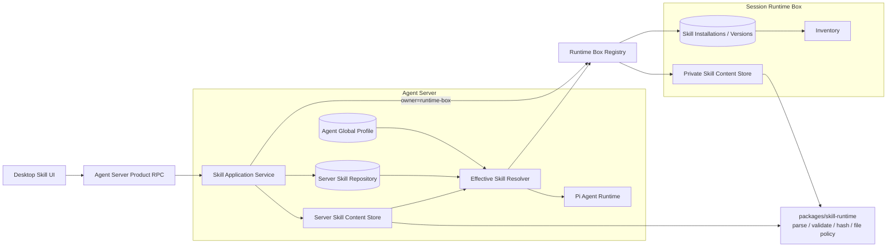

# Skill 双归属管理技术设计

> 状态：已实施
> 更新日期：2026-07-30
> 参考：[MCP 双归属接入技术设计](./mcp-integration.md)
> 范围：Agent Server-owned Skill、Runtime Box-owned Skill、Agent 绑定、Run 装配与 Desktop 管理
> 首期非目标：Server-owned Skill 附属文件、Git URL 更新、Skill 脚本执行链路、Project 级 Skill

## 1. 背景与结论

本设计启动时，Skill 只有一种所有权：所有 installation、immutable version、content、metadata 和文件都属于某个
Runtime Box。Agent Server 只保存 Runtime Profile ref，并在 Run 前从 Session 所属 Runtime Box 获取
`SKILL.md`。

这保证了 Box-owned Skill 的设备隔离，但有三个管理问题：

- 只包含通用提示词的 Skill 被迫重复安装到每个 Runtime Box。
- 切换 active Runtime Box 会整体切换 Skill 列表和 Agent 绑定。
- Skill 产品 API 隐式使用 active Runtime Box，调用方无法表达资源 owner。

目标模型参照 MCP 双归属，但保留 Skill 与 MCP 的能力差异：

1. **Agent Server-owned Skill**
   - installation、immutable version、metadata、`SKILL.md` 和完整性状态归 Agent Server。
   - 可跨 Runtime Box 复用，但仍需每个 Agent 显式分配。
   - 首期只允许一个非 executable 的 `SKILL.md`，不接受 `scripts/`、`references/`、`assets/` 或其他文件。
   - 不提供 Agent Server 本地脚本执行能力。
2. **Runtime Box-owned Skill**
   - 继续由 owning Runtime Box 管理完整 Skill package。
   - 可包含 `scripts/`、`references/`、`assets/`，只可被同一 Runtime Box 的 Runtime Profile 引用。
   - 相关文件的未来读取或执行仍必须发生在 owning Runtime Box。

两类 Skill 共用规范解析、package 校验、内容哈希和 prompt 装配合同，但持久化事实源、允许的 package
能力、Agent 绑定位置和内容读取目标不同。不得把 Server-owned Skill 复制进 Local Runtime Box，也不得用
伪 `runtimeBoxId` 表达 Agent Server。

## 2. 已确认需求

| 主题 | 决策 |
| --- | --- |
| 所有权模型 | 与 MCP 类似，支持 Agent Server-owned 与 Runtime Box-owned 两种显式 owner |
| Server-owned package | 首期只支持 `SKILL.md`；含脚本、引用或资源文件的 Skill 只能安装到 Runtime Box |
| Agent 绑定 | Server-owned Skill 属于 Agent global profile；Box-owned Skill 属于 `agentId + runtimeBoxId` Runtime Profile |
| 自动分配 | 安装或启用不等于分配，仍由 Agent 显式选择 |
| 同名冲突 | 有效 Skill 集中出现相同 `metadata.name` 时 Run fail closed，不做 owner 优先级覆盖 |
| Runtime Box 切换 | 不影响 Server-owned Skill 的安装、启用状态和 Agent global ref |
| Runtime Box 离线 | 沿用现有 Session/Run gate；即使只使用 Server-owned Skill，也禁止在离线 Box 上启动 Run |
| Box-owned package | 保留完整 package、immutable version、inventory 和 Runtime Profile 语义 |

## 3. 目标与非目标

### 3.1 目标

1. 同一 Agent 可同时使用 Server-owned 与 Session Runtime Box-owned Skill。
2. Server-owned Skill 在切换 active Runtime Box 后保持安装和分配状态。
3. Box-owned Skill 不泄漏到其他 Runtime Box 的 Runtime Profile。
4. 两类 Skill 都经过显式分配、live owner/version/hash 校验和内容完整性校验。
5. Server-owned Skill 不形成 Agent Server 文件、命令或脚本执行旁路。
6. Skill 规范解析、metadata 校验、package 限制和 hash 算法只维护一份。
7. 配置并发版本与 immutable content version 分离，启停不使 Agent ref 失效。
8. UI 明确显示 owner、package 能力、enabled、assigned、ready/stale 和版本状态。

### 3.2 非目标

- 不自动把现有 Box-owned Skill 提升或复制为 Server-owned Skill。
- 不允许 Server-owned Skill 包含或执行 `scripts/`。
- 不为 Server-owned Skill 下发临时 package 到 Runtime Box。
- 不在 Agent Server 主机执行 Skill 声明的命令。
- 不借本次改造实现 Box-owned Skill resource/script 的按需 RPC 与 execution grant。
- 不实现 Git URL 安装、自动更新、签名市场或团队共享。
- 不实现 `全局 -> Project -> Agent` 的完整覆盖层级；首期只有 Agent global assignment 与 Box profile assignment。
- 不在 Runtime Box 离线时放宽现有 Run gate。
- 不把 Skill 正文写入 Run event、Pi Session JSONL、diagnostic 或 Runtime Box inventory cache。

## 4. 改造前实现分析

本节保留双归属改造开始时的基线，用来解释后续设计选择；它不是当前实现状态。当前能力以第 5 节之后和
[实现状态](./progress.md)为准。

### 4.1 Runtime Box 权威状态

`apps/runtime-box/src/runtime-resource-store.ts` 当前同时负责：

- `skill_installations` 与 `skill_versions`。
- private `skills/` 目录、staging write、权限和 symlink 检查。
- `SKILL.md` YAML frontmatter 解析。
- package file decode、大小限制和内容哈希。
- install command 幂等、expected version、inventory change/tombstone。
- Skill live content hash 校验与 `SKILL.md` 读取。

当前 `enabled` 存在于 installation，但没有独立 `setEnabled` command。仅切换 enabled 也需要重新调用 install，
并生成新的 immutable version，导致内容未变时 Agent ref 仍被无意义地置为 stale。

### 4.2 Agent Server 当前职责

`apps/agents-server/src/product-rpc.ts` 的 `moshu.v1.skills.*`：

- 未显式传 `runtimeBoxId` 时使用 active Runtime Box。
- list/install/delete 全部路由到 Runtime Box。
- 删除前检查 Runtime Profile 引用。

`apps/agents-server/src/create-agents-server.ts` 在 Run 前：

1. 读取 `moshu.default + runtimeBoxId` Runtime Profile。
2. 在 Runtime Box live 校验全部 ref。
3. 对 Skill ref 逐个调用 `getSkillContent`。
4. 把 `SKILL.md` 作为 `AskChatSkillResource` 传给 Pi runtime。

当前没有 Server-owned Skill repository、global Skill ref 或 owner-aware Skill resolver。

### 4.3 Agent runtime 当前职责

`packages/agent-runtime/src/pi-agent-runtime.ts`：

- 禁用 Pi 自带 Skills，由 Moshu 组装 system prompt。
- `AskChatSkillResource` 只有 ID/version/hash/markdown，没有 owner。
- fingerprint 不含 owner。
- prompt 固定描述为 `Runtime Box-owned Skills`。

因此即使 Agent Server 能保存 Skill，runtime 也无法区分两个 owner 下的相同 stable ID。

### 4.4 Desktop 当前职责

`SkillsSettingsPage`：

- 始终随 active Runtime Box 切换。
- active Box online 时读取 live list，offline 时读取 stale inventory。
- install 只上传一个 `SKILL.md`，但底层合同允许完整 package。
- “Add to profile” 只更新当前 Runtime Profile。
- 不支持独立 enable/disable、owner 选择或 Agent global Skill assignment。

### 4.5 现有模型缺口

| 缺口 | 影响 |
| --- | --- |
| Skill API 隐式推断 active Box | mutation owner 不明确，无法安全增加 Server-owned Skill |
| `RuntimeBoxResourceRef` 是唯一 Skill ref | 无法表达 Agent global Skill |
| Agent global profile 只有 MCP refs | Server-owned Skill 无绑定位置 |
| parser/hash/private file 逻辑在 Runtime Box store 内 | Agent Server 接入会导致复制或反向依赖 |
| enabled 与 content version 耦合 | 仅启停也会让 Agent ref 失效 |
| runtime Skill DTO 不含 owner | fingerprint、prompt 和诊断无法区分 owner |
| 无同名冲突检查 | 两份同名 Skill 指令可能同时进入 prompt，来源和优先级不明确 |
| 无总 prompt payload 限制 | 多个合法大 Skill 可造成过大的模型上下文 |

## 5. 核心语义

### 5.1 enabled、assigned 与 ready

| 状态 | 含义 |
| --- | --- |
| `enabled` | owner 允许该 installation 被 Agent 使用 |
| `assigned` | 某 Agent profile 是否显式引用该 Skill |
| `ready` | owner 可读取当前 immutable version，且内容 hash 与 metadata 校验通过 |

一个 Skill 进入某次 Run 的有效集合必须满足：

```text
enabled
&& assigned
&& ready
&& owner/ref 匹配
&& version/contentHash 匹配
&& metadata.name 无冲突
```

安装不自动 assigned；assigned 资源 disabled、missing、tampered 或 stale 时，Run 失败，不能静默忽略。

### 5.2 Runtime Box 切换

- 发起 Client 的 active Runtime preference 只影响 Box-owned Skill 的默认列表和新建 Session/Project 默认值。
- Server-owned Skill 管理面不订阅 active Runtime Box change。
- 已有 Session 永久使用自身 `runtimeBoxId`。
- 新 Run 的有效 Skill 候选集合为：

```text
AgentGlobalProfile.serverSkillRefs
UNION
RuntimeProfile(Session.runtimeBoxId).resources.filter(skill)
```

- 合并资源前仍先校验 Session Runtime Box online/ready。
- Server-owned Skill 不进入 Runtime Box inventory。

### 5.3 configRevision 与 immutable version

Skill installation 增加两个独立版本维度：

- `configRevision`：每次 enabled、source metadata 或 current version pointer 变化时递增，用于 mutation CAS。
- `version + contentHash`：package 内容变化时更新，用于 Agent ref 与 Run live validation。

以下操作不得改变 `version/contentHash`：

- enable/disable。
- assigned/unassigned。
- UI 展示状态或最近使用时间更新。
- 对完全相同 package 内容的幂等重装。

以下操作必须产生新 version：

- `SKILL.md` 任意字节变化。
- Box-owned package 的文件增删、内容变化或 executable bit 变化。

内容更新后旧 Agent ref 不自动前移。UI 显示 stale assignment，由用户显式确认新版本。

### 5.4 Owner 能力矩阵

| 能力 | Agent Server | Runtime Box |
| --- | --- | --- |
| `SKILL.md` | 支持 | 支持 |
| `scripts/` | 拒绝 | 支持存储；执行链路另行实现 |
| `references/` | 拒绝 | 支持存储；按需读取链路另行实现 |
| `assets/` | 拒绝 | 支持存储；按需读取链路另行实现 |
| 其他 package 文件 | 拒绝 | 按共享 package policy 校验 |
| executable file | 拒绝 | 可存储；执行仍需 Policy/Action/grant |
| 跨 Box assignment | 支持 Agent global ref | 禁止 |

Server-owned install 必须恰好包含一个路径为 `SKILL.md`、encoding 为 UTF-8、`executable=false` 的文件。
相对链接指向 package-local 文件时，如果目标不存在则拒绝安装；不能让 prompt-only Skill 假装拥有不可读取的
bundle resource。

### 5.5 同名冲突

冲突键为解析并校验后的 `metadata.name`，不是 stable resource ID。

- 同一有效 Skill 集中出现重复 name 时返回 `SKILL_NAME_CONFLICT`。
- 不设置 Server/Box owner 优先级。
- 不拼接、重命名或静默丢弃其中一个 Skill。
- global profile update 和 Runtime Profile update 在 owner 内尽早检查；跨 owner 冲突在 Run resolver 中最终检查。
- UI 可做预检提示，但 Run 必须重新 live 校验，不能只信 UI。

## 6. 目标架构



### 6.1 新增或调整组件

| 组件 | 位置 | 职责 |
| --- | --- | --- |
| `@moshu/skill-runtime` | `packages/skill-runtime` | metadata 解析、package 校验、hash、private content store 通用逻辑 |
| `AgentServerSkillRepository` | `packages/database` | Server-owned installation/version、CAS、command idempotency、引用解析 |
| `AgentServerSkillService` | `apps/agents-server` | owner-explicit command/query、content store 补偿和 summary |
| `EffectiveSkillResolver` | `apps/agents-server` | 合并 global/Box refs、live validation、内容读取、冲突和总量检查 |
| `AgentGlobalProfileRepository` | `packages/database` | 在现有 MCP refs 之外保存 Server-owned Skill refs |
| Runtime Skill adapter | `apps/runtime-box` | 复用共享 Skill runtime，继续维护 inventory transaction |

### 6.2 复用边界

从 `runtime-resource-store.ts` 提取 owner-neutral 逻辑：

- `parseSkillMetadata`。
- package path/encoding/size/executable 校验。
- canonical package hash。
- private directory/file mode、owner、no-follow、atomic staging/rename/fsync。
- immutable version write/read/hash/delete。

共享 package 不得依赖 Product DB、Runtime Box DB、inventory、Agent profile 或 RPC。建议 Port：

```ts
interface SkillPackagePolicy {
  ownerKind: "agent-server" | "runtime-box";
  allowBundleFiles: boolean;
  allowExecutableFiles: boolean;
}

interface SkillContentStore {
  writeVersion(input: {
    stableResourceId: string;
    version: string;
    files: readonly SkillPackageFile[];
    policy: SkillPackagePolicy;
  }): Promise<{ locator: string; contentHash: string; metadata: SkillMetadata }>;

  readSkillMarkdown(locator: string, expectedHash: string): Promise<string>;
  verifyVersion(locator: string, expectedHash: string): Promise<void>;
  deleteVersion(locator: string): Promise<void>;
}
```

`locator` 只在 owner 内部使用，不进入公共 RPC、profile、inventory、event 或 prompt。

## 7. 所有权与合同

### 7.1 Owner contract

MCP 和 Skill 的 owner wire shape 相同。将底层 schema 泛化为 resource owner，并保留 MCP alias，避免改变已发布
MCP JSON：

```ts
type ResourceOwner =
  | { kind: "agent-server" }
  | { kind: "runtime-box"; runtimeBoxId: string };

type SkillOwner = ResourceOwner;
type McpOwner = ResourceOwner;
```

所有 v2 Skill product API 必须显式携带 owner。协议层不得用缺失 `runtimeBoxId` 推断 active Box。

### 7.2 Skill ref

统一 resolver 使用 owner-aware ref：

```ts
type SkillResourceRef =
  | {
      owner: { kind: "agent-server" };
      stableResourceId: string;
      version: string;
      contentHash: string;
    }
  | {
      owner: { kind: "runtime-box"; runtimeBoxId: string };
      stableResourceId: string;
      version: string;
      contentHash: string;
    };

type AgentServerSkillResourceRef = Extract<
  SkillResourceRef,
  { owner: { kind: "agent-server" } }
>;
```

持久化保持两类边界：

- `AgentGlobalProfile.serverSkillRefs` 只接受 `owner.kind = "agent-server"`。
- `RuntimeProfile.resources` 继续使用现有 `RuntimeBoxResourceRef`，只接受 profile 自身 Box 的资源。
- resolver 在边界处把 Runtime Profile ref 转成 owner-aware effective ref。
- 不要求 MCP 与 Skill ref 混入一个无类型的大数组。

### 7.3 Agent global profile

在现有合同上增加 Skill refs：

```ts
interface AgentGlobalProfile {
  agentId: string;
  revision: number;
  serverMcpRefs: AgentServerMcpResourceRef[];
  serverSkillRefs: AgentServerSkillResourceRef[];
  createdAt: string;
  updatedAt: string;
}
```

`agentGlobalProfile.update` 使用同一个 `expectedRevision` 原子替换两组 refs，避免 MCP 页面与 Skill 页面并发更新时
互相覆盖。调用方必须提交刚读取的另一组未修改 refs；revision conflict 后重新加载。

自定义 Agent/immutable Agent version 落地后，两类 global ref 应进入 Agent version config snapshot。当前
`agent_global_profiles` 是 `moshu.default` 的过渡配置投影。

### 7.4 Summary DTO

```ts
interface SkillSummary {
  owner: SkillOwner;
  stableResourceId: string;
  configRevision: number;
  version: string;
  contentHash: string;
  metadata?: SkillMetadata;
  enabled: boolean;
  health: "ready" | "stopped" | "error";
  packageKind: "prompt-only" | "runtime-package";
  sourceKind: "inline-editor" | "local-upload" | "import";
  sourceLabel?: string;
  stale: boolean;
  installedAt: string;
  updatedAt: string;
  lastErrorCode?: string;
}
```

- Server-owned summary 的 `stale` 恒为 false。
- Box online 时返回 live metadata；offline 时可由 inventory 生成缺少 metadata 的 stale summary。
- `source` 若含本机路径，不原样返回 renderer；只返回安全 source kind/label。
- summary 不含 `SKILL.md`、bundle 文件、content locator 或文件系统绝对路径。

### 7.5 Effective Skill

Agent runtime 只接收已经解析、校验并有界的内容：

```ts
interface EffectiveSkillResource {
  ref: SkillResourceRef;
  metadata: SkillMetadata;
  skillMarkdown: string;
}
```

不得把 package locator、其他文件列表、原始 source path 或 owner repository handle 传给 Agent runtime。

## 8. Agent Server-owned 持久化

### 8.1 Product DB

新增：

```text
agent_server_skill_installations
├── id TEXT PRIMARY KEY
├── config_revision INTEGER NOT NULL
├── current_version TEXT NOT NULL
├── enabled INTEGER NOT NULL
├── source_kind TEXT NOT NULL
├── source_label TEXT NULL
├── health TEXT NOT NULL
├── last_error_code TEXT NULL
├── created_at_ms INTEGER NOT NULL
└── updated_at_ms INTEGER NOT NULL

agent_server_skill_versions
├── skill_id TEXT NOT NULL
├── version TEXT NOT NULL
├── content_hash TEXT NOT NULL
├── metadata_json TEXT NOT NULL
├── content_locator TEXT NOT NULL
├── installed_at_ms INTEGER NOT NULL
└── PRIMARY KEY (skill_id, version)

agent_server_skill_command_results
├── command_id TEXT PRIMARY KEY
├── operation TEXT NOT NULL
├── request_digest TEXT NOT NULL
├── result_json TEXT NOT NULL
└── created_at_ms INTEGER NOT NULL
```

`agent_global_profiles` 增加：

```text
server_skill_refs_json TEXT NOT NULL DEFAULT '[]'
```

约束：

- DB 不保存 `SKILL.md` 正文；正文位于 Agent Server private Skill root。
- `content_locator` 是 server-internal opaque value。
- `metadata_json` 必须通过共享 schema，且仍按不可信内容处理。
- command result 有界保留，不包含正文。
- request digest 使用 canonical input 和 content hash，不把完整正文写入 command table。
- Server-owned Skill 不进入 `runtime_box_inventory_*`。

### 8.2 Private content root

建议目录：

```text
agentDataDirectory/
└── server-skills/
    └── <sha256(stableResourceId)>/
        └── <version>/
            └── SKILL.md
```

要求：

- root/version directory `0700`，文件 `0600`。
- stable resource ID 不直接作为路径段。
- 拒绝 symlink 和非 regular file。
- staging write、file fsync、atomic rename、parent fsync。
- read 时执行 mode/owner/size/no-follow 检查并重新计算 hash。
- Product DB commit 失败时删除新 version。
- DB delete 成功但文件删除失败时记录 pending deletion，启动和空闲期重试；不得静默遗留。

Server-owned Skill 是 Agent Server authority，因此其 private root 属于 server backup 范围；但运行时读取出的副本仍
不得进入 Run/Pi Session/event/diagnostic。Box-owned Skill 内容继续不进入 server backup。

### 8.3 Runtime Box store 演进

`skill_installations` 增加：

```text
config_revision INTEGER NOT NULL
```

并增加独立 `skill.setEnabled` command。`skill_versions` 与 private package 目录继续归 Box。Runtime Box inventory
Skill descriptor增加 `configRevision`；version/hash 语义不变。

Runtime DB migration 必须：

1. 为现有 installation 初始化 `config_revision = 1`。
2. 保留 current version/hash 和 package 目录。
3. 清理与旧 install digest schema 不兼容的 Skill command replay rows。
4. 提升 runtime resource DB version。

## 9. 安装、更新、启停与删除

### 9.1 owner-explicit install/upsert

```ts
interface UpsertSkillInput {
  owner: SkillOwner;
  commandId: string;
  stableResourceId?: string;
  expectedConfigRevision?: number;
  expectedVersion?: string;
  source: SkillSourceInput;
  enabled: boolean;
  files: SkillPackageFile[];
}

type SkillSourceInput = {
  kind: "inline-editor" | "local-upload" | "import";
  label?: string;
};
```

创建时两个 expected 字段均省略；更新时两个字段均要求匹配。处理顺序：

1. 公共 schema 检查 file count、path、encoding 和 decoded size。
2. 按 owner capability policy 检查 bundle/executable。
3. 解析 `SKILL.md` metadata 并校验 package-local link。
4. 计算 canonical content hash。
5. 如果 hash 与 current version 相同，不创建新 immutable version。
6. 否则先写入新 version，再提交 owner DB pointer/config revision。
7. DB 失败补偿删除新文件；成功后发布 owner-specific change。
8. 返回 persisted mutation result，不返回正文。

Server-owned mutation 不依赖 active Runtime Box 是否 online。Box-owned mutation 在目标 Box offline 时明确失败，
不排队，也不回退到 Server owner。

### 9.2 enable/disable

新增独立 command：

```ts
interface SetSkillEnabledInput {
  owner: SkillOwner;
  commandId: string;
  stableResourceId: string;
  expectedConfigRevision: number;
  enabled: boolean;
}
```

- 只更新 `enabled/configRevision/updatedAt`。
- 不创建 content version，不改变 content hash。
- disable 不自动删除 Agent ref。
- assigned 但 disabled 的 Skill 会使 Run fail closed，UI 应提示先移除分配或重新启用。

### 9.3 更新

- 内容更新允许已有 ref 暂时指向旧 version，但下一次 Run 明确返回 version mismatch。
- UI 显示 “Update assignment” 以显式替换 ref，不自动升级 Agent。
- 对同 hash 的重装不得制造新 version。
- Server-owned Skill 若上传额外文件，返回 owner capability error，不能只丢弃额外文件后成功。

### 9.4 删除

- Server-owned Skill 被任一 `serverSkillRefs` 引用时拒绝删除。
- Box-owned Skill 被 owning Box 的任一 Runtime Profile 引用时拒绝删除。
- stable ID 在不同 owner 中互不影响。
- 首期不自动级联移除 Agent refs。
- 删除 DB authority 后清理全部 immutable versions；失败进入 pending deletion。

## 10. 有效 Skill 解析

Run 启动顺序：

```text
1. 校验 Session.runtimeBoxId online/ready。
2. 读取 AgentGlobalProfile.serverSkillRefs。
3. 读取 agentId + Session.runtimeBoxId Runtime Profile 的 Skill refs。
4. 从 Agent Server repository live 校验 Server refs 的 enabled/version/hash/current pointer。
5. 通过 RuntimeBoxRegistry live 校验 Box refs。
6. 从各自 owner 读取 metadata 与 SKILL.md，并重新验证内容 hash。
7. 检查 metadata.name 冲突、单项大小、总 prompt 大小和数量限制。
8. 构造 EffectiveSkillResource[] 与 owner-aware fingerprint。
9. 创建或按 fingerprint 重建 Pi Agent Session。
```

读取应使用有界并发，例如最多 8 个 content fetch，不能对最多 256 个 ref 无限制 `Promise.all`。

任何 assigned Skill 出现以下状态时整个 Run 失败：

- owner unavailable。
- missing、disabled、not ready。
- version/hash mismatch。
- content tamper。
- metadata 解析结果与 version record 不一致。
- name conflict。
- prompt aggregate 超限。

首期有效 `SKILL.md` 总 UTF-8 大小上限为 2 MiB；单项继续使用 512 KiB。限制放在共享 contracts，
resolver 在拼接 prompt 前再次按字节计算。

## 11. Agent runtime 与 prompt 装配

`AskChatSkillResource` 改为 owner-aware：

```ts
interface AskChatSkillResource {
  owner: SkillOwner;
  stableResourceId: string;
  version: string;
  contentHash: string;
  metadata: SkillMetadata;
  skillMarkdown: string;
}
```

resource fingerprint 必须包含：

```text
owner.kind
owner.runtimeBoxId?
stableResourceId
version
contentHash
metadata.name
```

prompt 文案不再固定写 “Runtime Box-owned Skills”，而是为每个 Skill 标注来源：

```xml
<moshu-skill
  owner="agent-server"
  id="release-helper"
  name="release-helper"
  version="..."
  hash="..."
  package-kind="prompt-only">
...
</moshu-skill>
```

约束：

- Skill 内容是 untrusted guidance，不能授予 Tool、网络、文件或命令权限。
- `allowed-tools` 只用于展示和建议，不改变实际有效 Tool 集。
- Server-owned Skill 的相对 package path 不可用；prompt 明确 `package-kind=prompt-only`。
- 不把 resolved markdown 追加写入 Pi Session JSONL。
- Session 恢复时重新解析 refs 和 owner authority，不能使用上次内存内容的持久副本。
- stable ID、owner ID 等属性值在序列化前按 XML attribute 规则转义。

## 12. RPC 设计

### 12.1 Client -> Agent Server

新增 owner-explicit v2 API：

```text
moshu.v2.skills.list
moshu.v2.skills.upsert
moshu.v2.skills.setEnabled
moshu.v2.skills.delete
moshu.v2.agentGlobalProfile.get
moshu.v2.agentGlobalProfile.update
```

Skill mutation 统一要求：

- `owner`。
- `commandId`。
- 更新/删除时的 `expectedConfigRevision`。
- 内容更新/删除时的 `expectedVersion`。

`moshu.v1.skills.*` 不再作为新 UI 的调用面。若为兼容旧 client 暂留，只能作为明确的
`owner={kind:"runtime-box", runtimeBoxId}` adapter，且不得继续在协议核心中隐式解析 active Box。

### 12.2 Agent Server -> Runtime Box

保留现有 Box authority 路径，并为变更合同增加新的 runtime protocol method/version：

```text
runtimeBox.skills.list
runtimeBox.skills.upsert
runtimeBox.skills.setEnabled
runtimeBox.skills.delete
runtimeBox.resources.validate
runtimeBox.skills.getContent
```

Server-owned operation 不发送到 Runtime ingress。Remote Runtime Box 未声明新 Skill CAS capability 时：

- list/inventory 仍可只读。
- 新 schema mutation 返回 `RUNTIME_BOX_CAPABILITY_MISSING` 或进入 `upgrade_required`。
- Agent Server 不用旧 expectedVersion-only mutation 模拟成功。

### 12.3 内容读取

`getContent` 是 Agent Server 内部 resolver Port，不是 renderer 产品 API：

```ts
interface SkillContentResolver {
  resolve(ref: SkillResourceRef, signal?: AbortSignal): Promise<EffectiveSkillResource>;
}
```

- Server owner 直接访问 Server repository/content store。
- Box owner 通过 RuntimeBoxRegistry 和 runtime RPC。
- client 无法调用接口读取完整已安装 Skill 正文。

### 12.4 Typed errors

至少包含：

```text
SKILL_OWNER_NOT_AVAILABLE
SKILL_OWNER_CAPABILITY_MISMATCH
SKILL_CONFIG_REVISION_CONFLICT
SKILL_RESOURCE_IN_USE
SKILL_VERSION_MISMATCH
SKILL_CONTENT_HASH_MISMATCH
SKILL_CONTENT_TAMPERED
SKILL_NOT_READY
SKILL_NAME_CONFLICT
SKILL_PROMPT_LIMIT_EXCEEDED
SKILL_PACKAGE_INVALID
RUNTIME_BOX_UNAVAILABLE
RUNTIME_BOX_CAPABILITY_MISSING
```

错误 details 只包含 owner、stable ID、安全 name、expected/actual version 或限制值，不含正文、绝对路径和 locator。

## 13. Desktop UX

Skill 设置页与 MCP 一致分为两个明确作用域：

1. **Agent Server**
   - 文案：“通用于所有 Runtime Box；首期仅支持一个 `SKILL.md`，不包含脚本或资源。”
   - active Runtime Box offline 时仍可安装、启停、更新和删除。
   - install picker 只接受 `SKILL.md` 或编辑器文本。
2. **Runtime Box**
   - 显示当前 Box 名称、Local/Remote、online/stale。
   - 支持完整 package 的现有/后续安装入口。
   - offline 时只读，不自动回退 Local Box。

每个卡片显示：

- owner badge。
- prompt-only/runtime-package badge。
- enabled 与 ready/error/stale。
- metadata name/description。
- version/hash 摘要。
- assigned Agent 数量。
- stale assignment 数量。
- last safe error。

Agent 配置分两组：

- “所有 Runtime Box 可用”：选择 Server-owned Skill，更新 `AgentGlobalProfile.serverSkillRefs`。
- “当前 Runtime Box 可用”：选择 Box-owned Skill，更新当前 Runtime Profile。

同名冲突：

- UI 在添加 assignment 前对当前可见两组 Skill 做预检并阻止明显冲突。
- stale/offline 导致无法证明无冲突时，UI 显示需在 Run 前 live validation。
- 后端仍是最终 enforcement。

删除被引用 Skill 时默认拒绝并列出引用 Agent。复制/导入必须先选择 owner：

- 复制创建新 stable resource，不移动原资源。
- Box package 含额外文件时不能复制到 Agent Server owner。
- Server prompt-only Skill 可复制到 Runtime Box，但仍创建独立 version/ref。
- 首期不自动复制 assignment。

## 14. 安全设计

### 14.1 内容与执行隔离

- Server-owned Skill 永远不创建 executable file。
- Server owner 不提供 package resource read Tool 或 script invocation。
- Skill install/update/delete 只能由用户产品 API 发起，不能暴露成 Agent Tool。
- `allowed-tools`、Skill 正文和 metadata 都不能修改 Tool registry、Policy、approval 或 grant。
- Box-owned script 的未来执行必须走 Runtime Box Action/grant；本设计不新增直连路径。

### 14.2 文件安全

- 两个 owner 都使用 shared no-traversal/no-symlink/private file policy。
- package path 必须是规范化相对 POSIX path。
- base64 必须严格校验 decoded size，不能只按字符串长度估算后信任。
- hash 输入包含 path、executable bit、byte length 和原始 bytes，顺序固定。
- 读取时先 lstat/open-no-follow，再在 descriptor 上验证 size/mode/owner，防止 check/use 间路径替换。
- private root 的威胁边界与现有 Runtime Box 相同：不能防御同账户 malware、root 或磁盘快照。

### 14.3 Prompt 与数据边界

- Skill markdown、metadata、source label 都按不可信输入处理。
- Server-owned authoritative content 可存在 server private root 和 backup，但不进入 Product DB 正文字段。
- Box-owned content 不进入 server DB、backup、inventory cache 或 renderer。
- 两类 resolved content 都不进入 Pi Session JSONL、Run event、diagnostic、telemetry 或普通日志。
- 错误日志使用 owner/stable ID/version/hash/cause ID，不记录 markdown。
- aggregate prompt 限制在模型调用前执行。

### 14.4 安装预览

安装确认页至少展示：

- owner 与实际存储设备。
- metadata、文件数、总大小和 executable 文件数。
- Server owner 对 bundle file 的拒绝原因。
- Box owner 的 scripts/references/assets 清单。
- source kind 和内容 hash。

“来源未知”不自动禁止安装，但不能降低后续 Tool/Action 权限。

## 15. 故障与恢复

| 场景 | Server-owned Skill | Box-owned Skill |
| --- | --- | --- |
| 切换 active Box | 无影响 | 设置页切换到新 Box；已有 Session 不迁移 |
| Agent Server 重启 | 校验 current version 文件；单项损坏标 error | Box 重连后 inventory full sync |
| Runtime Box 离线 | authority 仍可管理，但现有规则禁止该 Session 新 Run | stale cache 只读，mutation/Run 失败 |
| Skill 文件被篡改 | live hash 失败，标 error，Run fail closed | owning Box live validation 失败 |
| 内容更新 | current version 前移，旧 global ref stale | inventory version 更新，旧 Runtime Profile ref stale |
| enable/disable | 只变 configRevision | 只变 configRevision 与 inventory revision |
| DB commit 失败 | 删除 staging/new version，不返回成功 | 现有 Box transaction + 文件补偿 |
| 内容删除失败 | pending deletion/GC | pending deletion/GC |
| 同名 assignment | resolver 返回冲突 | resolver 返回冲突 |
| owner 返回超大内容 | server 本地 size/hash gate | RPC schema/byte limit + resolver gate |

Agent Server 启动时对 Server-owned current versions 做有界 reconcile。单个坏 Skill 不阻止 Product RPC ready；
该 Skill summary 为 `health=error`，任何引用它的 Run fail closed。

## 16. 代码改造映射

| 当前文件 | 改造 |
| --- | --- |
| `apps/runtime-box/src/runtime-resource-store.ts` | 提取 parser/hash/private file 逻辑；增加 Skill configRevision 与 setEnabled |
| `apps/runtime-box/src/resource-handler.ts` | 增加新版 Skill upsert/setEnabled handler |
| `apps/runtime-box/src/index.ts` | 注册新版 runtime Skill RPC/capability |
| `packages/contracts/src/runtime-resources.ts` | 增加 SkillOwner/ref/summary/v2 command/global Skill refs/aggregate limits |
| `packages/contracts/src/process-rpc.ts` | 增加 owner-explicit product API 与新版 Runtime Box Skill API |
| `packages/skill-runtime` | 新增共享 Skill package 与 private content store 实现 |
| `packages/database/src/schema.ts` | 增加 Server Skill tables 与 `server_skill_refs_json` |
| `packages/database/src/migrations.ts` | Product DB schema migration |
| `packages/database/src/agent-global-profile-repository.ts` | 原子读写 MCP refs + Skill refs，按 kind 查询引用 |
| `packages/database/src/agent-server-skill-repository.ts` | 新增 authority、CAS、version 和 command repository |
| `apps/agents-server/src/create-agents-server.ts` | 初始化 Server Skill service/resolver，替换内联 Box-only解析 |
| `apps/agents-server/src/product-rpc.ts` | 增加 Skill v2 owner dispatch、引用保护和 typed error |
| `apps/agents-server/src/runtime-box-registry.ts` | 保留 Box owner gateway，增加新 Skill CAS/capability adapter |
| `packages/agent-runtime/src/pi-agent-runtime.ts` | owner-aware Skill DTO/fingerprint/prompt 与总量检查 |
| `apps/desktop/src/views/main/lib/rpc.ts` | 增加 owner-explicit Skill client |
| `apps/desktop/src/views/main/app/settings/runtime-resources-page.tsx` | Skill owner tabs、global assignment、enable/update/conflict UX |
| `apps/desktop/src/views/main/app/i18n.tsx` | owner、package kind、stale/conflict/error 文案 |

## 17. 实施阶段

### S0：合同与共享 Skill runtime

1. 增加 owner/ref/summary/global Skill ref schemas。
2. 提取 `packages/skill-runtime`。
3. Runtime Box 通过 adapter 继续运行现有 install/hash/tamper 测试。
4. 增加 prompt-only owner capability policy 与 aggregate limit。

**出口：** 现有 Box-owned Skill 行为不变，parser/hash 不再重复，Server owner 尚未开放。

### S1：版本语义与 Server authority

1. Runtime Box Skill 增加 configRevision/setEnabled。
2. 增加 Product DB Server Skill tables、repository 和 private content root。
3. 实现 Server owner upsert/list/setEnabled/delete 与 startup reconcile。
4. 实现 command idempotency、文件/DB 补偿和 pending deletion。

**出口：** 不依赖 Runtime Box 可管理 prompt-only Server-owned Skill，但尚未暴露给 Agent。

### S2：Agent global 绑定与 resolver

1. `AgentGlobalProfile` 增加 `serverSkillRefs`。
2. 新增 `EffectiveSkillResolver`，合并 global/Box refs。
3. 实现 owner live validation、content fetch、name conflict 和总量 gate。
4. Pi runtime 使用 owner-aware fingerprint/prompt。

**出口：** Agent 可同时加载两种 owner 的 Skill；切 Box 不改变 global Skill；所有 mismatch fail closed。

### S3：RPC 与 Desktop

1. 增加 `moshu.v2.skills.*` owner-explicit API。
2. 增加 Runtime Skill 新版 CAS RPC/capability gate。
3. Skill 设置页按 owner 分区。
4. 增加 global/current Box assignment、enable/disable、stale update 与 conflict UX。

**出口：** 用户可理解并可靠管理两种作用域，不存在 mutation owner 推断。

### S4：安全、恢复与文档

1. fault injection、tamper、symlink、oversize、compensation 和 startup recovery。
2. 验证正文不进入 DB/event/Pi JSONL/diagnostic。
3. Remote Runtime Box 版本/capability/upgrade gate。
4. 修订架构、数据、安全、产品和 Runtime Box 文档。

**出口：** 双归属 Skill 通过安全、恢复、跨 Box 和 packaged desktop 验收。

## 18. 测试与验收

### 18.1 Contract

- owner union 拒绝缺失或多余的 `runtimeBoxId`。
- global profile 拒绝 Box ref；Runtime Profile 拒绝 Server ref。
- Server owner 只接受一个非 executable `SKILL.md`。
- Server owner 对额外文件返回 capability mismatch，不静默丢弃。
- configRevision 与 version/hash 独立变化。
- aggregate Skill markdown 使用 UTF-8 byte limit，不按 JavaScript 字符数。

### 18.2 Repository 与 content store

- create/update/no-op update/setEnabled/delete CAS。
- command replay 相同 digest 返回原结果，不同 digest 冲突。
- DB commit 失败删除新 version。
- 文件删除失败记录 pending deletion，重启后继续清理。
- mode/owner/symlink/path traversal/base64/oversize 被拒绝。
- current version tamper 在 list reconcile 和 Run resolve 均被发现。
- stable ID 大小写碰撞使用不同 filesystem directory key。

### 18.3 有效 Skill 集

准备两个 Runtime Box A/B：

```text
Server Skill: S
Box A Skill: A
Box B Skill: B
```

| Session Box | Agent assignments | 有效 Skill |
| --- | --- | --- |
| A | S + A | S、A |
| B | S + B | S、B |
| A | S + B | Run validation 失败，不能跨 Box 使用 B |
| B offline | only S | 仍禁止启动 Run |

切换 active Box A -> B 时：

- S 的 installation/version/global ref 不变化。
- A 不出现在 B Runtime Profile。
- 已创建的 A Session 不迁移。

### 18.4 冲突与版本

- S 与 A 的 metadata.name 相同：Run 返回 `SKILL_NAME_CONFLICT`。
- 不同 owner 的 stable ID 相同但 name 不同：允许，因为 owner/ref 可唯一识别。
- 同 owner 两个 stable ID 使用同 name：profile update 或 Run fail closed。
- enable/disable 不改变 version/hash。
- 内容更新改变 version/hash，旧 assignment 显示 stale 且 Run 失败。
- 相同内容重装不旋转 version。

### 18.5 Runtime 与数据泄漏

- fingerprint 在 owner 变化时变化并重建 Agent Session。
- prompt 标注正确 owner/package kind。
- Skill markdown 不出现在 Product DB 正文字段、Run event、Pi Session JSONL、inventory、diagnostic 和日志。
- Server-owned Skill 不创建 Tool、进程或 execution grant。
- `allowed-tools` 不改变实际 ToolDefinition。
- 256 个小 Skill 仍受总 prompt byte limit 约束。

### 18.6 Desktop

- Agent Server tab 在 active Box offline 时可管理。
- Runtime Box tab offline 时只读且显示 stale。
- owner 切换清理未提交 draft/command ID，避免把 Server draft 提交给 Box。
- Agent global profile 更新保留 MCP refs；MCP 页面更新也保留 Skill refs。
- revision conflict 重新加载，不用最后写入覆盖另一页面变更。
- 删除被引用 Skill 被后端拒绝，UI 不仅依赖按钮 disabled。

## 19. 文档决策修订

实施时同步修订：

- `docs/implementation/README.md`：Skill recoverable state 改为显式 owner。
- `docs/implementation/architecture.md`：Agent Server 增加 prompt-only Skill authority。
- `docs/implementation/data-contracts.md`：Skill owner/ref/global profile/Server tables。
- `docs/product/agents-integrations.md`：Skill 双作用域、同名 fail closed、Server prompt-only 限制。
- `docs/product/security-data.md`：区分 Server authoritative `SKILL.md` 与 Box full package。
- `docs/implementation/runtime-box.md`：保留 Box-owned full package 规则，并明确不覆盖 Server-owned prompt-only Skill。
- `README.md`：角色所有权和多 Box 路由说明。

修订后的总原则：

> Skill installation、immutable version、content 和 metadata 归其显式 owner。Agent Server-owned Skill 首期仅拥有
> prompt-only `SKILL.md`；Runtime Box-owned Skill 拥有完整 package 及其未来资源/脚本执行面。Agent Server
> 始终拥有 Agent 绑定与 Run 前的 owner/version/hash/conflict 校验，任何 Skill 都不能授予额外执行权限。
